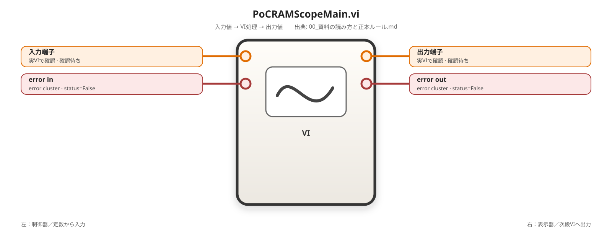
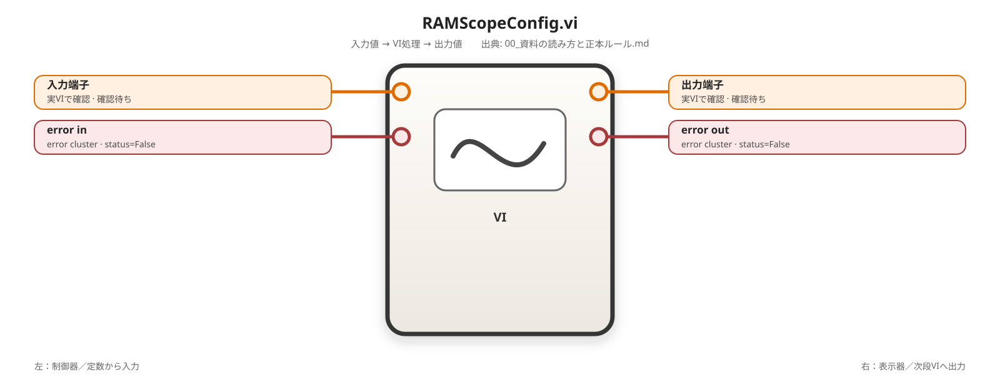
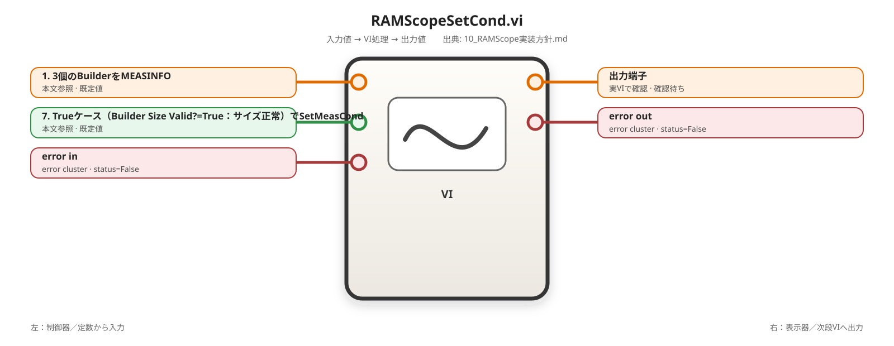
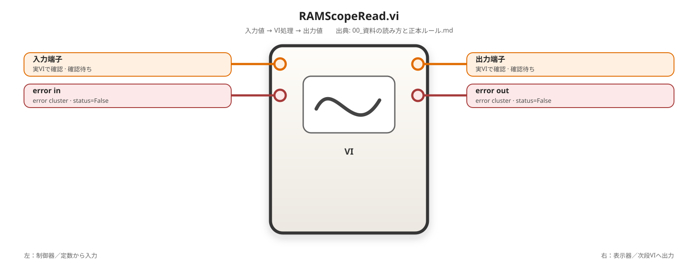
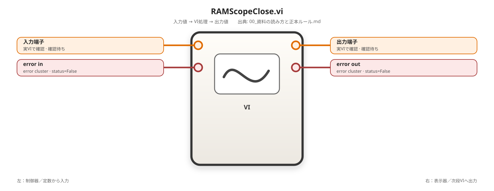

# 00. 資料の読み方と正本ルール

**最終整理日：2026-07-26**

本資料群では、検討案、過去の調査結果、実装手順、一次情報を混在させない。情報の役割、優先順位、書き方を次のとおり統一する。

---

## 1. 実装の一本道

```text
00A LabVIEW実装資料の記述ルール
  → 00B LabVIEW学習型VI設計ルール
  → 00C 一次資料とバージョン基準
  → 01 システム概要
  → 02 役割分担
  → 03 環境構築
  → 04 LabVIEW基礎
  → 05 共通仕様
  → 06 共通部品とVI雛形
  → 07 / 08 一般機器
  → 09 CAN方式検討
  → 10 RAMScope GT170実装
       環境準備
       → DLL疎通
       → 共通エラー変換
       → 薄いDLLラッパ
       → typedef・数値変換
       → Builder / Parser
       → 公開API
       → RAMScope単体PoC
  → CAN方式確定・CAN単体PoC
  → 11 TestStand
  → 12 異常系
  → 13 現在地・残作業
```

RAMScopeは[10_RAMScope実装方針.md](./10_RAMScope実装方針.md)だけを正本とする。旧`10A`、`10B`、`10B-1`から`10B-4`は廃止する。

画面を見ながら再現できる実装手順の記述方法は[00A_LabVIEW実装資料の記述ルール.md](./00A_LabVIEW実装資料の記述ルール.md)を正本とする。

機能要求をデータモデル、アルゴリズムおよびLabVIEW構造へ落とし込む設計意図の記述方法は[00B_LabVIEW学習型VI設計ルール.md](./00B_LabVIEW学習型VI設計ルール.md)を正本とする。

すべてのVI作成・改訂資料は00Aと00Bの両方へ従う。

---

## 2. 情報の優先順位

矛盾がある場合は次の順で判断する。

1. メーカー提供ヘッダ、プログラミングマニュアル、サンプル
2. 実機またはダミーデータで再現できた検証結果
3. 本リポジトリの正本章
4. 検討案、参考例、過去メモ

LabVIEWの画面操作は、使用中の日本語版LabVIEWで再現できる操作を優先し、NI公式資料で名称と動作を確認する。

---

## 3. 状態ラベル

| 表記 | 意味 |
|---|---|
| **確定** | 一次情報または再現可能な実測で確認済み |
| **PoC済み** | 最小構成で動作確認済み |
| **実機確認待ち** | 設計・実装済みだが対象機器で未確認 |
| **未確定** | 候補比較中、または一次情報未入手 |
| **参考** | 採用しない案、旧情報、代替手段 |

未確認の内容を「必須」「正常」「原因確定」と断定しない。観測結果と推測を分けて記載する。

---

## 4. 設計章と操作手順章

### 設計章

01、02、05、13は、目的、責務、採用理由、現在地を説明する。操作手順の正本にはしない。

### 操作手順章

03、06～12、付録A1で具体的な作業を説明する場合は、00Aと00Bの次の学習型構成を使用する。

```text
0. 実現したい機能とVIの責務
1. 入力データの実体
2. 出力データモデル
3. 前提条件・異常条件
4. 処理アルゴリズム
5. LabVIEW構造の選定理由
6. 入出力
7. 配置する関数およびSubVI等
8. 配線順
9. 単体テスト
```

単純なVIでは節を統合してよい。ただし、Case Structure、Forループ、Whileループ、Shift Register、配列処理または状態管理を採用する理由は省略しない。

画面上で直接入力できない構造体や生バイト列は、ダミーデータを作る関数、書込index、型、期待結果まで記載する。

---

## 5. RAMScopeの正本

| 項目 | 正本 |
|---|---|
| 環境、DLL配置、VC++、エラー193 | `10_RAMScope実装方針.md` |
| API関数、構造体、定数、ライフサイクル | `10_RAMScope実装方針.md` |
| 共通エラー変換、DLLラッパ | `10_RAMScope実装方針.md` |
| typedef、数値変換、Builder、Parser | `10_RAMScope実装方針.md` |
| 公開API、最小PoC | `10_RAMScope実装方針.md` |
| 配置、端子、配線および単体テストの書き方 | `00A_LabVIEW実装資料の記述ルール.md` |
| データモデル、アルゴリズムおよび構造選定理由の書き方 | `00B_LabVIEW学習型VI設計ルール.md` |
| CAN方式選定 | `09_CAN通信の実装.md` |
| TestStand配置 | `11_TestStandシーケンス構築手順.md` |
| Cleanup | `12_異常系処理とシャットダウン設計.md` |
| 進捗・残確認 | `13_構築ロードマップ.md` |

---

## 6. RAMScopeのレイヤルール

```text
TestStand
  → RAMScope_* 公開API
      → 00_Common / 20_Data_Conversion
          → RS_DLL_* 薄いDLLラッパ
              → CLFN
                  → RAMScopeVP_API_x64.dll
```

- `RS_DLL_*`はDLL関数を1個だけ呼ぶ。
- `RS_DLL_*`はAPI ReturnCodeと標準error clusterを返す。
- BuilderとParserはDLLを呼ばない。
- `RAMScope_*`公開APIは下位VIを接続して1イベントを完結させる。
- TestStandは`RS_DLL_*`を直接呼ばない。
- TestStand組み込み前に`PoC_RAMScope_Main.vi`でRAMScope単体確認を行う。
- CAN用VIはRAM計測PoC後に作成する。

---

## 7. RAMScopeの確定事項

- LabVIEW 64bitを使用する。
- RAMScopeVP API 64bit版をCLFNから直接呼ぶ。
- API DLLは`RAMScopeVP_API_x64.dll`。
- GT170はUSB3.0で接続する。
- Visual C++ 2013 Redistributable x64を利用可能にする。
- 64bit APIフォルダへx86版`mfc120*` / `msvc*120`を混在させない。
- `RAMScopeGT150DeviceInit`をGT170の接続にも使用する。
- DLL層は1関数1ラッパとする。
- `RAMScope_Init.vi`はAllInit、GetSysInfo、SYSINFO解析、PGT設定を担当する。
- `RAMScope_Config.vi`は作成しない。
- `RAMScope_Set_Cond.vi`は測定条件、チャンネル、ログ条件を担当する。
- `RAMScope_Read.vi`はGetBufferDataとBuffer Parserを接続する。
- `RAMScope_Context.ctl`はPoC完了まで作成しない。
- `ReleaseBufferData`は要否確定まで独立VIとする。
- `RAMScope_Close.vi`はCleanupで必ず実行する。

---

## 8. RAMScopeの未確定事項

- GT170接続時のDeviceInit正常値
- `0x30100001`の正式定義
- AllInit以降の通し動作
- 実データのEndianとTimestamp
- `Size`、`Sign`、`Speed`コード
- `ReleaseBufferData`の必須性と位置
- APIのスレッドセーフ性
- RAMScope CAN機能を採用するか

---

## 9. 本編と付録

- `01`から`13`を本編の正本とする。
- `00A`は本編・付録に共通する再現可能な操作手順の記述ルールとする。
- `00B`は本編・付録に共通する学習型の設計意図記述ルールとする。
- `A1_付録_FG420基盤単体試験自動化.md`は別案件資料とする。
- 付録と本編が異なる場合は本編を優先する。
- RAMScope VI実体はメインプロジェクトの`30_RAMScope`へ1セットだけ置く。

---

## 10. 更新ルール

1. 新しい事実を得たら、最初に正本を更新する。
2. READMEと13章の現在地を更新する。
3. 同じ詳細手順を複数章へ複製しない。
4. 過去案は「参考」「不採用」「旧情報」と明記する。
5. 関数名、VI名、ファイル名は大文字小文字を含めて統一する。
6. 実機未確認値には確認日、環境、観測条件を付ける。
7. Cleanup変更は11章と12章へ反映する。
8. RAMScopeの詳細変更は第10章だけへ反映し、他章は概要とリンクに留める。
9. 手順変更時は00Aの確認表で、接続元、接続先、端子、型、自動指標付け、シフトレジスタ、テスト方法を監査する。
10. 設計変更時は00Bの確認表で、機能要求、入力データ、出力モデル、前提条件、擬似コードおよび構造選定理由を監査する。
11. ダミーデータの論理値だけでなく、生成回路と書込位置を記載する。

<!-- generated-vi-reference-start -->

---

## 章内で参照するVIの入出力イメージ

### `PoCRAMScopeMain.vi`

<!-- generated-vi-diagram -->


### `RAMScopeInit.vi`

<!-- generated-vi-diagram -->


### `RAMScopeConfig.vi`

<!-- generated-vi-diagram -->


### `RAMScopeSetCond.vi`

<!-- generated-vi-diagram -->


### `RAMScopeRead.vi`

<!-- generated-vi-diagram -->


### `RAMScopeClose.vi`

<!-- generated-vi-diagram -->


<!-- generated-vi-reference-end -->
