# 09. CANalyzer ActiveX実装ガイド

<!-- generated-vi-diagram -->
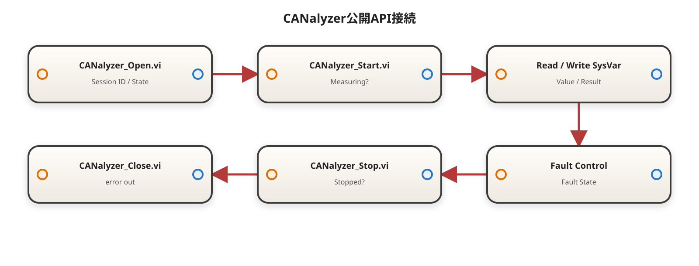

> **本章の役割**：既存のPython COM APIロジックをLabVIEW 2026 Q1 64bitのActiveX機能へ置き換え、CANalyzerの接続・新規起動・Configuration確認・Measurement制御・System Variable読書き・故障注入・最小PoC・LabVIEW単体本番VI・TestStand組み込みまでを、画面操作で再現できる粒度で定義する。
>
> VI作成手順は[00A_LabVIEW実装資料の記述ルール.md](./00A_LabVIEW実装資料の記述ルール.md)を正とし、ActiveXの一般仕様とCANalyzer固有Type Libraryの確認順は[00C](./00C_一次資料とバージョン基準.md)に従う。
>
> CANalyzer COM APIのプロパティ名・メソッド名は、対象PCに登録されたCANalyzer Type Libraryを一次情報とする。CANalyzerの版によって表示名や引数が異なる場合は推測で固定せず、`実機確認待ち`として`10_ActiveX_Wrapper`だけを差し替える。

**最終整理日：2026-08-24**

---

# 9.1 採用方針と現在地

## 9.1.1 確定事項

| 項目 | 採用内容 | 状態 |
|---|---|---|
| LabVIEW | 2026 Q1 64bit | 確定 |
| TestStand | 2026 Q1 64bit | 確定 |
| CANalyzer | 64bit | 確定 |
| CANalyzer版 | 確認中 | 実機確認待ち |
| 制御方式 | LabVIEW ActiveX Automation | 採用 |
| ProgID | `CANalyzer.Application` | 既存ロジックで使用済み |
| 起動済み環境 | 既存CANalyzerを再利用 | 必須 |
| 未起動環境 | LabVIEWからCANalyzerを起動 | 必須 |
| Configuration | 指定cfgを開く、または実cfgと照合 | 必須 |
| Measurement | Running確認、Start、Stop、Timeout | 必須 |
| Tx/Rx | System VariableのValue読書き | 必須 |
| 周期送信 | CAPLのTimerで実施 | 確定 |
| Alive Counter | CAPLで生成 | 確定 |
| Checksum | CAPLで生成 | 確定 |
| 故障注入 | System Variable経由でCAPLへ指示 | 確定 |

## 9.1.2 本章の実装範囲

```text
LabVIEW / TestStand
  ↓
30_Public
  ↓ Session IDと通常の数値・文字列・Booleanだけを公開
20_Service
  ↓ ActiveX参照保持、型変換、待ち、直列化
10_ActiveX_Wrapper
  ↓ Property Node / Invoke Node
CANalyzer.Application
  ├─ Configuration
  ├─ Measurement
  └─ System
       └─ Namespaces
            └─ Variables
                 └─ Item(...).Value
  ↓
CAPL
  ├─ 信号値をCANメッセージへ反映
  ├─ Alive Counter生成
  ├─ Checksum生成
  ├─ 周期送信
  └─ 故障注入
```

LabVIEWはCAN Payloadを直接組み立てない。通常送信用のAlive Counter生成VIとChecksum生成VIは作成しない。

---

# 9.2 既存COM APIロジックとの対応表

## 9.2.1 既存Python版の入力

既存ロジックは次の4列を持つExcelを読み込む。

| 列 | 意味 |
|---|---|
| `ID` | CANalyzer System VariableのNamespace |
| `Name` | Variable名 |
| `data` | Tx値 |
| `Wait` | 操作後の待ち時間、秒 |

基本アクセス：

```text
app.System.Namespaces("Namespace").Variables.Item("Variable").Value
```

RxはValueを読みログへ出す。TxはValueへ値を書き込む。

## 9.2.2 対応表

| 機能 | 既存Python COM API | LabVIEW ActiveX版 | ActiveX版で追加する理由 |
|---|---|---|---|
| Application取得 | `Dispatch("CANalyzer.Application")` | オートメーションを開く（Automation Open） | LabVIEW標準ActiveX機能へ統一 |
| 起動済み環境 | 起動済みを運用前提 | `Require Existing` | 未起動なら意図せず試験を始めない |
| 再利用または起動 | Dispatch挙動へ依存 | `Reuse Existing Or Launch` | 起動状態に関係なく自動準備 |
| 新規インスタンス要求 | なし | `Force New Instance` | PoC・複数構成の検証用 |
| 起動所有権 | なし | External / LabVIEW / Unknown | CleanupでQuit可否を判断 |
| cfg指定 | なし | Configuration Open | 試験対象cfgを自動準備 |
| cfg一致確認 | なし | Expected / Actual Path比較 | 誤cfg接続を検出 |
| Measurement確認 | なし | Running読出し | CAPL Timerが動く状態を確認 |
| Measurement開始 | 手動前提 | Start + Running待ち | Setupを自動化 |
| Measurement停止 | なし | 所有権付きStop | 手動開始Measurementを勝手に止めない |
| SysVar Tx | Valueへ代入 | `CANalyzer_Write_SysVar.vi` | 型検証、Verify、ログを追加 |
| SysVar Rx | Value読出し | `CANalyzer_Read_SysVar.vi` | 期待型と取得結果を明示 |
| 直列アクセス | 必須 | Resolver内へ集約 | 参照の取り違えを防ぐ |
| 行単位継続 | 例外時continue | Batch Policy | Stop / Continueを条件化 |
| Wait | 仕様書のみ | `Wait ms`を実装 | 仕様と実装を一致させる |
| Rx Excel書戻し | なし | 標準ではログのみ | 現行仕様を維持 |
| Session管理 | なし | Session Registry | ActiveX参照をTestStandへ出さない |
| 参照解放 | Python終了に依存 | Close Referenceを明示 | 長時間運転の参照リーク防止 |
| Version対応 | なし | Wrapper隔離 + Capability Probe | 別版で影響範囲を限定 |
| 故障注入 | 汎用SysVar書込 | 専用公開VI | TestStandの条件を分かりやすくする |
| Cleanup | なし | Fault Clear → Stop → Close | 次試験へ状態を残さない |

## 9.2.3 既存コードから引き継ぐ修正

- Txコードの列名`deta`は誤記であり、正式名を`data`とする。
- 互換Importerでは`deta`を検出した場合だけWarningを出して読込可能としてよい。
- 仕様書にある`Wait`は既存コードに未実装のため、LabVIEW版で初めて実装する。
- ExcelはCore層の必須依存にしない。標準入力はCluster配列またはCSVとする。

---

# 9.3 LabVIEW上で実施する動作

## 9.3.1 起動・接続

```text
A. 起動済みCANalyzerを再利用する
B. CANalyzerが未起動ならLabVIEWから起動する
C. 新規インスタンス作成を要求する
D. COM未登録、起動失敗、参照無効を区別する
E. Applicationを誰が起動したかを保持する
```

## 9.3.2 Configuration

```text
A. 指定cfgを開く
B. 起動済みCANalyzerの実cfgを取得する
C. Expected PathとActual Pathを比較する
D. 不一致時のError / WarningをPolicyで選ぶ
E. cfgをLabVIEWが開いたか保持する
```

## 9.3.3 Measurement

```text
A. Runningを読む
B. 停止中ならStartする
C. Running=Trueまでポーリングする
D. Timeoutで明確なエラーを返す
E. LabVIEWがStartしたMeasurementだけStopする
```

CAPLは`on start`で10、40、100、300、500、1000msのTimerを開始する。Mainへ進む前にMeasurementがRunningであることを確認する。

## 9.3.4 System Variable

```text
A. 1変数を書き込む
B. 1変数を読み取る
C. 複数変数を順番に処理する
D. Boolean / I32 / U32 / DBL / Stringを扱う
E. Namespace / Variable不存在を名称付きエラーにする
F. Write後にRead BackでVerifyできる
```

## 9.3.5 故障注入

```text
ALIVE_COUNTER = 0  → CAPLがAliveを正常更新
ALIVE_COUNTER != 0 → CAPLがAlive更新を停止

CHECKSUM = 0 → 正常Checksum
CHECKSUM = 1 → CAPLがChecksum+1を送信

TIMEOUT = 0 → output(message)
TIMEOUT != 0 → CAPLが対象フレームを送信しない
```

LabVIEWはこれらのSystem Variableを操作する。Alive Counter計算とChecksum計算はCAPLへ残す。

## 9.3.6 Cleanup

```text
故障注入System Variableを0へ戻す
  ↓
LabVIEWが開始したMeasurementだけStop
  ↓
子ActiveX参照をClose
  ↓
LabVIEW所有Applicationだけ必要に応じてQuit
  ↓
Application RefをClose
  ↓
Session Registryから削除
```

---

# 9.4 動作に必要なロジックとLabVIEW機能

| 必要ロジック | LabVIEW機能 | 主な用途 |
|---|---|---|
| ActiveX Server参照取得 | オートメーションを開く（Automation Open） | CANalyzer Application |
| Property読書き | プロパティノード（Property Node） | System、Measurement、Running、Value |
| Method呼出し | インボークノード（Invoke Node） | Start、Stop、cfg Open、Quit候補 |
| 参照解放 | リファレンスを閉じる（Close Reference） | ActiveX Ref解放 |
| LabVIEW値→Variant | バリアントへ変換（To Variant） | Wrapperへ渡す書込値 |
| Variant→LabVIEW値 | バリアントからデータに変換（Variant To Data） | Read値の型変換 |
| 型別処理 | ケースストラクチャ（Case Structure） | Value Type分岐 |
| Batch | Forループ（For Loop） | Request配列処理 |
| Measurement待ち | Tick Count + Wait (ms) | Timeout付きポーリング |
| Session保持 | 非初期化シフトレジスタを持つFGV | ActiveX参照保持 |
| 呼出し直列化 | 非再入Dispatcher | Thread競合防止 |
| 起動前後のプロセス確認 | System Execまたは実機で確定した検出方法 | Application所有権推定 |
| エラー情報追加 | 文字列にフォーマット（Format Into String） | 操作名、Namespace等をsourceへ追加 |

## 9.4.1 ActiveX機能の配置場所

| 日本語名 | 英語名 | 配置場所 |
|---|---|---|
| オートメーションを開く | Automation Open | 接続 → ActiveX |
| プロパティノード | Property Node | 接続 → ActiveX |
| インボークノード | Invoke Node | 接続 → ActiveX |
| リファレンスを閉じる | Close Reference | 接続 → ActiveX、またはプログラミング → アプリケーション制御 |
| バリアントへ変換 | To Variant | プログラミング → クラスタ、クラス、バリアント |
| バリアントからデータに変換 | Variant To Data | プログラミング → クラスタ、クラス、バリアント |

見つからない場合は`Ctrl + Space`で英語名を検索する。

---

# 9.5 Version依存と起動所有権

## 9.5.1 完全なVersion非依存ではない

Property NodeとInvoke Nodeは、開発時に選択したActiveX Type Libraryの型情報を保持する。すべてのCANalyzer版で無条件に動作することは保証できない。

```text
コンパイル時依存
  → 10_ActiveX_Wrapperだけへ閉じ込める

実行時判定
  → Version + Capability Probeで判定する
```

Public、Service、TestStandはCANalyzer固有ActiveX型へ依存させない。

## 9.5.2 Compatibility判定

| 判定 | 意味 |
|---|---|
| `Compatible` | 検証済み版で必須機能が使用可能 |
| `Compatible With Warning` | 未検証版だがCapability Probe成功 |
| `Unsupported` | 必須PropertyまたはMethodが使用不可 |
| `Unknown` | Version取得不可。接続のみ確認済み |

Capability Probe：

```text
Application Ref取得
System Ref取得
Measurement Ref取得
Running読出し
既知Read用SysVar取得
必要なら既知Write用SysVar読書き
```

## 9.5.3 起動モード

`CANalyzer_Launch_Mode.ctl`：

```text
Require Existing
Reuse Existing Or Launch
Force New Instance
```

| モード | 基本ロジック | 状態 |
|---|---|---|
| `Require Existing` | 起動済み検出後にAutomation Open `open new instance=False` | 正式候補 |
| `Reuse Existing Or Launch` | Automation Open `open new instance=False` | 正式候補 |
| `Force New Instance` | Automation Open `open new instance=True` | 実機PoC後に正式化 |

Automation Openの`open new instance=False`は、既存参照への接続を試み、接続できない場合に新規作成する可能性がある。したがって`Require Existing`ではAutomation Openの前に起動済み検出を行う。

## 9.5.4 Application所有権

`CANalyzer_Application_Ownership.ctl` の現行Enum順は次で扱う。

```text
Unknown
External
LabVIEW
```

初版`CANalyzer_Open.vi`の確定Ownership contract：

```text
Require Existing
  Pre Detect Found=True + Open success
  → External

Reuse Existing Or Launch
  Pre Found=True + Open success
  → External

  Pre Found=False + Open success + Post Found=True
  → LabVIEW

  Detect failure / Post Found=False / evidence ambiguous
  → Unknown

Force New Instance
  Open successでもstatic designでは
  → Unknown
```

`Unknown`では安全側としてApplication Quitを実行しない。Application Refの`Close Reference`はownershipに関係なく取得済みならcleanupで試行する。

## 9.5.5 実機確認待ちメンバ

| Wrapper目的 | 候補メンバ | 状態 |
|---|---|---|
| Version取得 | Application配下Version関連Property | 実機確認待ち |
| cfg Open | ApplicationまたはConfigurationのOpen Method | 実機確認待ち |
| cfg Path取得 | Path / FullName相当Property | 実機確認待ち |
| Application終了 | Quit相当Method | 実機確認待ち |
| Force New | `open new instance=True`時の実挙動 | 実機確認待ち |
| Process検出 | 実行ファイル名と複数版の挙動 | 実機確認待ち |

---

# 9.6 フォルダとVI構成

```text
40_CANalyzer\
├─ 00_Common\
│  ├─ CANalyzer_Launch_Mode.ctl
│  ├─ CANalyzer_Application_Ownership.ctl
│  ├─ CANalyzer_Compatibility_Policy.ctl
│  ├─ CANalyzer_Compatibility_Status.ctl
│  ├─ CANalyzer_Value_Type.ctl
│  ├─ CANalyzer_SysVar_Value.ctl
│  ├─ CANalyzer_SysVar_Request.ctl
│  ├─ CANalyzer_SysVar_Result.ctl
│  ├─ CANalyzer_Session_State.ctl
│  ├─ CANalyzer_Fault_Request.ctl
│  └─ CANalyzer_Error_Code.ctl
│
├─ 10_ActiveX_Wrapper\
│  ├─ CAN_AX_Open_Application.vi
│  ├─ CAN_AX_Get_System.vi
│  ├─ CAN_AX_Get_Measurement.vi
│  ├─ CAN_AX_Get_Measurement_Running.vi
│  ├─ CAN_AX_Start_Measurement.vi
│  ├─ CAN_AX_Stop_Measurement.vi
│  ├─ CAN_AX_Get_Namespace.vi
│  ├─ CAN_AX_Get_Variables.vi
│  ├─ CAN_AX_Get_Variable_Item.vi
│  ├─ CAN_AX_Read_Variable_Value.vi
│  ├─ CAN_AX_Write_Variable_Value.vi
│  ├─ CAN_AX_Get_Version.vi
│  ├─ CAN_AX_Get_Configuration.vi
│  ├─ CAN_AX_Get_Configuration_Path.vi
│  ├─ CAN_AX_Open_Configuration.vi
│  └─ CAN_AX_Quit_Application.vi
│
├─ 20_Service\
│  ├─ CANalyzer_Detect_Process.vi
│  ├─ CANalyzer_Session_Registry.vi
│  ├─ CANalyzer_Execute_Command.vi
│  ├─ CANalyzer_Resolve_SysVar.vi
│  ├─ CANalyzer_Wait_Measurement_State.vi
│  ├─ CANalyzer_Check_Compatibility.vi
│  ├─ CANalyzer_Verify_Configuration.vi
│  ├─ CANalyzer_Value_To_Variant.vi
│  ├─ CANalyzer_Variant_To_Value.vi
│  ├─ CANalyzer_Batch_Read.vi
│  ├─ CANalyzer_Batch_Write.vi
│  └─ CANalyzer_Clear_All_Faults_Core.vi
│
├─ 30_Public\
│  ├─ CANalyzer_Open.vi
│  ├─ CANalyzer_Start.vi
│  ├─ CANalyzer_Read_SysVar.vi
│  ├─ CANalyzer_Write_SysVar.vi
│  ├─ CANalyzer_Batch_Read_SysVar.vi
│  ├─ CANalyzer_Batch_Write_SysVar.vi
│  ├─ CANalyzer_Set_Message_Fault.vi
│  ├─ CANalyzer_Clear_Message_Faults.vi
│  ├─ CANalyzer_Clear_All_Faults.vi
│  ├─ CANalyzer_Health_Check.vi
│  ├─ CANalyzer_Stop.vi
│  └─ CANalyzer_Close.vi
│
├─ 40_PoC\
│  ├─ PoC_CANalyzer_01_Open_Close.vi
│  ├─ PoC_CANalyzer_02_SysVar_Read_Write.vi
│  ├─ PoC_CANalyzer_03_Launch_Config_Start.vi
│  ├─ PoC_CANalyzer_04_Fault_Control.vi
│  └─ PoC_CANalyzer_05_Compatibility.vi
│
├─ 50_Standalone\
│  ├─ CANalyzer_Standalone_Main.vi
│  └─ CANalyzer_Standalone_Config.ctl
│
└─ 90_TestStand\
   └─ CANalyzer_TestStand_Mapping.md
```

## 9.6.1 レイヤ責務

| レイヤ | 責務 | 含めないもの |
|---|---|---|
| `00_Common` | typedef、通常型の要求・結果 | ActiveXノード |
| `10_ActiveX_Wrapper` | 1 Propertyまたは1 Method | Session、Batch、TestStand |
| `20_Service` | 参照解決、Variant変換、待ち、直列化、保持 | TestStand変数 |
| `30_Public` | 1イベント1VI | 生ActiveX Ref、Raw Variant |
| `40_PoC` | 下位から順に動作確認 | 本番シナリオ |
| `50_Standalone` | TestStandなしの本番制御 | Wrapper直呼び |
| `90_TestStand` | 変数マッピング | ActiveX詳細 |

---

# 9.7 typedef作成

# 9.7.1 `CANalyzer_Value_Type.ctl`

```text
Boolean
I32
U32
DBL
String
```

`Variant Raw`はPublicへ公開しない。

# 9.7.2 `CANalyzer_SysVar_Value.ctl`

| 要素 | 型 | 用途 |
|---|---|---|
| `Value Type` | Enum | 使用する値を選択 |
| `Boolean Value` | Boolean | Boolean時 |
| `Numeric Value` | DBL | I32 / U32 / DBL時 |
| `String Value` | String | String時 |

Value Typeで選択されていないフィールドは無視する。

# 9.7.3 `CANalyzer_SysVar_Request.ctl`

| 要素 | 型 |
|---|---|
| `Namespace` | String |
| `Variable Name` | String |
| `Value` | `CANalyzer_SysVar_Value.ctl` |
| `Wait ms` | U32 |
| `Continue On Error?` | Boolean |
| `Verify After Write?` | Boolean |
| `Tag` | String |

# 9.7.4 `CANalyzer_SysVar_Result.ctl`

| 要素 | 型 |
|---|---|
| `Namespace` | String |
| `Variable Name` | String |
| `Value` | `CANalyzer_SysVar_Value.ctl` |
| `Success?` | Boolean |
| `Verified?` | Boolean |
| `Skipped?` | Boolean |
| `Elapsed ms` | U32 |
| `Tag` | String |
| `error` | error cluster |

# 9.7.5 `CANalyzer_Session_State.ctl`

| 要素 | 型 | 用途 |
|---|---|---|
| `Session ID` | U32 | 外部識別子 |
| `Application Ref` | ActiveX Refnum | 内部のみ |
| `System Ref` | ActiveX Refnum | 内部のみ |
| `Measurement Ref` | ActiveX Refnum | 内部のみ |
| `Version String` | String | 実版 |
| `Configuration Path` | Path | 実cfg |
| `Launch Mode` | Enum | Open条件 |
| `Application Ownership` | Enum | Quit可否 |
| `Configuration Opened By LabVIEW?` | Boolean | cfg所有権 |
| `Measurement Started By LabVIEW?` | Boolean | Stop所有権 |
| `Is Connected?` | Boolean | 状態 |
| `Is Measuring?` | Boolean | 状態 |
| `Compatibility Status` | Enum | 互換性 |

ActiveX Refを含むためTestStandへ直接渡さない。

# 9.7.6 `CANalyzer_Compatibility_Policy.ctl`

2026-08-24の`CANalyzer_Open.vi` Final Integration Design ClosureでProduction contractを次に固定する。

```text
Require Compatible
Allow Warning
Allow Unknown
```

Enum順を変更しない。

| Compatibility Status | Require Compatible | Allow Warning | Allow Unknown |
|---|---:|---:|---:|
| `Compatible` | Accept | Accept | Accept |
| `Compatible With Warning` | Reject | Accept | Accept |
| `Unknown` | Reject | Reject | Accept |
| `Unsupported` | Reject | Reject | Reject |

`Allow Unknown`で受け入れるUnknownはmandatory probe pass済みのUnknownに限る。`Unsupported`は全PolicyでRejectする。

---

# 9.8 ActiveX Wrapper作成

# 9.8.1 `CAN_AX_Open_Application.vi`

<!-- generated-vi-diagram -->
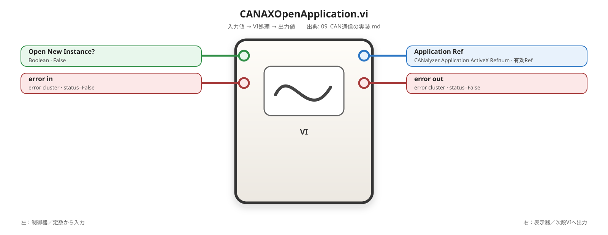

## 0. 目的と処理概要

CANalyzer ApplicationのActiveX参照を取得する。起動モード判定と所有権判定はServiceへ置き、本VIはAutomation Openだけを担当する。

## 1. 入出力

| 端子 | 方向 | 型 |
|---|---|---|
| `Open New Instance?` | 入力 | Boolean |
| `error in` | 入力 | error cluster |
| `Application Ref` | 出力 | CANalyzer Application ActiveX Refnum |
| `error out` | 出力 | error cluster |

## 2. 配置する関数

| 数 | 日本語名 | 英語名 | 配置場所 |
|---:|---|---|---|
| 1 | オートメーションrefnum制御器 | Automation Refnum | フロントパネル → Refnum |
| 1 | オートメーションを開く | Automation Open | 接続 → ActiveX |
| 1 | ケースストラクチャ | Case Structure | プログラミング → ストラクチャ |

## 3. 配線順

1. フロントパネルへAutomation Refnumを配置する。
2. 右クリックし`ActiveXクラスを選択 → 参照`を開く。
3. CANalyzer Type LibraryからApplicationクラスを選択する。
4. Automation Openの`automation refnum`へApplication型定数を接続する。
5. `Open New Instance?`を`open new instance`へ接続する。
6. `error in`を接続する。
7. 出力refnumを`Application Ref`へ接続する。
8. error clusterを`error out`へ接続する。
9. 外側Caseで既存エラー時は実処理をスキップする。

## 4. 単体テスト

| CANalyzer状態 | Open New Instance? | 期待結果 |
|---|---:|---|
| 起動済み | False | 参照取得 |
| 未起動 | False | 起動または参照取得。実挙動記録 |
| 起動済み | True | 新規要求。実挙動記録 |
| COM未登録 | 任意 | Automation Openエラー |
| 既存エラー | 任意 | 実処理スキップ |

推奨プローブ：Automation Openのrefnum、error out。

# 9.8.2 `CAN_AX_Get_System.vi`

<!-- generated-vi-diagram -->
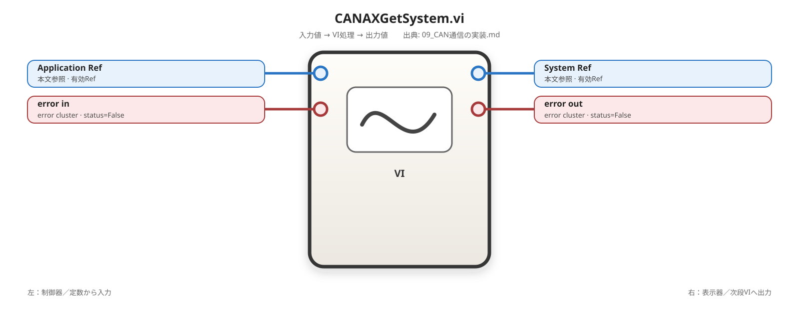

## 0. 目的

Application RefからSystem Refを取得する。

## 1. 入出力

```text
Application Ref → System Ref
error in        → error out
```

## 2. 配置

プロパティノード（Property Node）を1個配置する。

## 3. 配線順

1. Application RefをProperty Nodeの`reference`へ接続する。
2. `System` Propertyを選択する。
3. 出力を`System Ref`へ接続する。
4. error clusterを直列接続する。

## 4. 単体テスト

Application取得直後に有効System Refが返ることを確認する。

# 9.8.3 `CAN_AX_Get_Measurement.vi`

<!-- generated-vi-diagram -->
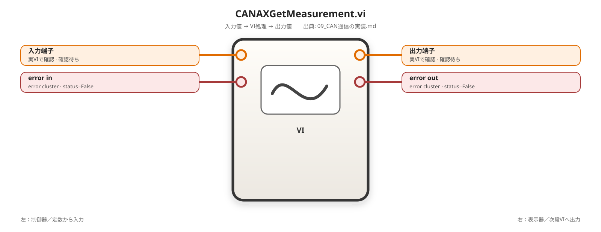

`CAN_AX_Get_System.vi`と同じ構造で、Propertyを`Measurement`へ変更する。

# 9.8.4 `CAN_AX_Get_Measurement_Running.vi`

<!-- generated-vi-diagram -->


## 1. 入出力

```text
Measurement Ref
error in
  ↓
Running? Boolean
error out
```

## 3. 配線順

1. Measurement RefをProperty Nodeへ接続する。
2. 読取Propertyとして`Running`を選択する。
3. Boolean出力を`Running?`へ接続する。
4. error clusterを直列接続する。

停止中=False、実行中=TrueをCANalyzer画面と照合する。

# 9.8.5 `CAN_AX_Start_Measurement.vi`

<!-- generated-vi-diagram -->


Measurement RefをInvoke Nodeへ接続し、Type Libraryに表示される`Start` Methodを選択する。Running待ちは本VIへ入れない。

# 9.8.6 `CAN_AX_Stop_Measurement.vi`

<!-- generated-vi-diagram -->


Startと同じ構成でMethodを`Stop`へ変更する。

# 9.8.7 System Variable参照取得

```text
System Ref
  → Namespace Ref
  → Variables Ref
  → Variable Ref
```

## `CAN_AX_Get_Namespace.vi`

<!-- generated-vi-diagram -->


1. System RefをProperty NodeまたはInvoke Nodeへ接続する。
2. `Namespaces`のindexed accessを選択する。
3. Namespace Stringをindexまたは引数へ接続する。
4. Namespace Refを出力する。

## `CAN_AX_Get_Variables.vi`

<!-- generated-vi-diagram -->
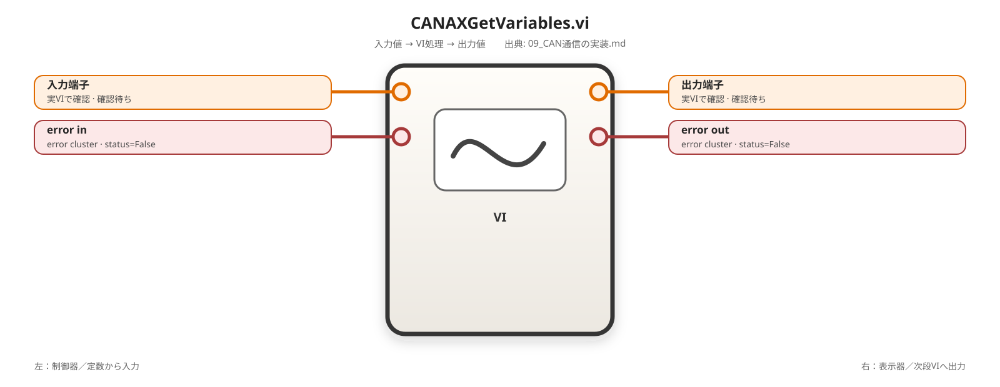

Namespace Refの`Variables` Propertyを読み、Variables Refを出力する。

## `CAN_AX_Get_Variable_Item.vi`

<!-- generated-vi-diagram -->


Variables Refの`Item`へVariable Nameを渡し、Variable Refを出力する。

Type LibraryでPropertyまたはMethodのどちらとして表示されるかを確認し、表示された正式メンバを使用する。

# 9.8.8 `CAN_AX_Read_Variable_Value.vi`

<!-- generated-vi-diagram -->


## 1. 入出力

```text
Variable Ref
error in
  ↓
Value Variant
error out
```

## 3. 配線順

1. Variable RefをProperty Nodeへ接続する。
2. `Value`を選択する。
3. 読取モードにする。
4. 出力を`Value Variant`へ接続する。
5. error clusterを直列接続する。

# 9.8.9 `CAN_AX_Write_Variable_Value.vi`

<!-- generated-vi-diagram -->


## 1. 入出力

```text
Variable Ref
Value Variant
error in
  ↓
error out
```

## 3. 配線順

1. Variable RefをProperty Nodeへ接続する。
2. `Value`を選択する。
3. Property Nodeを右クリックして書込へ変更する。
4. Value VariantをValue入力へ接続する。
5. error clusterを直列接続する。

# 9.8.10 Version・Configuration・Quit Wrapper

CANalyzer版確定後、Type Libraryの正式メンバで作成する。

```text
CAN_AX_Get_Version.vi
CAN_AX_Get_Configuration.vi
CAN_AX_Get_Configuration_Path.vi
CAN_AX_Open_Configuration.vi
CAN_AX_Quit_Application.vi
```

1VIへ1 Propertyまたは1 Methodだけを置く。

`CAN_AX_Get_Configuration.vi` はApplication Refから`CANalyzer.IConfiguration16`を取得し、`CAN_AX_Get_Configuration_Path.vi` はそのConfiguration Refの`Path` PropertyをStringで返す。これらのWrapperはConfiguration RefをCloseしないため、取得したService側が所有権に従ってCloseする。

---

# 9.9 Service VI作成

# 9.9.1 `CANalyzer_Detect_Process.vi`

<!-- generated-vi-diagram -->
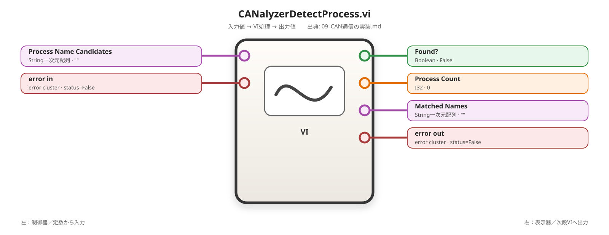

## 0. 目的

Automation Open前後のCANalyzerプロセス状態を確認し、`Require Existing`のガードとApplication所有権推定に使用する。

## 1. 入出力

| 端子 | 方向 | 型 |
|---|---|---|
| `Process Name Candidates` | 入力 | String一次元配列 |
| `error in` | 入力 | error cluster |
| `Found?` | 出力 | Boolean |
| `Process Count` | 出力 | I32 |
| `Matched Names` | 出力 | String一次元配列 |
| `error out` | 出力 | error cluster |

実装方法は対象PCで確認した実行ファイル名に合わせる。候補名をVIへ固定せず外部設定から渡す。

プロセス検出は所有権の補助情報であり、COM Running Object Tableへの登録を完全に証明するものではない。判定が曖昧ならOwnership=`Unknown`とする。

# 9.9.2 `CANalyzer_Resolve_SysVar.vi`

<!-- generated-vi-diagram -->


## 0. 目的

System Ref、Namespace、Variable NameからVariable Refを取得する。既存Python版の直列アクセスを1VIへ閉じ込める。

## 1. 入出力

```text
System Ref
Namespace String
Variable Name String
error in
  ↓
Variable Ref
error out
```

## 2. SubVI

```text
CAN_AX_Get_Namespace.vi
CAN_AX_Get_Variables.vi
CAN_AX_Get_Variable_Item.vi
Close Reference × 2
```

## 3. 配線順

1. System RefとNamespaceをGet Namespaceへ接続する。
2. Namespace RefをGet Variablesへ接続する。
3. Variables RefとVariable NameをGet Itemへ接続する。
4. error clusterを直列接続する。
5. Variable Refを出力する。
6. Namespace RefとVariables RefをCloseする。
7. エラーsourceへNamespaceとVariable Nameを追加する。

Variable Refは呼出側が使用後にCloseする。

# 9.9.3 `CANalyzer_Value_To_Variant.vi`

<!-- generated-vi-diagram -->


## 0. 目的

Publicで使用する通常型ClusterをActiveX書込用Variantへ変換する。

## 3. 配線順

1. Value TypeをCase Structureへ接続する。
2. BooleanケースではBoolean ValueをTo Variantへ接続する。
3. I32ケースではNumeric ValueがI32範囲内か、小数部が0かを検証する。
4. 検証後にI32へ変換しTo Variantへ接続する。
5. U32も範囲と小数部を検証する。
6. DBLケースではNumeric Valueを接続する。
7. StringケースではString Valueを接続する。
8. 全ケースのVariant出力とerror outを配線する。

# 9.9.4 `CANalyzer_Variant_To_Value.vi`

<!-- generated-vi-diagram -->


Value Typeに応じた型定数をVariant To Dataの`type`へ接続し、結果を`CANalyzer_SysVar_Value.ctl`へ格納する。

変換不能時はcode=`-710106`と期待型をsourceへ追加する。

# 9.9.5 `CANalyzer_Wait_Measurement_State.vi`

<!-- generated-vi-diagram -->
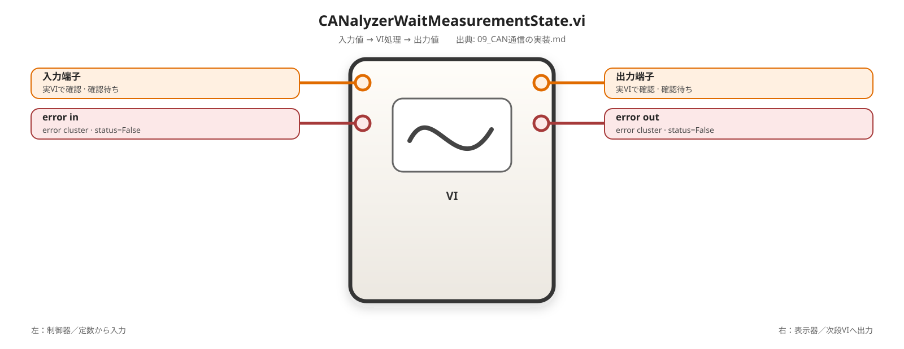

## 0. 目的

Runningが期待値になるまで待ち、Timeoutする。

## 1. 入出力

```text
Measurement Ref
Expected Running? Boolean
Timeout ms U32
Poll Interval ms U32
error in
  ↓
Actual Running? Boolean
Elapsed ms U32
error out
```

## 2. 配置

```text
While Loop
Tick Count × 2以上
Wait (ms)
CAN_AX_Get_Measurement_Running.vi
比較、OR
```

## 3. 配線順

1. Loop前にStart Tickを取得する。
2. Loop内でRunningを読む。
3. RunningとExpectedを比較する。
4. Current Tick - Start TickをElapsedとする。
5. Elapsed >= Timeoutを判定する。
6. 状態一致、Timeout、error.statusをORし停止条件へ接続する。
7. 継続時だけPoll IntervalをWaitへ接続する。
8. Timeout時はcode=`-710104`を生成する。

推奨初期値：Poll=100ms。

# 9.9.6 `CANalyzer_Session_Registry.vi`

<!-- generated-vi-diagram -->
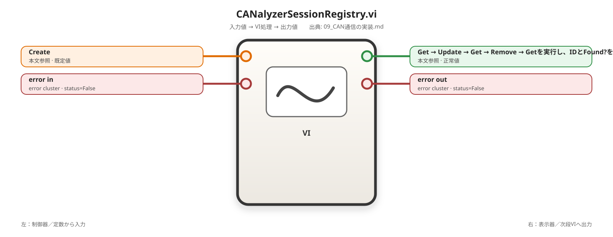

## 0. 目的

ActiveX参照をLabVIEW内部に保持し、外部へSession IDだけを公開する。

## 1. 入出力

```text
Action: Create / Get / Update / Remove / Clear All
Session ID U32
Session In Cluster
error in
  ↓
Session ID Out U32
Session Out Cluster
Found? Boolean
error out
```

## 2. 実装

- 非再入実行にする。
- 1回だけ動くWhile Loopを配置する。
- 非初期化シフトレジスタへSession配列とNext IDを保持する。
- Removeは配列削除だけにし、参照CloseはPublic Closeで先に行う。

## 4. 単体テスト

Create → Get → Update → Get → Remove → Getを実行し、IDとFound?を確認する。

# 9.9.7 `CANalyzer_Execute_Command.vi`

<!-- generated-vi-diagram -->


## 0. 目的

すべての本番ActiveX操作を1本の非再入VIへ通し、異なるPublic VIが複数Threadから呼ばれても直列化する。

```text
Public VI
  → Command Cluster
  → CANalyzer_Execute_Command.vi（非再入）
  → Registry / Service / Wrapper
  → Result
```

PoCではWrapper直呼び可。本番前にDispatcher経由へ統一する。

# 9.9.8 `CANalyzer_Verify_Configuration.vi`

> 詳細な設計判断の根拠は [`09I_CANalyzer_Verify_Configuration設計.md`](./09I_CANalyzer_Verify_Configuration設計.md) を参照する。本節を**作成・再構築手順の正本**とし、同じ詳細手順を別章へ複製しない。
>
> 2026-08-24時点でFocused As-Built ReviewおよびClosure Spot Checkを完了し、`P0=0 / P1=0`、Functional Design Alignment=`PASS`。Broken Run Arrowは人間確認で問題なし。残るP2は内部定数名のcosmetic事項のみで、機能Closureを阻害しない。

## 0. 目的と処理概要

`CANalyzer_Verify_Configuration.vi` は `20_Service` に属するread-only Verify Serviceである。callerが所有する`CANalyzer.IApplication10`を借用し、CANalyzerで現在有効なConfiguration Pathを取得して、callerが要求するExpected Configuration Pathと照合する。

このVIはConfigurationを開かない。状態変更は上位`CANalyzer_Open.vi`の責務とし、本VIは「今開かれているConfigurationが期待どおりか」の確認だけを行う。

```text
Application Ref（borrowed / never close）
  ↓
Expected PathをTrim・入力検証
  ↓
CAN_AX_Get_Configuration.vi
  ↓
Configuration Ref（temporary）
  ↓
CAN_AX_Get_Configuration_Path.vi
  ↓
Actual Path raw String
  ↓
Expected / Actualを同一規則でnormalize
  ↓
Equal? exact compare
  ↓
Match / -710103 Mismatch
  ↓
Configuration Refを取得済みの場合だけClose
  ↓
Operation Error > Cleanup Errorで最終errorを選択
```

本VIでは次を行わない。

- Configuration Open / Save
- Measurement Start / Stop
- SysVar Read / Write
- Version判定
- Compatibility Probe
- Session Registry操作
- `CANalyzer_Execute_Command.vi`経由化
- Application Quit
- Application Ref Close
- relative path canonicalization
- mapped driveとUNCのalias解決

### 0.1 確定設計仕様

| ID | 仕様 |
|---|---|
| F-01 | `error in.status=True`ではActiveX処理を開始せず、元errorをそのまま返す |
| F-02 | `Expected Configuration Path`は最初に`Trim Whitespace.vi`へ通す |
| F-03 | Trim後Expectedがemptyなら`-710116`を返し、ActiveX処理を開始しない |
| F-04 | `CAN_AX_Get_Configuration.vi`でConfiguration Refを取得する |
| F-05 | `CAN_AX_Get_Configuration_Path.vi`でActual PathをStringとして取得する |
| F-06 | Expected / Actualの両方へ`Trim → /を\へ置換 → lowercase`を同じ順序で適用する |
| F-07 | 比較は`Equal?`によるnormalized Stringの完全一致とする |
| F-08 | mismatch時は`-710103`を返す |
| F-09 | mismatch sourceはExpectedにtrim済み期待値、Actualにraw取得値を残す |
| F-10 | `Actual Configuration Path`出力にはnormalize前のraw Actual Pathを返す |
| F-11 | Configuration RefはGet Configuration成功時だけ「acquired」とし、acquired時だけCloseする |
| F-12 | Get Configuration failure時はunacquired RefをCloseしない |
| F-13 | Get Path failure / Match / Mismatchではacquired Configuration RefをCloseする |
| F-14 | 最終error優先順位は`Operation Error > Cleanup Error`とする |
| F-15 | Application Refはcaller-ownedのため本VIでは絶対にCloseしない |

### 0.2 Path比較契約

初版のExpected Pathはfully-qualified absolute Windows file path Stringを前提とする。absolute UNC pathは使用可能とする。

```text
Expected:
Trim Whitespace
→ Search and Replace String で "/" を "\" へ全置換
→ To Lower Case

Actual:
Trim Whitespace
→ Search and Replace String で "/" を "\" へ全置換
→ To Lower Case

Normalized Expected == Normalized Actual
```

初版ではrelative→absolute変換、`.` / `..`解決、short/long path同一視、junction / symbolic link解決、mapped driveとUNCの同一視、network alias解決、trailing separator吸収は行わない。

## 1. 入出力

| 端子 | 方向 | 型 | 用途 |
|---|---|---|---|
| `CANalyzer.IApplication10` | 入力 | ActiveX Ref | caller-owned Application Ref。borrowed、never close |
| `Expected Configuration Path` | 入力 | String | 期待するfully-qualified absolute Configuration Path |
| `エラー入力 (エラーなし)` | 入力 | error cluster | prior error。status=Trueなら最外周でbypass |
| `Actual Configuration Path` | 出力 | String | CANalyzerから取得したraw Configuration Path |
| `Configuration Match?` | 出力 | Boolean | normalized Expected / Actualの完全一致結果 |
| `エラー出力` | 出力 | error cluster | 元error、`-710116`、`-710103`、Wrapper error、Cleanup-only errorの最終結果 |

Connector Paneは3 inputs / 3 outputsとする。

```text
Left upper   : CANalyzer.IApplication10
Left middle  : Expected Configuration Path
Left lower   : エラー入力 (エラーなし)
Right upper  : Actual Configuration Path
Right middle : Configuration Match?
Right lower  : エラー出力
```

## 2. 配置する関数およびSubVI等

| 数 | 日本語名 / 実VI表示名 | 英語名 | 配置場所・追加方法 | 用途 |
|---:|---|---|---|---|
| 1 | `CAN_AX_Get_Configuration.vi` | SubVI | `60_CAN\10_ActiveX_Wrapper` | Application Refから`CANalyzer.IConfiguration16`を取得 |
| 1 | `CAN_AX_Get_Configuration_Path.vi` | SubVI | `60_CAN\10_ActiveX_Wrapper` | Configuration Refの`Path`をStringで取得 |
| 2 | `Trim Whitespace.vi` | Trim Whitespace | Quick Dropで`Trim Whitespace` | Expected / Actual先頭末尾の空白除去 |
| 1 | 空文字列/パス判定 | Empty String/Path? | プログラミング → 文字列 | trim後Expectedのempty判定 |
| 2 | 文字列検索・置換 | Search and Replace String | プログラミング → 文字列 | `/`を`\`へ全置換 |
| 2 | 小文字へ変換 | To Lower Case | プログラミング → 文字列 | case-insensitive比較用normalize |
| 1 | 等しい? | Equal? | プログラミング → 比較 | normalized Stringのexact compare |
| 必要数 | 名前でバンドル解除 | Unbundle By Name | プログラミング → クラスタ、クラス、バリアント | error.status取得 |
| 必要数 | 名前でバンドル | Bundle By Name | プログラミング → クラスタ、クラス、バリアント | `-710116` / `-710103` error生成 |
| 1 | 文字列にフォーマット | Format Into String | プログラミング → 文字列 | mismatch sourceへExpected/Actualを埋め込む |
| 1 | エラーをクリア | Clear Errors | Quick Dropで`Clear Errors` | cleanup error chainをOperation Errorから分離 |
| 1 | リファレンスを閉じる | Close Reference | 接続 → ActiveX、またはプログラミング → アプリケーション制御 | acquired Configuration RefのClose |
| 必要数 | ケースストラクチャ | Case Structure | プログラミング → ストラクチャ | incoming / validation / wrapper result / compare / cleanup gate / final error選択 |

関数がパレットで見つからない場合は`Ctrl + Space`を開き、表の英語名でQuick Drop検索する。実VIで確認したSubVI connectorを優先し、存在しない端子名を推測で追加しない。

## 3. 配線順

### 3.1 Front PanelとConnector Pane

1. Front Panelへ`CANalyzer.IApplication10` ActiveX Ref control、String control `Expected Configuration Path`、error cluster control `エラー入力 (エラーなし)`を配置する。
2. String indicator `Actual Configuration Path`、Boolean indicator `Configuration Match?`、error cluster indicator `エラー出力`を配置する。
3. Label先頭へtabなどの不可視文字を入れない。
4. Connector Paneへ1節の3-in / 3-out配置で割り当てる。

### 3.2 Incoming Error Guard

1. `エラー入力 (エラーなし)`を`Unbundle By Name`へ接続し、`status`を取り出す。
2. `status`を最外周Case Structureのselectorへ接続する。
3. True CaseではActiveX SubVIを配置しない。`Actual Configuration Path=""`、`Configuration Match?=False`、`エラー出力=元error in`を明示配線する。
4. False Caseだけを通常処理へ進める。

### 3.3 Expected Path入力検証

1. `Expected Configuration Path`を1個目の`Trim Whitespace.vi`へ接続し、出力を`Trimmed Expected`として扱う。
2. `Trimmed Expected`を`Empty String/Path?`へ接続する。
3. empty=True Caseでは`Actual Configuration Path=""`、`Configuration Match?=False`を明示する。
4. 同Caseでerror clusterを`Bundle By Name`し、`status=True`、`code=-710116`、`source="CANalyzer_Verify_Configuration.vi / Invalid Expected Configuration Path"`を設定する。
5. empty=True Caseから`CAN_AX_Get_Configuration.vi`へ進まない。

### 3.4 Configuration Ref取得

1. empty=False Caseで`CAN_AX_Get_Configuration.vi`を配置する。
2. `CANalyzer.IApplication10`をSubVIのApplication Ref入力へ接続する。
3. 現在のoperation error wireをSubVIのerror inへ接続する。
4. SubVIの`Configuration Ref`と`error out`を受ける。
5. Get Configurationのerror statusで分岐する。
6. failure Caseでは`Actual Configuration Path=""`、`Configuration Match?=False`、Operation Error=元Wrapper error、`Configuration Ref Acquired?=False`とする。`-710103`へ変換しない。
7. success CaseではConfiguration Refを保持し、`Configuration Ref Acquired?=True`として次へ進む。

### 3.5 Configuration Path取得

1. Get Configuration success Caseだけに`CAN_AX_Get_Configuration_Path.vi`を配置する。
2. acquired Configuration RefをSubVIへ接続する。
3. operation error wireをerror inへ接続する。
4. Path出力Stringを`Raw Actual Path`として保持する。
5. Get Path failureでは`Actual Configuration Path=""`、`Configuration Match?=False`、Operation Error=元Wrapper error、`Configuration Ref Acquired?=True`を保持してcleanupへ進む。
6. Get Path successだけをPath比較へ進める。

### 3.6 Expected / Actual Path normalize

Expected側：

1. `Trimmed Expected`を1個目の`Search and Replace String`へ接続する。
2. search stringへ`/`、replace stringへ`\`を設定し、対象を全置換する設定にする。
3. 置換後Stringを1個目の`To Lower Case`へ接続し、`Normalized Expected`とする。

Actual側：

4. `Raw Actual Path`を2個目の`Trim Whitespace.vi`へ接続する。
5. Trim出力を2個目の`Search and Replace String`へ接続し、Expected側と同じ`/`→`\`全置換を行う。
6. 置換後Stringを2個目の`To Lower Case`へ接続し、`Normalized Actual`とする。
7. `Raw Actual Path`は別wireで保持し、`Actual Configuration Path`出力と診断source用に使用する。normalize後値をActual出力へ接続しない。

### 3.7 Exact Compare

1. `Normalized Expected`と`Normalized Actual`を`Equal?`へ接続する。
2. Equal?出力をMatch / Mismatch Case Structureのselectorへ接続する。
3. substring、Contains、filename-only比較へ置き換えない。

### 3.8 Match / Mismatch

Match=True Case：

1. `Actual Configuration Path=Raw Actual Path`を接続する。
2. `Configuration Match?=True`を接続する。
3. Operation ErrorをNo Errorのまま保持する。

Mismatch Case：

4. `Actual Configuration Path=Raw Actual Path`を接続する。
5. `Configuration Match?=False`を接続する。
6. `Format Into String`で次を作る。

```text
CANalyzer_Verify_Configuration.vi / Configuration Mismatch
Expected=%s
Actual=%s
```

7. 1個目の`%s`には`Trimmed Expected`を接続する。lowercase済みNormalized Expectedを診断sourceへ使わない。
8. 2個目の`%s`には`Raw Actual Path`を接続する。
9. error clusterを`Bundle By Name`し、`status=True`、`code=-710103`、`source=Format Into String出力`を設定する。
10. Wrapper successかつ`Raw Actual Path=""`の場合も通常のMismatchとして`-710103`を返す。

### 3.9 Conditional Cleanup

1. operation結果とは別に`Configuration Ref Acquired?` Booleanをcleanup Case Structureのselectorへ接続する。
2. False CaseはCloseを実行しない。cleanup errorはNo Errorとする。
3. True Caseではoperation error wireをClose Referenceへ直接入れない。
4. `Clear Errors.vi`または明示的なNo Errorからcleanup用error chainを開始する。
5. acquired Configuration Refを`Close Reference`へ接続する。
6. Close Referenceのerror outを`Cleanup Error`として保持する。
7. Get Configuration failureではAcquired=FalseなのでCloseしない。
8. Get Path failure / Match / MismatchではAcquired=TrueなのでCloseする。
9. Application RefをClose Referenceへ接続しない。

### 3.10 Final Error Selection

1. 保持していた`Operation Error.status`を取得する。
2. Final Error用Case Structureのselectorへ接続する。
3. Operation status=Falseでは`Cleanup Error`を`エラー出力`へ接続する。これによりClose-only failureを失わない。
4. Operation status=Trueでは`Operation Error`を`エラー出力`へ接続する。Cleanup Errorで主原因を上書きしない。

優先順位は次で固定する。

| Operation | Cleanup | Final Error |
|---|---|---|
| OK | OK | No Error |
| OK | FAIL | Cleanup Error |
| FAIL | OK | Operation Error |
| FAIL | FAIL | Operation Error |

## 4. 単体テスト

### 4.1 静的受け入れ条件

| Case | 入力 / 状態 | 期待結果 |
|---|---|---|
| Incoming Error | `error in.status=True` | Actual=`""`、Match=False、元error、ActiveX未実行 |
| Expected whitespace-only | Trim後empty | Actual=`""`、Match=False、`-710116`、ActiveX未実行 |
| Normalize symmetry | Expected=`" C:/Test/Config.cfg "`、Actual=`" c:\test\config.cfg "` | Match=True |
| Get Configuration failure | Wrapper failure | 元Wrapper error、Config Ref Closeしない |
| Get Path failure | Config取得成功後にPath failure | 元Wrapper error、Config Ref Closeする |
| Different cfg | normalized String不一致 | Match=False、`-710103`、Config Ref Closeする |
| Match | normalized String一致 | Match=True、Operation Errorなし、Config Ref Closeする |
| Actual empty | Wrapper success、Actual=`""` | Match=False、`-710103` |
| Operation OK + Close FAIL | Close Reference failure | Final Error=Cleanup Error |
| Operation FAIL + Close FAIL | operationとCloseの両方failure | Final Error=Operation Error |
| Application Ref ownership | 任意 | Application Refを一度もCloseしない |

### 4.2 As-Built確認状態

| 項目 | 状態 |
|---|---|
| 3 inputs / 3 outputs | PASS |
| Incoming Error Guard | PASS |
| Empty Expected `-710116` | PASS |
| Get Configuration / Get Path | PASS |
| Expected / Actual normalize symmetry | PASS |
| Exact Compare | PASS |
| Mismatch `-710103` | PASS |
| Wrapper error preservation | PASS |
| Raw Actual Path output | PASS |
| Conditional Configuration Ref cleanup | PASS |
| Application Ref never close | PASS |
| Operation Error > Cleanup Error | PASS |
| Forbidden side effects | PASS |
| Broken Run Arrow | **NO（人間確認済み）** |
| P0 | 0 |
| P1 | 0 |
| 残件 | P2 cosmetic only |

### 4.3 Source / Version / Verified by / State

| 項目 | 内容 |
|---|---|
| Source | local Projectの`CANalyzer_Verify_Configuration.vi`、`CAN_AX_Get_Configuration.vi`、`CAN_AX_Get_Configuration_Path.vi`、登録済みCANalyzer Type Library |
| Version | RepositoryのCANalyzer実装基準と00Cに従う。製品Version固有差はWrapper層へ閉じ込める |
| Verified by | Final Design Closure、Focused As-Built Review、Closure Spot Check、Broken Run Arrow人間確認 |
| State | **AS-BUILT CONFIRMED / Functional Design Alignment PASS** |

実機CANalyzerを使用したruntime/hardware E2E結果は本節のstatic As-Built確認とは別に記録する。

---

# 9.10 Public API VI

# 9.10.1 `CANalyzer_Open.vi`

<!-- generated-vi-diagram -->
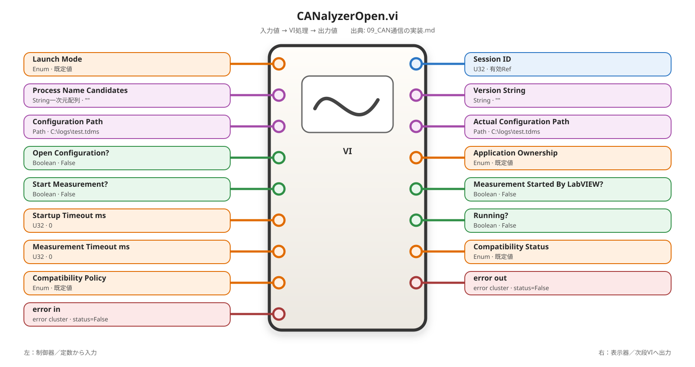

> **Final Design Review Baseline:** 詳細なFinal Integration Design Closure、Static Acceptance、P0/P1 Model Check Gateは [`09J_CANalyzer_Open設計.md`](./09J_CANalyzer_Open設計.md) を正とする。本節はCANalyzer全体ガイド上の統合要約であり、実装後のModel Check Review Promptは09Jを基準に作成する。
>
> 2026-08-24時点でFinal Integration Design Closure AmendmentおよびImplementation-Blocking Final Closure Spot Checkを完了し、**P0=0 / P1=0 / READY FOR MANUAL IMPLEMENTATION**。Implementation / As-Built Review / runtime E2Eは未実施。

## 0. 目的と責務

`CANalyzer_Open.vi`は`30_Public`に属するSession ID発行前bootstrap Public APIである。Process Detect、Automation Open、Ownership、Compatibility Phase 1、optional Configuration Open、Configuration Verify、Compatibility Phase 2、Policy、final Session Ref取得、Measurement Start/Wait、Session Registry Createを一つの順序へ統合する。

成功時だけApplication/System/Measurement RefのownershipをSession Registry lifecycleへ移管し、失敗時はOpen自身が取得済みresourceを逆順cleanupする。

初版では`CANalyzer_Execute_Command.vi`を使用せず、`CANalyzer_Open.vi`自身を**Non-reentrant**としてbootstrap処理を直列化する。

## 1. Final Public I/O

### 1.1 Inputs

| 端子 | 方向 | 型 | 契約 |
|---|---|---|---|
| `Launch Mode` | 入力 | `CANalyzer_Launch_Mode.ctl` | Require Existing / Reuse Existing Or Launch / Force New Instance |
| `Process Name Candidates` | 入力 | String一次元配列 | Process Detect候補。Require Existingでは実質必須 |
| `Configuration Path` | 入力 | Path | Open有無に関係なく必須。Expected Configuration |
| `Open Configuration?` | 入力 | Boolean | TrueならOpenしてVerify、Falseでも現在cfgを必ずVerify |
| `Start Measurement?` | 入力 | Boolean | TrueかつInitial Running=FalseでStart + Wait |
| `Measurement Timeout ms` | 入力 | U32 | Start=True時だけ`>0`必須 |
| `Compatibility Policy` | 入力 | `CANalyzer_Compatibility_Policy.ctl` | Compatible / Warning / Unknown受入Policy |
| `error in` | 入力 | error cluster | incoming errorで全副作用bypass |

`Startup Timeout ms`は削除する。現行Closed designに使用先がないdead inputだからである。

Measurement Poll IntervalはPublicへ出さず、Wait ServiceへのProduction内部定数を**100 ms**とする。

### 1.2 Outputs

| 端子 | 方向 | 型 | 契約 |
|---|---|---|---|
| `Session ID` | 出力 | U32 | Success=`>0`、Failure=`0` |
| `Version String` | 出力 | String | Compatibility Service出力。failureでも取得済みなら保持 |
| `Actual Configuration Path` | 出力 | Path | Verify Actual StringをPath化。failureでも取得済みなら保持 |
| `Application Ownership` | 出力 | `CANalyzer_Application_Ownership.ctl` | 判定済み値、未判定はUnknown |
| `Measurement Started By LabVIEW?` | 出力 | Boolean | 今回のOpenでStart Invoke成功したhistory flag |
| `Running?` | 出力 | Boolean | 最後に実際に観測したRunning値 |
| `Compatibility Status` | 出力 | `CANalyzer_Compatibility_Status.ctl` | 最後に確定したstatus、未判定はUnknown |
| `error out` | 出力 | error cluster | primary Operation Error |

## 2. Input Validation

### 2.1 Incoming Error

`error in.status=True`ではProcess Detect、ActiveX、Configuration、Compatibility、Registryを一切実行せず、Session ID=0、Ownership=Unknown、Compatibility=Unknown等の安全なdefaultとoriginal errorを返す。

### 2.2 Configuration Path

```text
Configuration Path
→ Path To String
→ Trim Whitespace
→ Empty String/Path?
```

empty / whitespace-onlyなら：

```text
code   = -710116
source = CANalyzer_Open.vi / Invalid Expected Configuration Path
```

ActiveX side effectへ進まない。

### 2.3 Measurement Timeout

```text
Start Measurement? = True
AND Measurement Timeout ms = 0
```

なら：

```text
code   = -710118
source = CANalyzer_Open.vi / Invalid Measurement Timeout
```

Start/Waitを呼ばない。`Start Measurement?=False`ならTimeout=0を許可する。

## 3. Final Bootstrap Sequence

```text
error in guard
↓
input validation
↓
Launch Mode別Process Detect
↓
derive Open New Instance?
↓
CAN_AX_Open_Application.vi
↓
必要な場合だけPost Detect
↓
resolve Application Ownership
↓
CANalyzer_Check_Compatibility.vi Phase 1
↓
Phase 1 mandatory pass gate
↓
if Open Configuration? = True:
    CAN_AX_Open_Configuration.vi
↓
CANalyzer_Verify_Configuration.vi   ← always
↓
Verify PASS gate
↓
CANalyzer_Check_Compatibility.vi Phase 2
↓
Phase 2 mandatory pass gate
↓
Compatibility Policy
↓
CAN_AX_Get_System.vi
↓
CAN_AX_Get_Measurement.vi
↓
CAN_AX_Get_Measurement_Running.vi
↓
if Start Measurement? = True and Running=False:
    CAN_AX_Start_Measurement.vi
    Measurement Started By LabVIEW? = True
    CANalyzer_Wait_Measurement_State.vi(Expected=True)
↓
build CANalyzer_Session_State.ctl
↓
CANalyzer_Session_Registry.vi Action=Create
↓
Session ID Out
```

順序は**Phase 1 → optional Configuration Open → Verify → Phase 2 → Policy**で固定する。Verify前にPhase 2を実行しない。

Version Stringは`CANalyzer_Check_Compatibility.vi`のoutputを使用し、Open側でVersion wrapperを二重呼出ししない。

## 4. Launch Mode / Ownership

| Launch Mode | Pre Detect | Post Detect | Ownership |
|---|---|---|---|
| Require Existing | Required | Skip | Found=True + Open success → External |
| Reuse Existing Or Launch | Run | Pre成功 + Found=Falseのときだけ | Pre Found=True → External、Pre False + Post True → LabVIEW、Post False/error → Unknown |
| Force New Instance | Skip | Skip | Open成功でも初版Unknown |

`Open New Instance?`はRequire Existing=False、Reuse=False、Force New=True。

Require ExistingでPre Detect成功かつFound=FalseならAutomation Openせず`-710109 Required Existing CANalyzer Process Not Found`を返す。Detect mechanism errorは元errorを保持し`-710109`へ変換しない。

ReuseのDetect errorはadvisoryとして隔離し、Ownership=UnknownでAutomation Openを継続する。

## 5. Configuration Contract

Public / Session StateはPathを維持し、Wrapper / Verify境界だけStringへ変換する。

`Open Configuration?=True`では`CAN_AX_Open_Configuration.vi`へ次を固定する。

```text
AutoSave?    = False
Prompt User? = False
```

Open success直後に`Configuration Opened By LabVIEW?=True`。Open failureではFalse。

`Open Configuration?=False`でも`CANalyzer_Verify_Configuration.vi`を必ず呼ぶ。

Verify成功のActual raw StringをPath化し、Public `Actual Configuration Path`とSession State `Configuration Path`へ使用する。

**Documented Limitation: NO AUTOMATIC CONFIGURATION ROLLBACK**。Configuration Open成功後に後段failureしてもprevious cfgへrestoreしない。

## 6. Compatibility Policy

`CANalyzer_Compatibility_Policy.ctl`は次の順で固定する。

```text
Require Compatible
Allow Warning
Allow Unknown
```

| Status | Require Compatible | Allow Warning | Allow Unknown |
|---|---:|---:|---:|
| Compatible | Accept | Accept | Accept |
| Compatible With Warning | Reject | Accept | Accept |
| Unknown | Reject | Reject | Accept |
| Unsupported | Reject | Reject | Reject |

Unsupportedは全PolicyでRejectし、`-710101`を保持する。

Phase 2成功後のWarning / UnknownをPolicyが拒否した場合：

```text
code   = -710117
source = CANalyzer_Open.vi / Compatibility Policy Rejected
         Policy=<policy>
         Status=<status>
         Version=<version>
```

## 7. Measurement Contract

final Measurement Ref取得後にInitial Runningを読む。

- Start=False → Startしない。Running=FalseでもOpen成功可。
- Start=True + Initial Running=True → Startしない、Started=False。
- Start=True + Initial Running=False → Startを呼び、**Start Invoke成功直後**に`Measurement Started By LabVIEW?=True`、その後Wait Running=True。

Wait：

```text
Expected Running? = True
Timeout ms         = Measurement Timeout ms
Poll Interval ms   = 100
```

## 8. Session State / Registry Create

Registry Create直前に13 fieldsを完成する。

| Session Field | Source |
|---|---|
| Session ID | 0。Registryが上書き |
| Application Ref | final Application Ref |
| System Ref | final System Ref |
| Measurement Ref | final Measurement Ref |
| Version String | Compatibility output |
| Configuration Path | verified Actual Path |
| Launch Mode | Public input |
| Application Ownership | resolved ownership |
| Configuration Opened By LabVIEW? | actual Configuration Open result |
| Measurement Started By LabVIEW? | actual Start result |
| Cached Connected? | True |
| Cached Measuring? | final observed Running |
| Compatibility Status | Phase 2 final status |

Registry Create成功をApplication/System/Measurement Refのownership transfer pointとする。成功後はOpen success pathでCloseしない。

## 9. Failure Rollback

```text
Original Operation Errorを保持
↓
if Measurement Started By LabVIEW? = True:
    CAN_AX_Stop_Measurement.vi
    if Stop success:
        CANalyzer_Wait_Measurement_State.vi
            Expected Running? = False
            Timeout ms         = Measurement Timeout ms
            Poll Interval ms   = 100
↓
if Measurement Ref acquired:
    Close Measurement Ref
↓
if System Ref acquired:
    Close System Ref
↓
if Application Ownership = LabVIEW:
    CAN_AX_Quit_Application.vi
↓
if Application Ref acquired:
    Close Application Ref
↓
Final Error Select
Operation Error > Cleanup Error
```

Initial Running=TrueだったMeasurementはStopしない。Stop判定は`Measurement Started By LabVIEW?`だけを使う。

Rollback Wait False成功時は`Running?=False`。再観測できない場合はそれ以前の最後の観測値を保持する。

Application Quit規則：

| Ownership | Quit | Application Ref Close |
|---|---|---|
| LabVIEW | Attempt | Attempt |
| External | Do not call | Attempt |
| Unknown | Do not call | Attempt |

Quit failureでもApplication Ref Closeをskipしない。

## 10. Error Priority / Error Codes

原則：

```text
Operation Error > Cleanup Error
```

最初のOperation failureをprimaryに固定し、Stop / Wait / Close / Quitのcleanup errorでcodeを上書きしない。

重要code：

| Code | Meaning |
|---:|---|
| `-710101` | Required Capability Missing |
| `-710103` | Configuration Mismatch |
| `-710104` | Measurement State Timeout |
| `-710109` | Required Existing CANalyzer Process Not Found |
| `-710116` | Invalid Expected Configuration Path |
| `-710117` | Compatibility Policy Rejected |
| `-710118` | Invalid Measurement Timeout |

Automation Open failureは元Wrapper errorを保持し、`-710100`へ強制normalizeしない。

## 11. Failure Output Semantics

Failureでも取得済みdiagnosticを保持する。

```text
Session ID                      = 0 fixed
Version String                  = acquiredなら保持
Actual Configuration Path       = acquiredなら保持
Application Ownership           = 判定済みなら保持
Measurement Started By LabVIEW? = historyとして保持
Running?                        = 最後の実観測値
Compatibility Status            = 最後の確定値
error out                       = primary Operation Error
```

## 12. Static / Model Check Review Baseline

実装完了後は[`09J_CANalyzer_Open設計.md`](./09J_CANalyzer_Open設計.md)のStatic Acceptance全件を照合する。最低限、次をP0/P1 gateとして扱う。

### P0

- Verify前にPhase 2を実行
- Unsupportedをaccept
- Registry Create前/失敗時のRef leak
- External / Unknown ApplicationをQuit
- Initial Running=TrueだったMeasurementをrollback Stop
- Start後Wait failureでOpen-started Measurementを放置
- Operation ErrorをCleanup Errorで上書き
- failureなのにRegistry Sessionが残る
- Broken Run Arrow confirmed

### P1

- Public I/O不一致、`Startup Timeout ms`残留
- Poll 100 ms契約不一致
- Path/String境界不一致
- `-710116 / -710118 / -710109 / -710117`契約不一致
- Detect fatal/advisory / Ownership matrix不一致
- Phase 1 → Config → Verify → Phase 2順序不一致
- `AutoSave=False / Prompt User=False`不一致
- Open Configuration?=FalseでVerify skip
- Compatibility Policy enum / matrix不一致
- Start成功直後のStarted flag不一致
- rollback Stop + Wait False不足
- Session State mapping不一致
- Operation Error > Cleanup Error不一致

Closure条件：

```text
P0 = 0
P1 = 0
Functional Design Alignment = PASS
Broken Run Arrow = NO
```

## 13. Design Status

```text
CANalyzer_Open.vi
Design Status            = FINAL / CLOSED
P0                        = 0
P1                        = 0
Implementation Readiness = READY FOR MANUAL IMPLEMENTATION
Implementation           = PENDING
As-Built Review           = PENDING
Runtime / Hardware E2E    = PENDING
```

# 9.10.2 `CANalyzer_Write_SysVar.vi`

<!-- generated-vi-diagram -->


## 1. 入出力

```text
Session ID U32
Namespace String
Variable Name String
Value CANalyzer_SysVar_Value.ctl
Verify After Write? Boolean
error in
  ↓
Written Value Cluster
Read Back Value Cluster
Verified? Boolean
error out
```

## 3. 処理順

1. RegistryからSessionを取得する。
2. NamespaceとVariable Nameを検証する。
3. Resolve SysVarでVariable Refを取得する。
4. Value ClusterをVariantへ変換する。
5. ActiveX Valueへ書き込む。
6. Verify=TrueならValueを読み戻す。
7. 型別に期待値と読戻し値を比較する。
8. Variable RefをCloseする。
9. error sourceへSession ID、Namespace、Variable Nameを追加する。

# 9.10.3 `CANalyzer_Read_SysVar.vi`

<!-- generated-vi-diagram -->


## 1. 入出力

```text
Session ID U32
Namespace String
Variable Name String
Expected Value Type Enum
error in
  ↓
Value CANalyzer_SysVar_Value.ctl
error out
```

Writeと同じ参照解決を行い、Variantを期待型へ変換する。

# 9.10.4 Batch Read / Write

Request配列をFor Loopへ自動指標付けする。

```text
N端子：未配線
入力自動指標付け：有効
反復数：Request要素数
出力自動指標付け：有効
```

1反復で1Requestを処理し、Result Clusterを1個作る。

`Wait ms > 0`のときだけ操作後に待機する。エラー時は`Continue On Error?`に従い、継続または後続をSkippedにする。

# 9.10.5 `CANalyzer_Set_Message_Fault.vi`

<!-- generated-vi-diagram -->
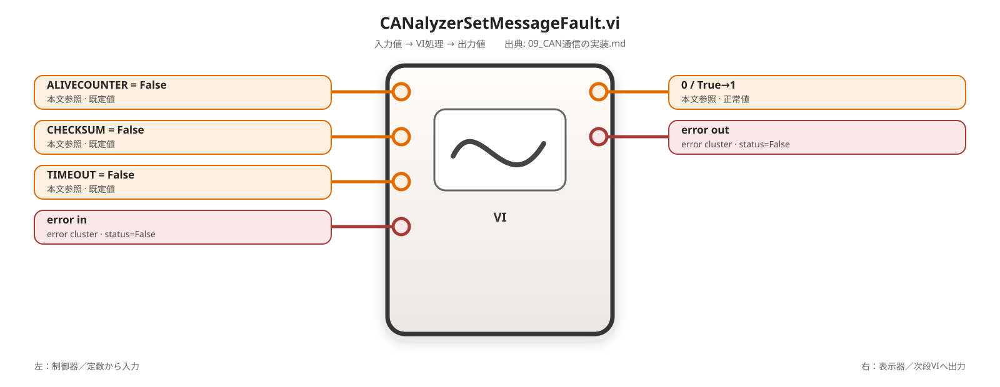

## 1. 入出力

```text
Session ID
Namespace
Alive Fault? Boolean
Checksum Fault? Boolean
Timeout Fault? Boolean
Verify? Boolean
error in/out
```

## 3. 書込値

```text
ALIVE_COUNTER = False→0 / True→1
CHECKSUM      = False→0 / True→1
TIMEOUT       = False→0 / True→1
```

3要素Request配列を作りBatch Writeを呼ぶ。

# 9.10.6 `CANalyzer_Clear_Message_Faults.vi`

<!-- generated-vi-diagram -->


指定Namespaceの`ALIVE_COUNTER`、`CHECKSUM`、`TIMEOUT`へ0を書き込む。

# 9.10.7 `CANalyzer_Clear_All_Faults.vi`

<!-- generated-vi-diagram -->


Fault対象Namespace配列を入力し、各Namespaceの3変数を0へ戻す。Namespace一覧をVIへ固定しない。

# 9.10.8 `CANalyzer_Health_Check.vi`

<!-- generated-vi-diagram -->


```text
Session Found?
Application Ref Valid?
Measurement Running?
Actual Configuration Path
Version String
Known SysVar Read Result
Compatibility Status
```

# 9.10.9 `CANalyzer_Stop.vi`

<!-- generated-vi-diagram -->
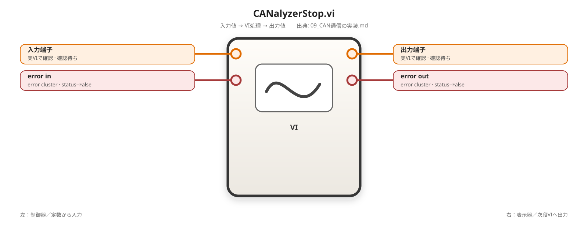

Measurement Started By LabVIEW?がTrueの場合だけStopする。FalseではRunning状態を読むだけにする。

# 9.10.10 `CANalyzer_Close.vi`

<!-- generated-vi-diagram -->


## 3. 処理順

```text
Registry Get
  ↓
必要ならClear All Faults
  ↓
LabVIEW開始MeasurementだけStop
  ↓
Measurement Ref Close
  ↓
System Ref Close
  ↓
Ownership=LabVIEWかつQuit有効ならQuit
  ↓
Application Ref Close
  ↓
Registry Remove
```

Cleanup用VIのため前段エラーがあっても処理する。元エラーを優先してCleanupエラーを追跡可能にする。

---

# 9.11 最小PoC用VI

単純なActiveX疎通と、新規機能を分ける。

# 9.11.1 `PoC_CANalyzer_01_Open_Close.vi`

<!-- generated-vi-diagram -->


## 目的

Automation Open、Property Node、Close Referenceの最小経路を確認する。

```text
CAN_AX_Open_Application.vi
  → CAN_AX_Get_System.vi
  → System Ref Close
  → Application Ref Close
```

合格条件：

- 起動済みCANalyzerで参照取得。
- 未起動時の`open new instance=False`実挙動を記録。
- Close後に無効参照や異常プロセス残留がない。

# 9.11.2 `PoC_CANalyzer_02_SysVar_Read_Write.vi`

<!-- generated-vi-diagram -->


## 入力例

```text
Namespace      = ID03AD5D62
Variable Name  = CORE_SVS_OPE_MODE_COM
Value Type     = I32
Numeric Value  = 2
```

## 構成

```text
Open Application
  → Get System
  → Resolve SysVar
  → Read Before
  → Write 2
  → Read After
  → Close Variable / System / Application Ref
```

合格条件：

- Read Before表示。
- Write後にCANalyzer画面値=2。
- Read After=2。
- 不正Variableで名称付きエラー。

# 9.11.3 `PoC_CANalyzer_03_Launch_Config_Start.vi`

<!-- generated-vi-diagram -->
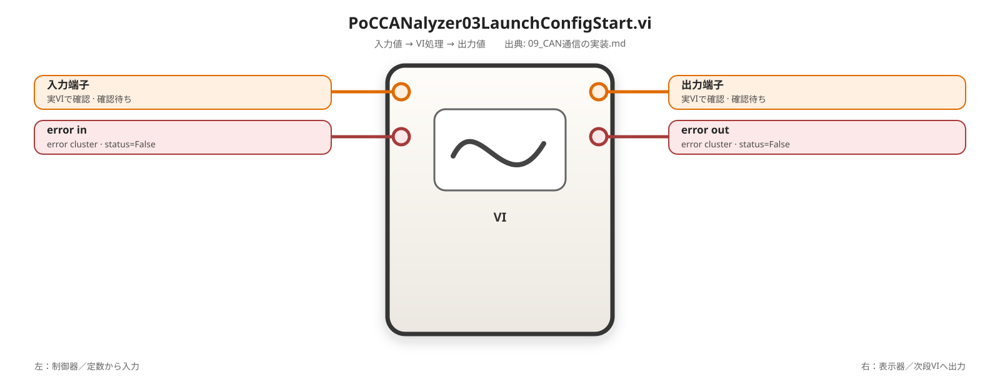

```text
未起動から起動
指定cfg Open
Actual cfg一致
Measurement Start
Running=True待ち
Stop
Ownership=LabVIEW時だけQuit
```

Version、Configuration、Quitの正式メンバ確定後に作成する。

# 9.11.4 `PoC_CANalyzer_04_Fault_Control.vi`

<!-- generated-vi-diagram -->
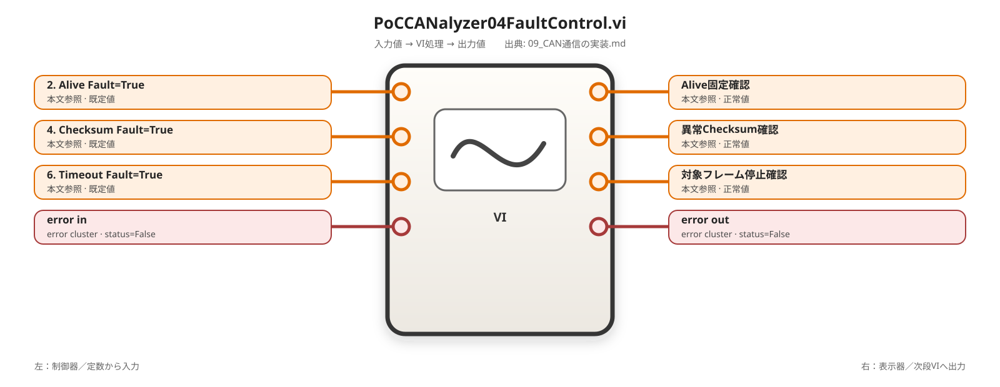

```text
1. ALIVE_COUNTER=0、CHECKSUM=0、TIMEOUT=0
2. Alive Fault=True → Alive固定確認
3. Alive Fault=False
4. Checksum Fault=True → 異常Checksum確認
5. Checksum Fault=False
6. Timeout Fault=True → 対象フレーム停止確認
7. Clear Message Faults
```

# 9.11.5 `PoC_CANalyzer_05_Compatibility.vi`

<!-- generated-vi-diagram -->


Version、Capability Probe、Ownership判定を表示し、検証済み版、未知版、必須機能不足を確認する。

---

# 9.12 TestStandなしの本番VI

# 9.12.1 `CANalyzer_Standalone_Main.vi`

<!-- generated-vi-diagram -->


## 0. 目的

LabVIEW単体で起動、cfg確認、Measurement、SysVar操作、故障注入、Cleanupまで行う。Public APIだけを呼ぶ。

## 状態

```text
Initialize
Open
Verify
Start
Run Sequence
Clear Faults
Stop
Close
Done
Error Cleanup
```

## 基本フロー

```text
CANalyzer_Open.vi
  ↓
CANalyzer_Health_Check.vi
  ↓
CANalyzer_Batch_Write_SysVar.vi
  ↓
Wait / DUT処理 / 判定
  ↓
CANalyzer_Batch_Read_SysVar.vi
  ↓
必要ならCANalyzer_Set_Message_Fault.vi
  ↓
CANalyzer_Clear_All_Faults.vi
  ↓
CANalyzer_Stop.vi
  ↓
CANalyzer_Close.vi
```

## `CANalyzer_Standalone_Config.ctl`

```text
Launch Mode
Process Name Candidates
Configuration Path
Open Configuration?
Start Measurement?
Startup Timeout ms
Measurement Timeout ms
Poll Interval ms
SysVar Request配列
Fault Namespace配列
Stop On First Error?
Log Path
```

Excel読込をCoreへ入れない。既存Excel互換が必要な場合だけImporterを追加する。

---

# 9.13 TestStand利用時の構成

# 9.13.1 Adapter

- TestStand 2026 Q1 64bit。
- LabVIEW AdapterをLabVIEW 2026 Q1 64bitへ合わせる。
- TestStandから`10_ActiveX_Wrapper`と`20_Service`を呼ばない。
- `30_Public`だけを呼ぶ。

# 9.13.2 変数

| TestStand変数 | 型 | 用途 |
|---|---|---|
| `FileGlobals.CANalyzer.SessionID` | Number | Session ID |
| `FileGlobals.CANalyzer.IsConnected` | Boolean | Cleanup判定 |
| `FileGlobals.CANalyzer.IsMeasuring` | Boolean | Stop判定 |
| `FileGlobals.CANalyzer.ApplicationOwnership` | Number / String | Quit判定 |
| `FileGlobals.CANalyzer.MeasStartedByLabVIEW` | Boolean | Stop所有権 |
| `FileGlobals.CANalyzer.ConfigPath` | String | 実cfg |
| `FileGlobals.CANalyzer.Version` | String | 実版 |
| `FileGlobals.CANalyzer.Compatibility` | Number / String | 判定 |
| `Locals.CANalyzer.Requests` | Array of Container | Batch入力 |
| `Locals.CANalyzer.Results` | Array of Container | Batch結果 |
| `Locals.CANalyzer.FaultNamespaces` | Array of String | Cleanup対象 |

ActiveX RefとVariantをFileGlobalsへ保存しない。

## SysVar Value Container

```text
ValueType
BooleanValue
NumericValue
StringValue
```

LabVIEW側`CANalyzer_SysVar_Value.ctl`と同じ構造へマッピングする。

# 9.13.3 Setup

```text
CANalyzer_Open.vi
  Launch Mode          = Reuse Existing Or Launch
  Configuration Path   = Parameters.CfgPath
  Open Configuration?  = True
  Start Measurement?   = True
```

保存：Session ID、Version、Actual cfg、Ownership、Running、Compatibility。

Open成功後にIsConnected=True、Running確認後にIsMeasuring=Trueとする。

# 9.13.4 Main

```text
CANalyzer_Batch_Write_SysVar.vi
  → Wait
  → DUT操作
  → CANalyzer_Batch_Read_SysVar.vi
  → 判定
```

故障試験：

```text
CANalyzer_Set_Message_Fault.vi
  → Wait
  → DUT異常検出確認
  → CANalyzer_Clear_Message_Faults.vi
```

通常のWaitはTestStandで管理する。Batch内Waitは既存4列テーブル互換またはデータ駆動シーケンスで使用する。

# 9.13.5 Cleanup

```text
If IsConnected:
    CANalyzer_Clear_All_Faults.vi

If IsMeasuring:
    CANalyzer_Stop.vi

CANalyzer_Close.vi
```

Clear All Faultsが失敗してもStopとCloseを続行する。

# 9.13.6 並列実行

同一SessionのPublic APIを複数Threadから直接同時実行しない。

```text
LabVIEW側：CANalyzer_Execute_Command.viを非再入
TestStand側：Named Lockで同一Sessionを直列化
```

Lock名例：

```text
CANalyzer.ActiveX.Session.<SessionID>
```

---

# 9.14 Errorとログ

## 9.14.1 ローカルエラーコード

| code | 用途 |
|---:|---|
| `-710100` | ActiveX Open失敗（legacy allocation。`CANalyzer_Open.vi`はWrapper errorをこのcodeへ強制normalizeしない） |
| `-710101` | 必須Capability不足 |
| `-710102` | Session ID未登録 |
| `-710103` | Configuration不一致 |
| `-710104` | Measurement状態待ちTimeout |
| `-710105` | Namespace / Variable解決失敗 |
| `-710106` | Variant型変換失敗 |
| `-710107` | Batch Request不正 |
| `-710108` | Fault Clear失敗 |
| `-710109` | Require Existingで起動済みCANalyzerなし |
| `-710116` | Invalid Expected Configuration Path |
| `-710117` | Compatibility Policy Rejected |
| `-710118` | Invalid Measurement Timeout |

`-710109 / -710117 / -710118`は2026-08-24のOpen Design Closure時のlocal Project collision確認で未使用として採用した。

## 9.14.2 error source

```text
Public VI名
Wrapper名
Session ID
Launch Mode
Application Ownership
CANalyzer Version
Configuration Path
Namespace
Variable Name
Value Type
Batch Index
元ActiveX error source
```

## 9.14.3 ログ

```text
日時
試験ID
Session ID
Version
Configuration Path
Measurement Running
Namespace
Variable Name
Read / Write
要求値
読戻し値
Wait ms
結果
error code / source
```

---

# 9.15 完了条件

## ActiveX基盤

- [ ] CANalyzer Applicationクラスを選択できる
- [ ] 起動済みCANalyzerを再利用できる
- [ ] 未起動から起動できる
- [ ] Require Existingで未起動を検出できる
- [ ] OwnershipをExternal / LabVIEW / Unknownで保持できる
- [ ] System、Measurement、Runningを取得できる
- [ ] Start / Stopできる
- [ ] 参照を明示Closeできる
- [x] `CANalyzer_Verify_Configuration.vi`のStatic As-Built確認（P0=0 / P1=0、Broken Run Arrow=NO）
- [x] `CANalyzer_Open.vi` Final Integration Design Closure（P0=0 / P1=0、READY FOR MANUAL IMPLEMENTATION）
- [ ] `CANalyzer_Open.vi` Manual Implementation
- [ ] `CANalyzer_Open.vi` Focused As-Built / Model Check Review

## System Variable

- [ ] I32 Read / Write
- [ ] Boolean / U32 / DBL / String確認
- [ ] 不正Namespace / Variable検出
- [ ] Verify After Write
- [ ] Batch Result配列
- [ ] Wait ms

## CAPL連携

- [ ] SysVar値がCAN信号へ反映
- [ ] AliveがCAPLで0→1→2→3
- [ ] ChecksumがCAPLで生成
- [ ] Alive Fault確認
- [ ] Checksum Fault確認
- [ ] Timeout Fault確認
- [ ] Cleanupで全Faultを0へ戻す

## Version・別環境

- [ ] Version取得
- [ ] 検証済み版をCompatible判定
- [ ] 未知版でCapability Probe
- [ ] Wrapper以外がActiveX型非依存
- [ ] 別PCのCOM登録確認

## TestStand

- [ ] 64bit AdapterでPublic APIを呼べる
- [ ] Session ID保持
- [ ] SetupでOpen / Start
- [ ] MainでRead / Write / Fault
- [ ] CleanupでClear / Stop / Close
- [ ] External / Unknown ApplicationをQuitしない
- [ ] LabVIEW所有ApplicationだけQuit可能

---

# 9.16 今後必要な実機情報

1. CANalyzerの製品版、Service Pack、Build番号。
2. Type Library上のVersion取得Property。
3. Configuration Open Methodの正式名称と引数。
4. Actual Configuration Path取得Property。
5. Application Quit Method。
6. `open new instance=True`時の実挙動。
7. CANalyzer実行ファイル名と複数版共存時のプロセス名。
8. PoC用cfg絶対パス。
9. Read専用SysVarとRead/Write SysVar各1個。

---

# 9.17 他方式との関係

| 方式 | 使用条件 |
|---|---|
| CANalyzer ActiveX | 既存CAPL、残バス、SysVarを再利用 |
| NI-XNET | DBC中心でLabVIEW内へCANを閉じる |
| メーカーUSB-CAN | 既存USB-CANを利用 |
| RAMScope GT170 CAN | RAMとCANを同一Timestamp系へ集約 |

同一CAN IDを複数方式から同時送信しない。
