# 14. VI入出力・公開API接続イメージ図

**最終生成日：2026-07-26**

中央にVI、左に入力、右に出力を配置し、`error in`／`error out`を必ず最下段へ固定したSVG一覧である。
画像生成スキルで作成したデザイン原案を基準に、端子名・型・値を検索可能なベクター文字としてSVG化した。
各章で確定していない端子は推測せず、`実VIで確認`／`確認待ち`と明示する。

## 公開API・処理接続図

### 負荷電流ランプと並列処理

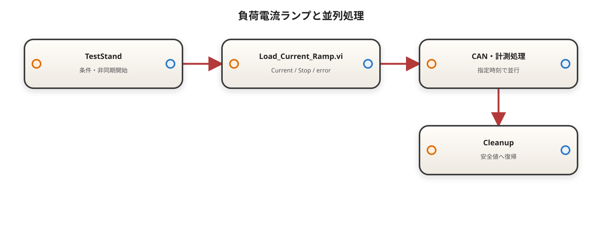

### CANalyzer公開API接続

### RAMScope公開API接続

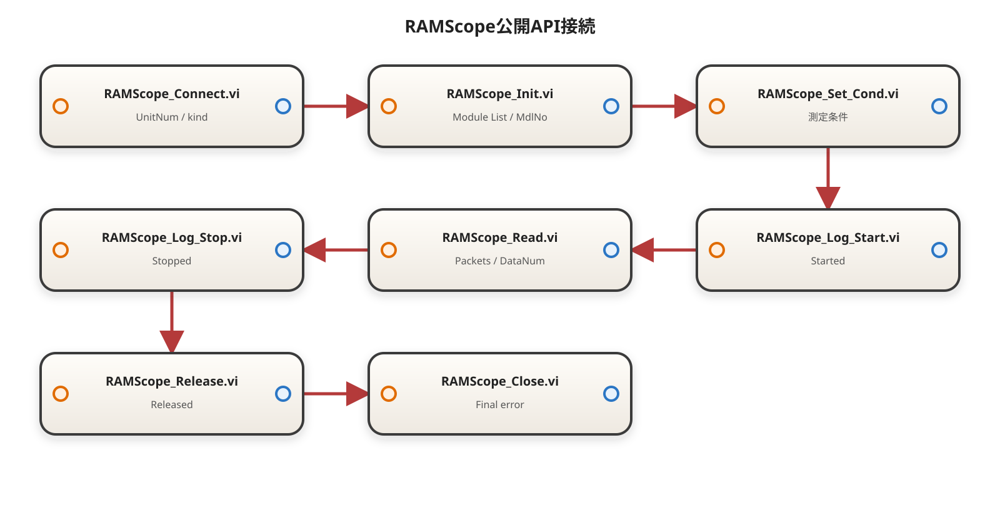

### RAMScopeロギング公開API接続

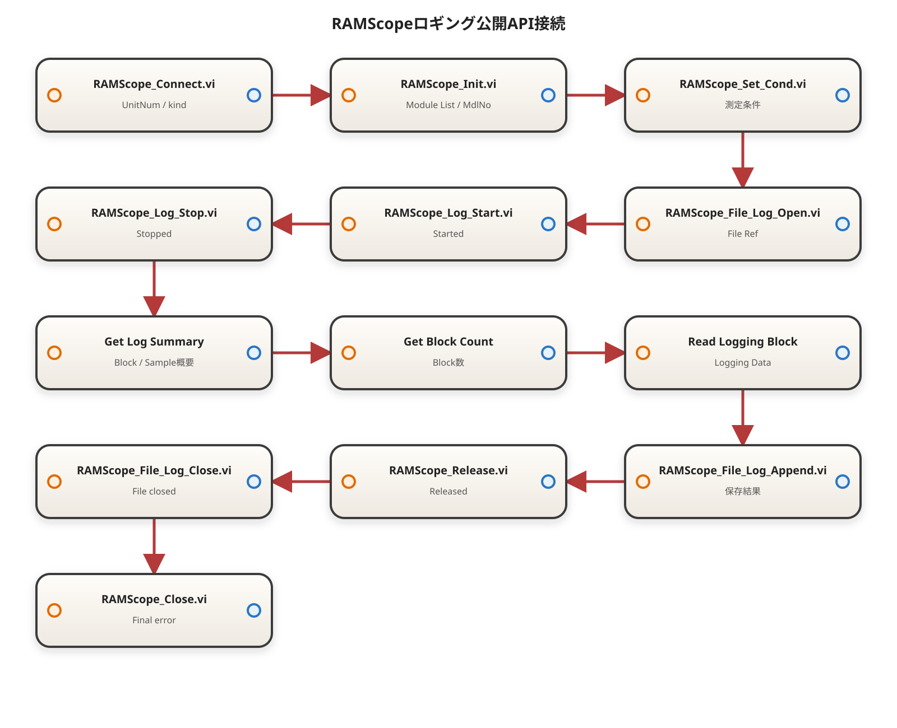

### TestStandと公開APIの接続

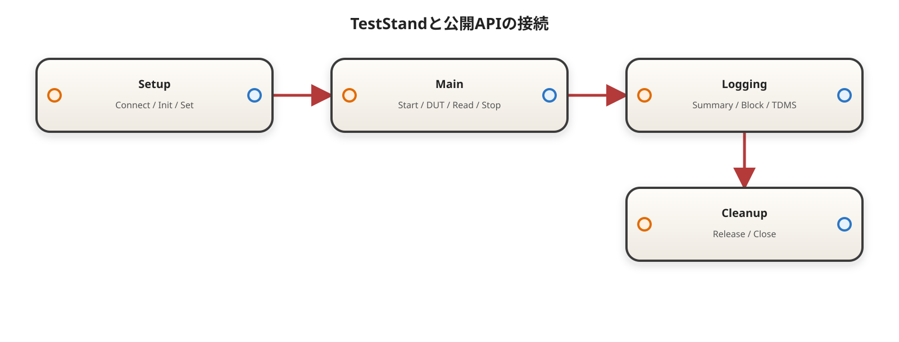

### 異常時Cleanup接続

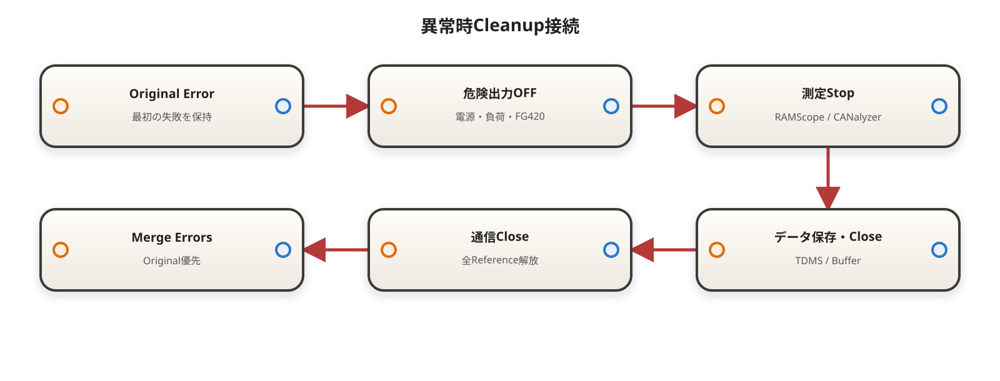

### FG420公開API接続

## VI単体図

### `BuildCHINFO170Raw.vi`

出典章：`10_RAMScope実装方針.md`

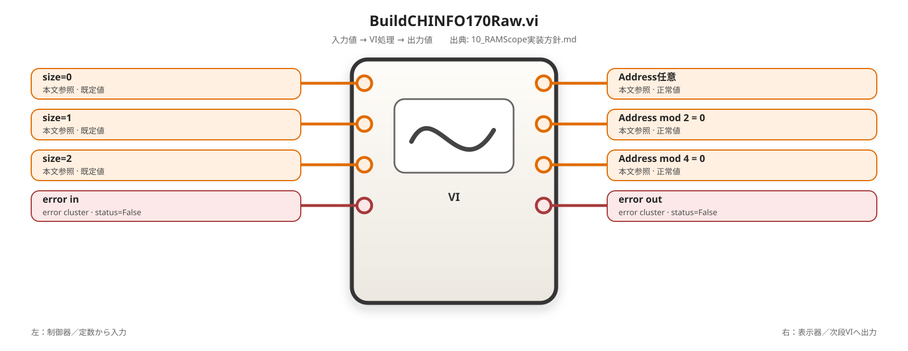

### `BuildLOGINFORaw.vi`

出典章：`10_RAMScope実装方針.md`

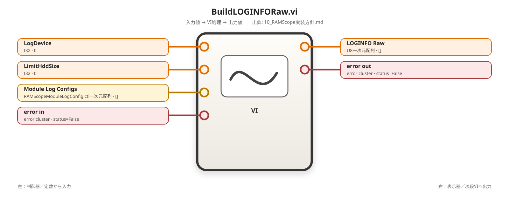

### `BuildMEASINFO170Raw.vi`

出典章：`10_RAMScope実装方針.md`

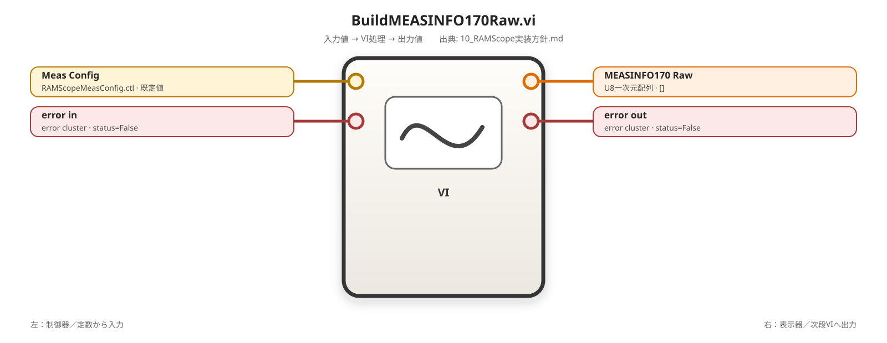

### `CANAXGetMeasurement.vi`

出典章：`09_CAN通信の実装.md`

### `CANAXGetMeasurementRunning.vi`

出典章：`09_CAN通信の実装.md`

### `CANAXGetNamespace.vi`

出典章：`09_CAN通信の実装.md`

### `CANAXGetSystem.vi`

出典章：`09_CAN通信の実装.md`

### `CANAXGetVariableItem.vi`

出典章：`09_CAN通信の実装.md`

### `CANAXGetVariables.vi`

出典章：`09_CAN通信の実装.md`

### `CANAXOpenApplication.vi`

出典章：`09_CAN通信の実装.md`

### `CANAXReadVariableValue.vi`

出典章：`09_CAN通信の実装.md`

### `CANAXStartMeasurement.vi`

出典章：`09_CAN通信の実装.md`

### `CANAXStopMeasurement.vi`

出典章：`09_CAN通信の実装.md`

### `CANAXWriteVariableValue.vi`

出典章：`09_CAN通信の実装.md`

### `CANSendMode.vi`

出典章：`05_VI設計方針と共通仕様.md`

### `CANalyzerClearAllFaults.vi`

出典章：`09_CAN通信の実装.md`

### `CANalyzerClearMessageFaults.vi`

出典章：`09_CAN通信の実装.md`

### `CANalyzerClose.vi`

出典章：`09_CAN通信の実装.md`

### `CANalyzerDetectProcess.vi`

出典章：`09_CAN通信の実装.md`

### `CANalyzerExecuteCommand.vi`

出典章：`09_CAN通信の実装.md`

### `CANalyzerHealthCheck.vi`

出典章：`09_CAN通信の実装.md`

### `CANalyzerOpen.vi`

出典章：`09_CAN通信の実装.md`

### `CANalyzerReadSysVar.vi`

出典章：`09_CAN通信の実装.md`

### `CANalyzerResolveSysVar.vi`

出典章：`09_CAN通信の実装.md`

### `CANalyzerSessionRegistry.vi`

出典章：`09_CAN通信の実装.md`

### `CANalyzerSetMessageFault.vi`

出典章：`09_CAN通信の実装.md`

### `CANalyzerStandaloneMain.vi`

出典章：`09_CAN通信の実装.md`

### `CANalyzerStop.vi`

出典章：`09_CAN通信の実装.md`

### `CANalyzerValueToVariant.vi`

出典章：`09_CAN通信の実装.md`

### `CANalyzerVariantToValue.vi`

出典章：`09_CAN通信の実装.md`

### `CANalyzerWaitMeasurementState.vi`

出典章：`09_CAN通信の実装.md`

### `CANalyzerWriteSysVar.vi`

出典章：`09_CAN通信の実装.md`

### `Clear Errors.vi`

出典章：`10_RAMScope実装方針.md`

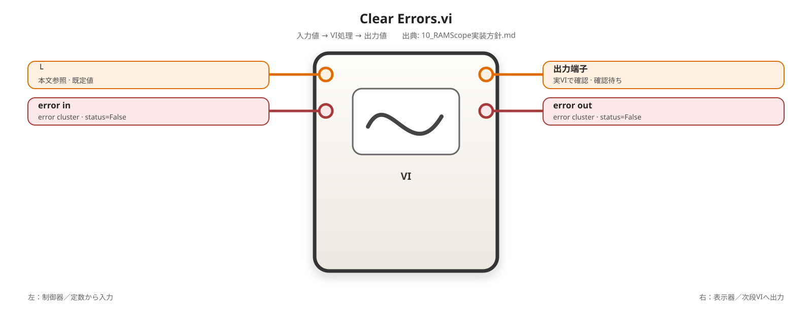

### `DLM5058AcquireStart.vi`

出典章：`05_VI設計方針と共通仕様.md`

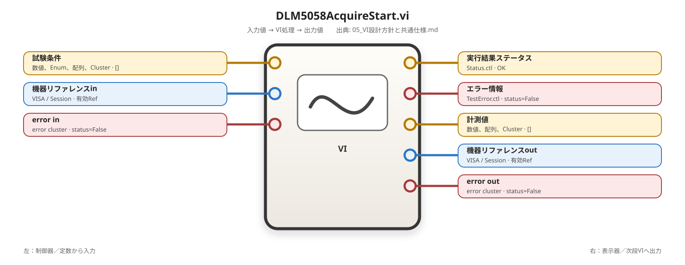

### `DLM5058AcquireStop.vi`

出典章：`07_機器別VI構築手順.md`

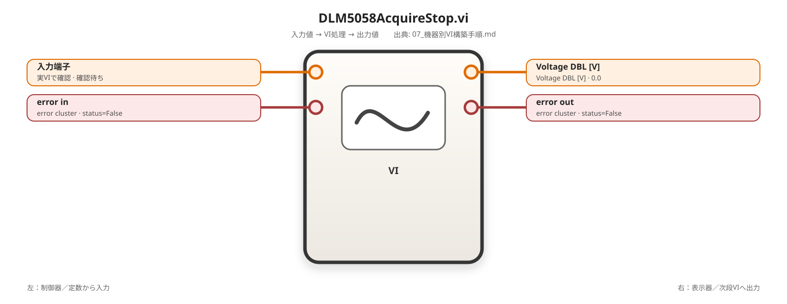

### `DLM5058Close.vi`

出典章：`07_機器別VI構築手順.md`

### `DLM5058Config.vi`

出典章：`07_機器別VI構築手順.md`

### `DLM5058Init.vi`

出典章：`07_機器別VI構築手順.md`

### `DLM5058SaveWaveform.vi`

出典章：`05_VI設計方針と共通仕様.md`

### `DeviceSetVoltage.vi`

出典章：`07_機器別VI構築手順.md`

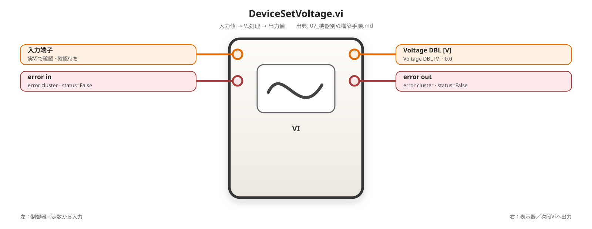

### `EnvironmentSmokeTest.vi`

出典章：`03_LabVIEW環境構築.md`

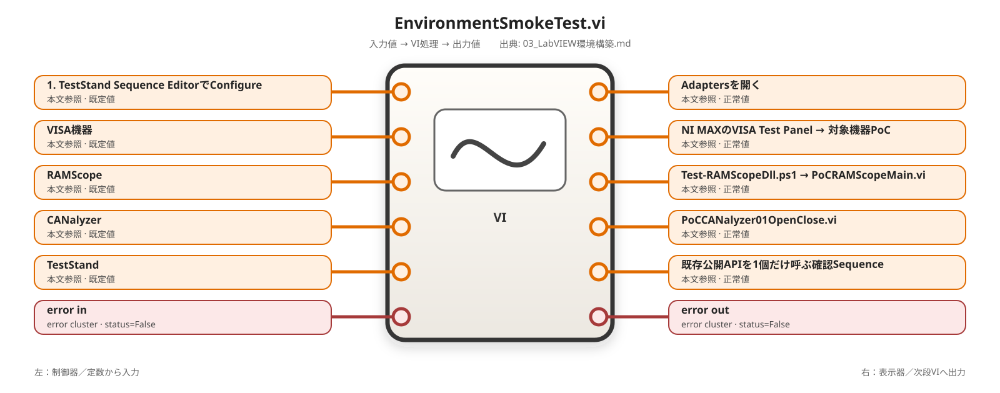

### `ErrorToTestStatus.vi`

出典章：`06_VIの作り方_手順.md`

### `FG420ApplyOutputLimit.vi`

出典章：`A1A_FG420複数台2ch出力リミットPoC.md`

### `FG420Close.vi`

出典章：`A1_付録_FG420基盤単体試験自動化.md`

### `FG420ConfigureChannelSafe.vi`

出典章：`A1A_FG420複数台2ch出力リミットPoC.md`

### `FG420FlowTest.vi`

出典章：`A1_付録_FG420基盤単体試験自動化.md`

### `FG420GetID.vi`

出典章：`A1A_FG420複数台2ch出力リミットPoC.md`

### `FG420Init.vi`

出典章：`A1_付録_FG420基盤単体試験自動化.md`

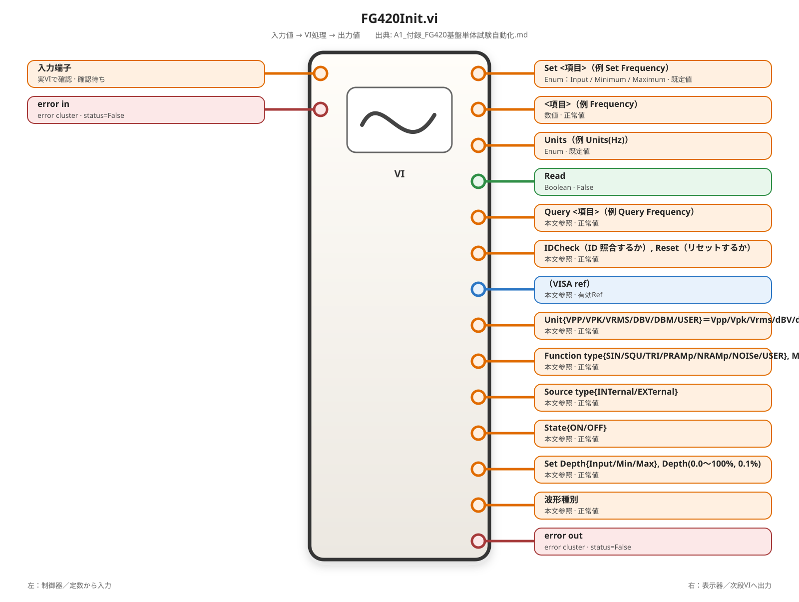

### `FG420Output.vi`

出典章：`A1_付録_FG420基盤単体試験自動化.md`

### `FG420PrepareDevice.vi`

出典章：`A1A_FG420複数台2ch出力リミットPoC.md`

### `FG420QueryAmplBound.vi`

出典章：`A1A_FG420複数台2ch出力リミットPoC.md`

### `FG420QueryOffsetBound.vi`

出典章：`A1A_FG420複数台2ch出力リミットPoC.md`

### `FG420ReadSystemError.vi`

出典章：`A1A_FG420複数台2ch出力リミットPoC.md`

### `FG420SetAmpl.vi`

出典章：`A1A_FG420複数台2ch出力リミットPoC.md`

### `FG420SetChanMode.vi`

出典章：`A1A_FG420複数台2ch出力リミットPoC.md`

### `FG420SetCoupling.vi`

出典章：`A1A_FG420複数台2ch出力リミットPoC.md`

### `FG420SetFreq.vi`

出典章：`A1_付録_FG420基盤単体試験自動化.md`

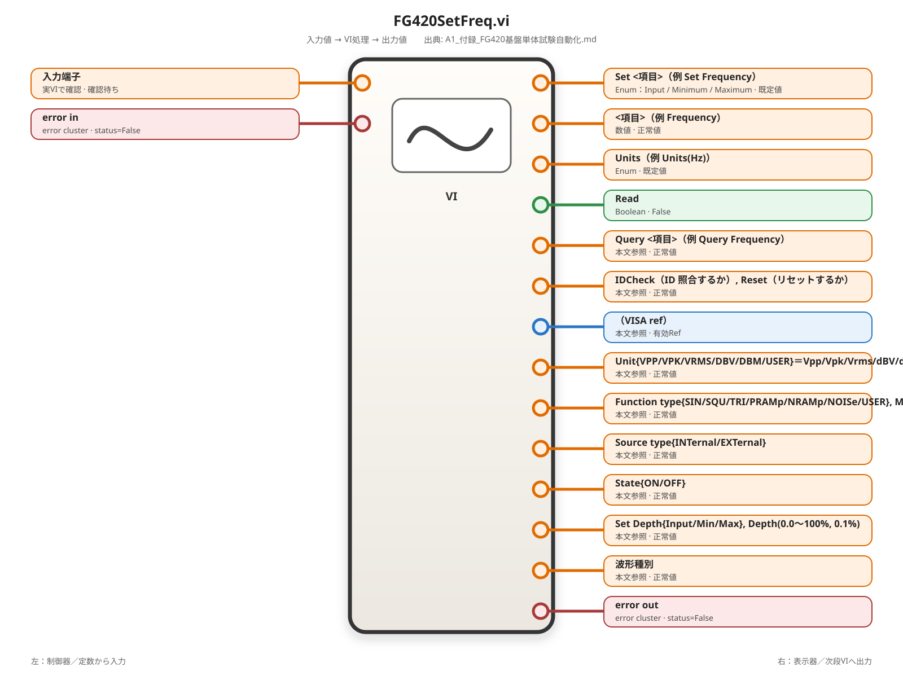

### `FG420SetFunc.vi`

出典章：`A1_付録_FG420基盤単体試験自動化.md`

### `FG420SetLoad.vi`

出典章：`A1_付録_FG420基盤単体試験自動化.md`

### `FG420SetOffset.vi`

出典章：`A1A_FG420複数台2ch出力リミットPoC.md`

### `FG420SetPhase.vi`

出典章：`A1_付録_FG420基盤単体試験自動化.md`

### `FG420SetPowerOnOutput.vi`

出典章：`A1A_FG420複数台2ch出力リミットPoC.md`

### `FG420SetReferenceSource.vi`

出典章：`A1A_FG420複数台2ch出力リミットPoC.md`

### `FG420SetTriggerSource.vi`

出典章：`A1A_FG420複数台2ch出力リミットPoC.md`

### `FG420Trigger.vi`

出典章：`A1A_FG420複数台2ch出力リミットPoC.md`

### `I32ToLEU8x4.vi`

出典章：`00A_LabVIEW実装資料の記述ルール.md`

### `LoadCurrentRamp.vi`

出典章：`08_負荷電流VIと並列処理.md`

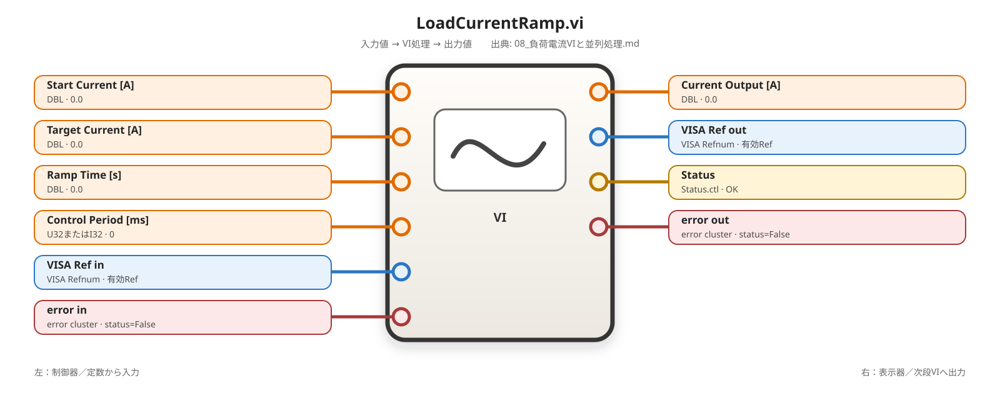

### `MX100Close.vi`

出典章：`07_機器別VI構築手順.md`

### `MX100Init.vi`

出典章：`07_機器別VI構築手順.md`

### `MX100LogStart.vi`

出典章：`05_VI設計方針と共通仕様.md`

### `MX100LogStop.vi`

出典章：`07_機器別VI構築手順.md`

### `MX100Read.vi`

出典章：`07_機器別VI構築手順.md`

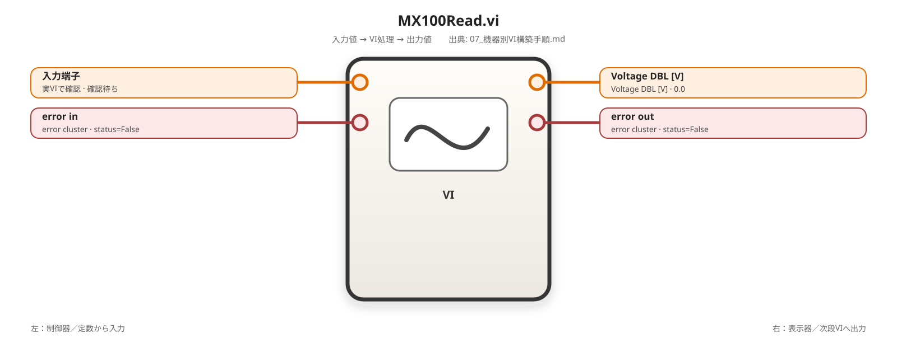

### `MX100Save.vi`

出典章：`07_機器別VI構築手順.md`

### `PPXApply.vi`

出典章：`07_機器別VI構築手順.md`

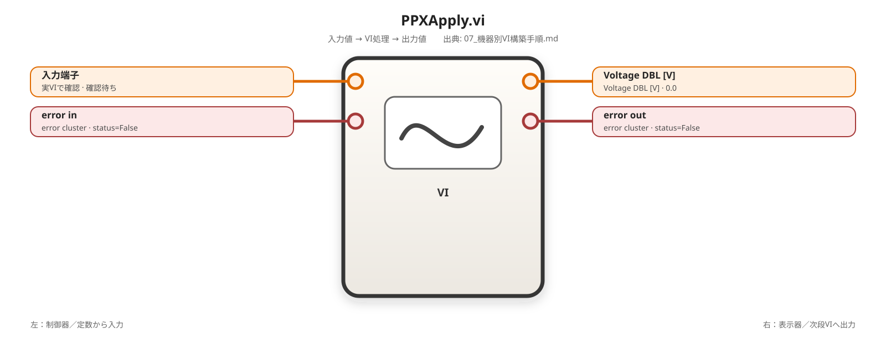

### `PPXClose.vi`

出典章：`07_機器別VI構築手順.md`

### `PPXCurrentSet.vi`

出典章：`07_機器別VI構築手順.md`

### `PPXErrorCheck.vi`

出典章：`07_機器別VI構築手順.md`

### `PPXInit.vi`

出典章：`07_機器別VI構築手順.md`

### `PPXOutputOff.vi`

出典章：`07_機器別VI構築手順.md`

### `PPXOutputOn.vi`

出典章：`07_機器別VI構築手順.md`

### `PPXRead.vi`

出典章：`07_機器別VI構築手順.md`

### `PPXResetProtection.vi`

出典章：`07_機器別VI構築手順.md`

### `PPXSetProtection.vi`

出典章：`07_機器別VI構築手順.md`

### `PPXVoltageSet.vi`

出典章：`07_機器別VI構築手順.md`

### `ParseSYSINFOArray.vi`

出典章：`10_RAMScope実装方針.md`

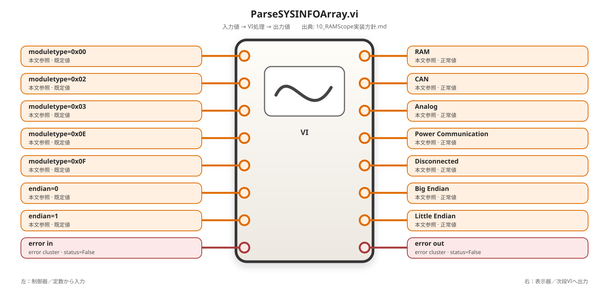

### `PoCCANalyzer01OpenClose.vi`

出典章：`09_CAN通信の実装.md`

### `PoCCANalyzer02SysVarReadWrite.vi`

出典章：`09_CAN通信の実装.md`

### `PoCCANalyzer03LaunchConfigStart.vi`

出典章：`09_CAN通信の実装.md`

### `PoCCANalyzer04FaultControl.vi`

出典章：`09_CAN通信の実装.md`

### `PoCCANalyzer05Compatibility.vi`

出典章：`09_CAN通信の実装.md`

### `PoCFG420MultiDevice.vi`

出典章：`A1A_FG420複数台2ch出力リミットPoC.md`

### `PoCRAMScopeLoggingMain.vi`

出典章：`10_RAMScope実装方針.md`

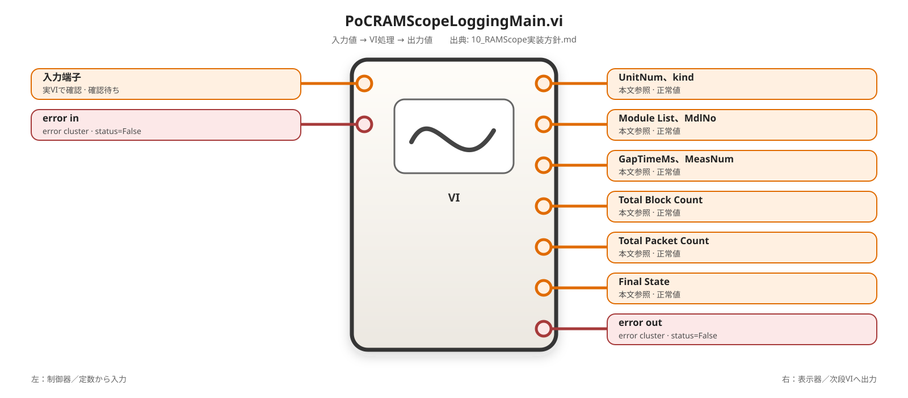

### `PoCRAMScopeMain.vi`

出典章：`00_資料の読み方と正本ルール.md`

### `RAMScopeClose.vi`

出典章：`00_資料の読み方と正本ルール.md`

### `RAMScopeCodeToError.vi`

出典章：`10_RAMScope実装方針.md`

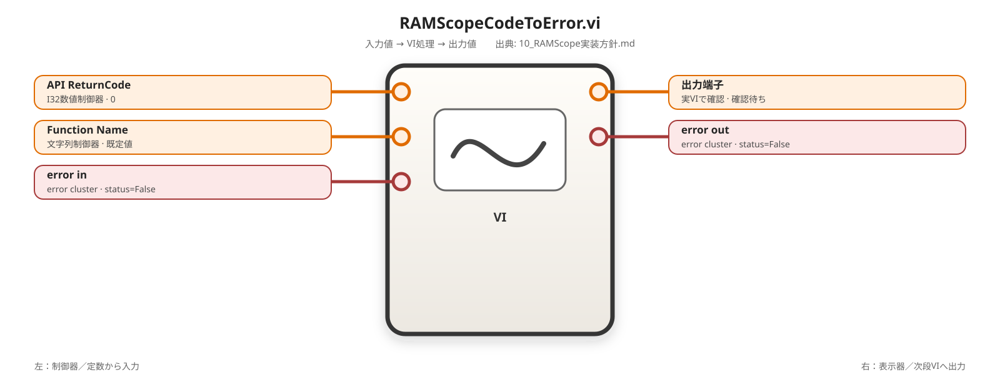

### `RAMScopeConfig.vi`

出典章：`00_資料の読み方と正本ルール.md`

### `RAMScopeConnect.vi`

出典章：`10_RAMScope実装方針.md`

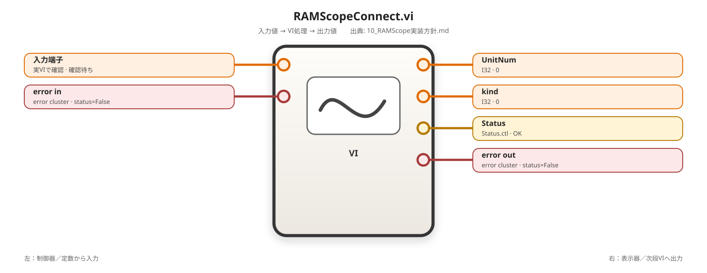

### `RAMScopeFileLogAppend.vi`

出典章：`10_RAMScope実装方針.md`

### `RAMScopeFileLogClose.vi`

出典章：`10_RAMScope実装方針.md`

### `RAMScopeFileLogOpen.vi`

出典章：`10_RAMScope実装方針.md`

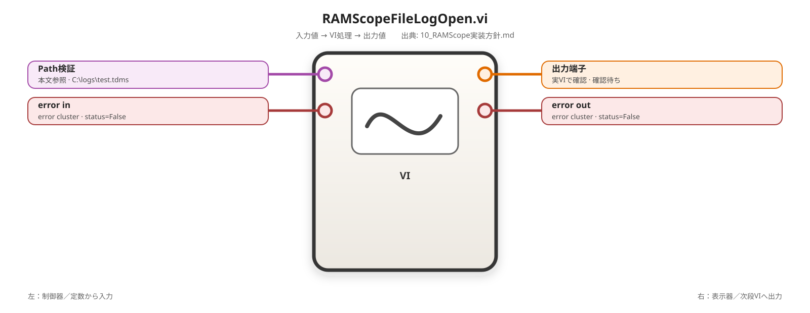

### `RAMScopeFileLogWriteMetadata.vi`

出典章：`10_RAMScope実装方針.md`

### `RAMScopeGetBlockCount.vi`

出典章：`10_RAMScope実装方針.md`

### `RAMScopeGetLogSummary.vi`

出典章：`10_RAMScope実装方針.md`

### `RAMScopeInit.vi`

出典章：`00_資料の読み方と正本ルール.md`

### `RAMScopeLogStart.vi`

出典章：`02_役割分担とアーキテクチャ.md`

### `RAMScopeLogStop.vi`

出典章：`02_役割分担とアーキテクチャ.md`

### `RAMScopeParseBuffer.vi`

出典章：`10_RAMScope実装方針.md`

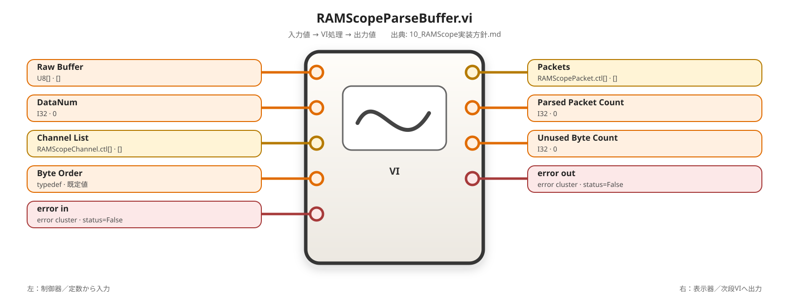

### `RAMScopeRead.vi`

出典章：`00_資料の読み方と正本ルール.md`

### `RAMScopeReadLoggingBlock.vi`

出典章：`10_RAMScope実装方針.md`

### `RAMScopeRelease.vi`

出典章：`02_役割分担とアーキテクチャ.md`

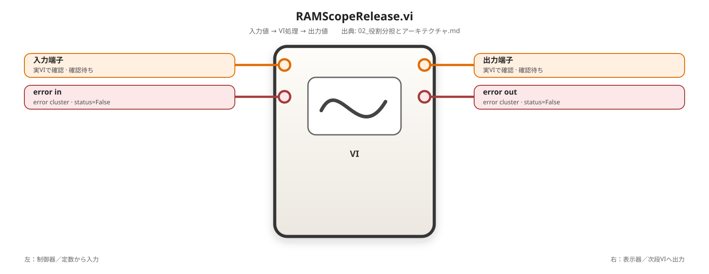

### `RAMScopeReset.vi`

出典章：`07_機器別VI構築手順.md`

### `RAMScopeSetCond.vi`

出典章：`10_RAMScope実装方針.md`

### `RSDLLGT150AllInit.vi`

出典章：`10_RAMScope実装方針.md`

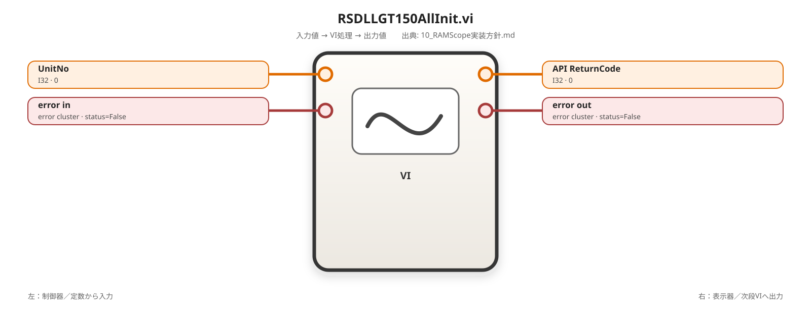

### `RSDLLGT150DeviceExit.vi`

出典章：`10_RAMScope実装方針.md`

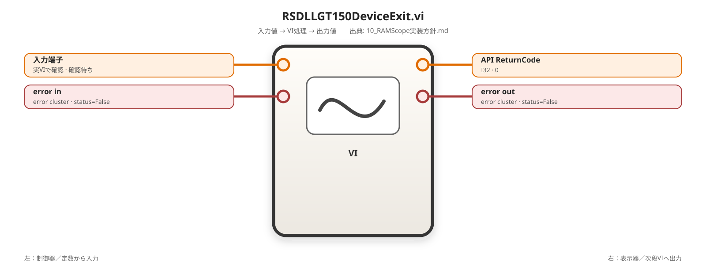

### `RSDLLGT150DeviceInit.vi`

出典章：`10_RAMScope実装方針.md`

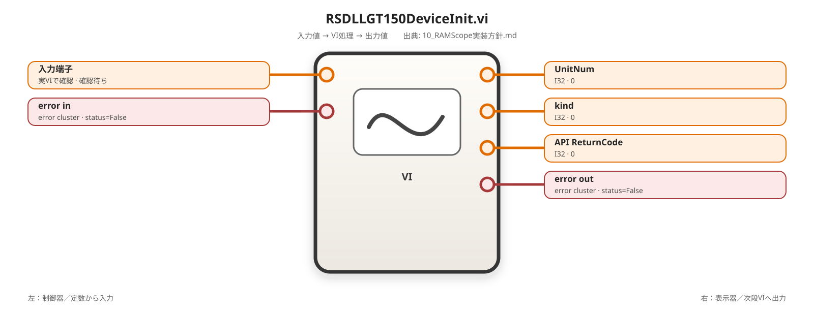

### `RSDLLGT150GetBlockNum.vi`

出典章：`10_RAMScope実装方針.md`

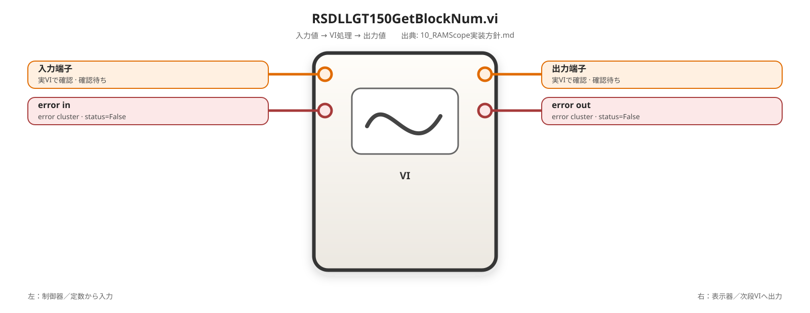

### `RSDLLGT150GetBufferData.vi`

出典章：`10_RAMScope実装方針.md`

### `RSDLLGT150GetBufferDataNum.vi`

出典章：`10_RAMScope実装方針.md`

### `RSDLLGT150GetGapTime.vi`

出典章：`10_RAMScope実装方針.md`

### `RSDLLGT150GetLoggingData.vi`

出典章：`10_RAMScope実装方針.md`

### `RSDLLGT150GetLoggingDataNum.vi`

出典章：`10_RAMScope実装方針.md`

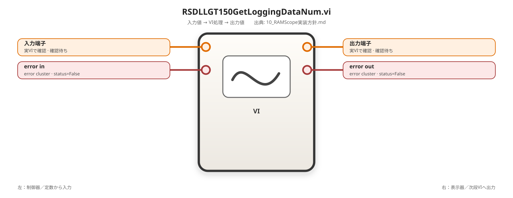

### `RSDLLGT150GetMeasNum.vi`

出典章：`10_RAMScope実装方針.md`

### `RSDLLGT150GetSysInfo.vi`

出典章：`10_RAMScope実装方針.md`

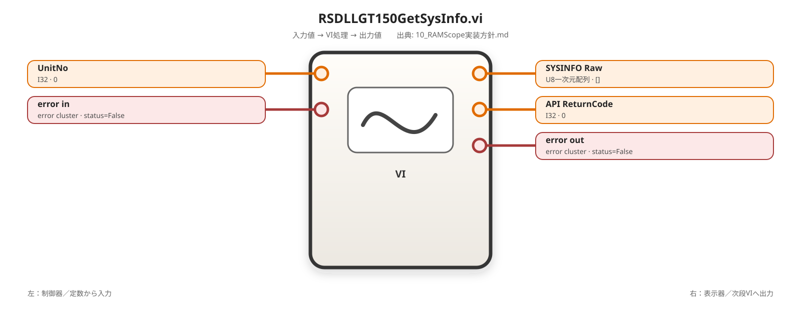

### `RSDLLGT150MeasStart.vi`

出典章：`10_RAMScope実装方針.md`

### `RSDLLGT150MeasStop.vi`

出典章：`10_RAMScope実装方針.md`

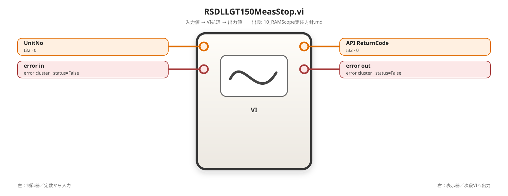

### `RSDLLGT150PGTSetMdlConfig.vi`

出典章：`10_RAMScope実装方針.md`

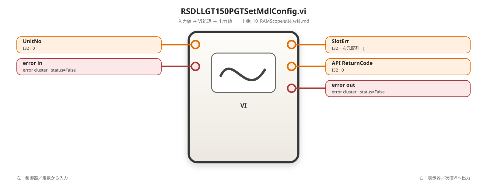

### `RSDLLGT150ReleaseBufferData.vi`

出典章：`10_RAMScope実装方針.md`

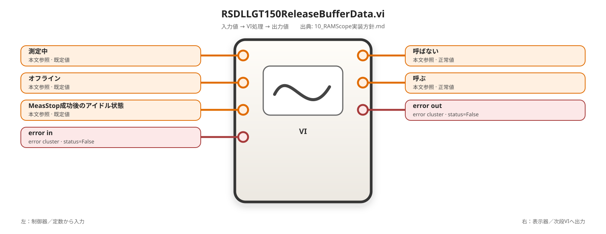

### `RSDLLGT150SetLoggingInfo.vi`

出典章：`10_RAMScope実装方針.md`

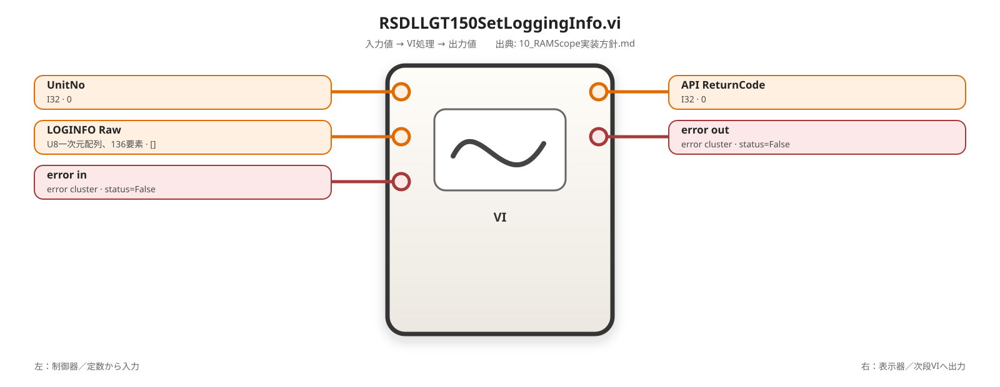

### `RSDLLGT170SetMeasCh.vi`

出典章：`10_RAMScope実装方針.md`

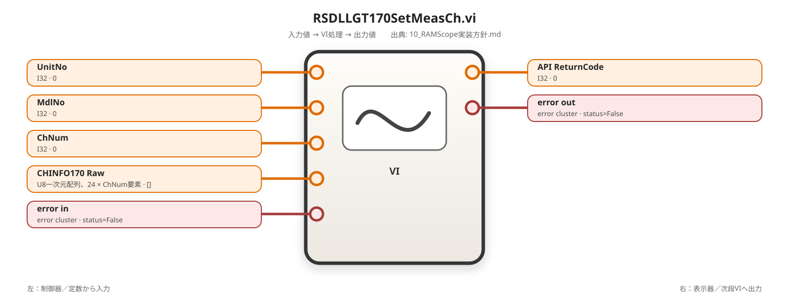

### `RSDLLGT170SetMeasCond.vi`

出典章：`10_RAMScope実装方針.md`

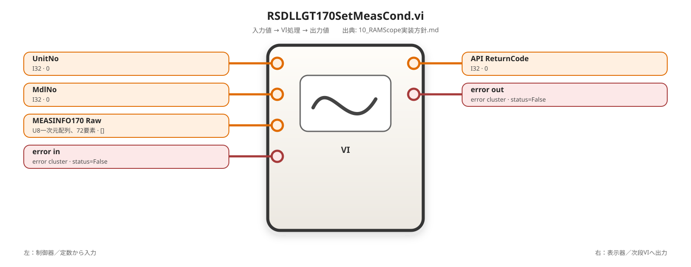

### `RZXAlarmClear.vi`

出典章：`07_機器別VI構築手順.md`

### `RZXClose.vi`

出典章：`07_機器別VI構築手順.md`

### `RZXCurrentLimitSet.vi`

出典章：`07_機器別VI構築手順.md`

### `RZXErrorCheck.vi`

出典章：`07_機器別VI構築手順.md`

### `RZXInit.vi`

出典章：`07_機器別VI構築手順.md`

### `RZXModeSet.vi`

出典章：`07_機器別VI構築手順.md`

### `RZXOutputOff.vi`

出典章：`07_機器別VI構築手順.md`

### `RZXOutputOn.vi`

出典章：`07_機器別VI構築手順.md`

### `RZXRead.vi`

出典章：`07_機器別VI構築手順.md`

### `RZXReady.vi`

出典章：`07_機器別VI構築手順.md`

### `RZXRun.vi`

出典章：`07_機器別VI構築手順.md`

### `RZXStop.vi`

出典章：`07_機器別VI構築手順.md`

### `RZXVoltageSet.vi`

出典章：`05_VI設計方針と共通仕様.md`

### `TRIG.vi`

出典章：`A1A_FG420複数台2ch出力リミットPoC.md`

### `TestParseSYSINFOArray.vi`

出典章：`13_構築ロードマップ.md`

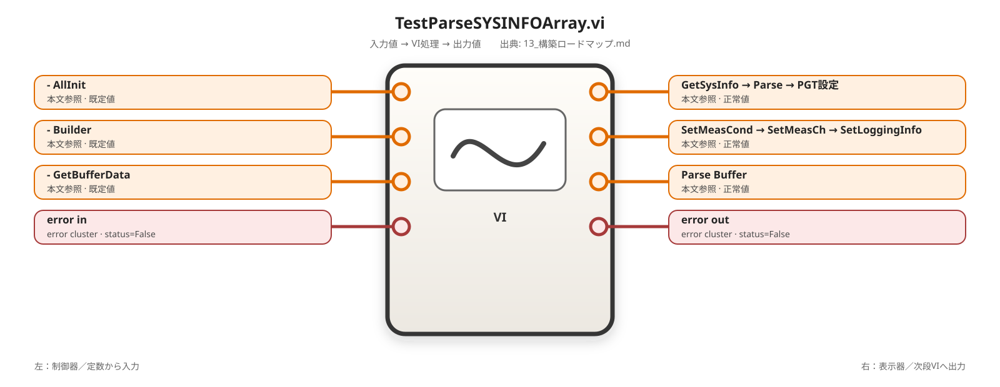

### `TestRAMScopeParseBuffer.vi`

出典章：`13_構築ロードマップ.md`

### `U32ToLEU8x4.vi`

出典章：`00A_LabVIEW実装資料の記述ルール.md`

### `U8x4ToI32.vi`

出典章：`00A_LabVIEW実装資料の記述ルール.md`

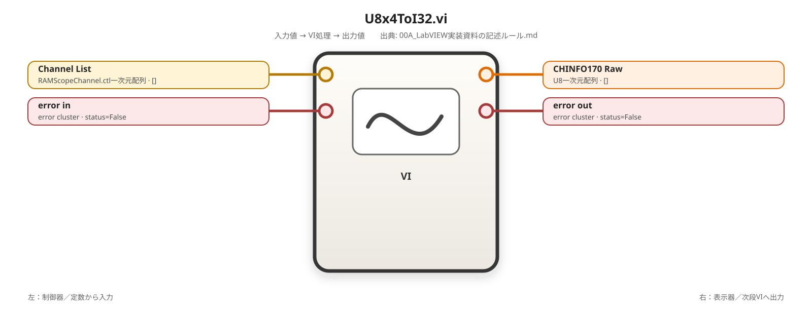

### `U8x4ToU32.vi`

出典章：`10_RAMScope実装方針.md`

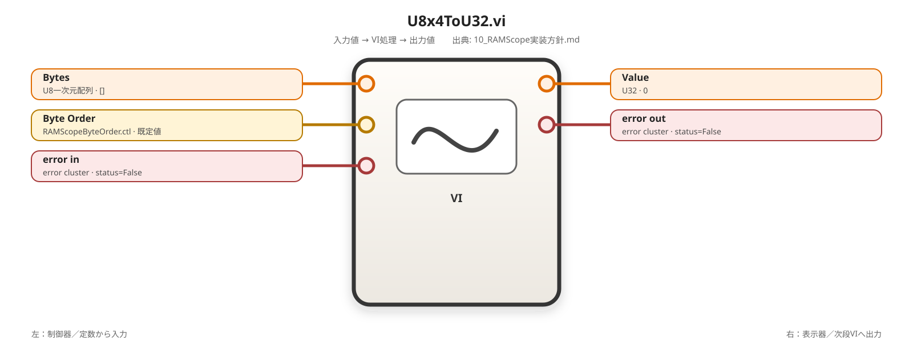

### `U8x8ToU64.vi`

出典章：`10_RAMScope実装方針.md`

### `VI Tree.vi`

出典章：`07_機器別VI構築手順.md`

### `YKFG400 .vi`

出典章：`A1A_FG420複数台2ch出力リミットPoC.md`

### `YKFG400 CHAN Mode.vi`

出典章：`A1A_FG420複数台2ch出力リミットPoC.md`

### `YKFG400 Close.vi`

出典章：`A1_付録_FG420基盤単体試験自動化.md`

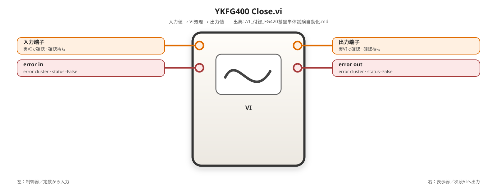

### `YKFG400 FREQ.vi`

出典章：`A1_付録_FG420基盤単体試験自動化.md`

### `YKFG400 FUNC.vi`

出典章：`A1_付録_FG420基盤単体試験自動化.md`

### `YKFG400 IDN.vi`

出典章：`A1A_FG420複数台2ch出力リミットPoC.md`

### `YKFG400 INST Coup.vi`

出典章：`A1A_FG420複数台2ch出力リミットPoC.md`

### `YKFG400 Initialize.vi`

出典章：`A1_付録_FG420基盤単体試験自動化.md`

### `YKFG400 OUTP Load.vi`

出典章：`A1A_FG420複数台2ch出力リミットPoC.md`

### `YKFG400 OUTP Pon.vi`

出典章：`A1A_FG420複数台2ch出力リミットPoC.md`

### `YKFG400 OUTP.vi`

出典章：`A1_付録_FG420基盤単体試験自動化.md`

### `YKFG400 ROSC Sour.vi`

出典章：`A1A_FG420複数台2ch出力リミットPoC.md`

### `YKFG400 SYST Err.vi`

出典章：`A1A_FG420複数台2ch出力リミットPoC.md`

### `YKFG400 TRIG Sour.vi`

出典章：`A1A_FG420複数台2ch出力リミットPoC.md`

### `YKFG400 TRIG.vi`

出典章：`A1A_FG420複数台2ch出力リミットPoC.md`

### `YKFG400 VOLT Offs.vi`

出典章：`A1A_FG420複数台2ch出力リミットPoC.md`

### `YKFG400 VOLT.vi`

出典章：`A1A_FG420複数台2ch出力リミットPoC.md`

