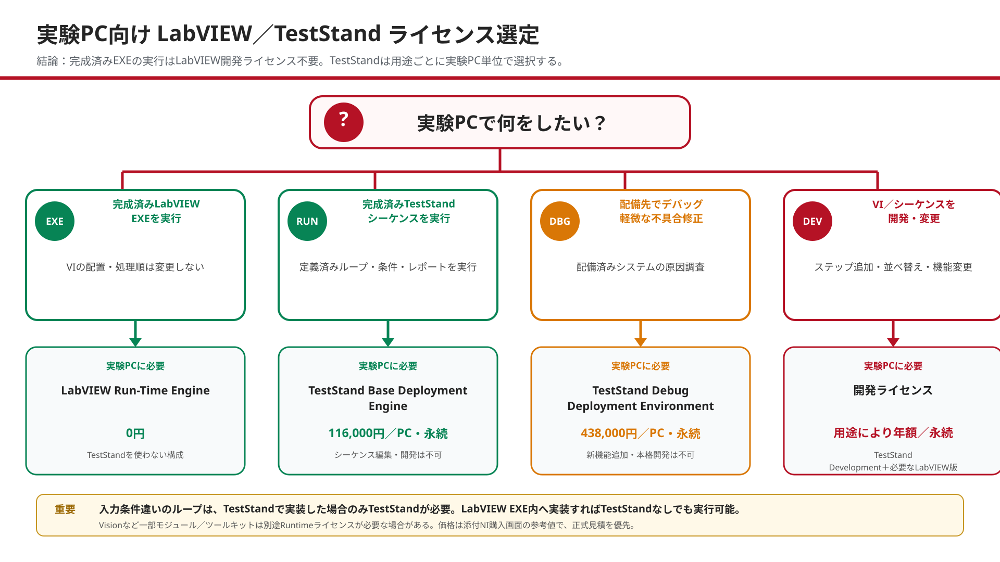
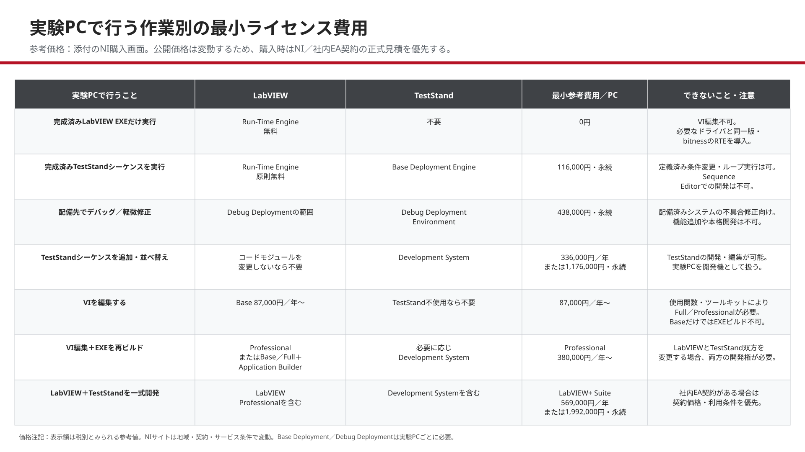

# 15. 実験PC向けLabVIEW・TestStandライセンス選定

**確認日：2026-07-27**

本章は「実験PCで何をしたいか」を起点に、LabVIEWおよびTestStandの最小ライセンス構成を選定するための資料である。
最終的な購入判断は、NIのSoftware License Agreement、使用するモジュール／ツールキット、社内EA契約およびNI正式見積を優先する。

## 15.1 結論

- 完成済みのLabVIEW EXEを実行するだけなら、実験PCにLabVIEW開発システムを導入する必要はない。
- 実験PCには、開発時と互換性のあるLabVIEW Run-Time Engine、使用するハードウェアドライバ、ベンダーDLLを導入する。
- TestStandで作成済みのシーケンスを実行する実験PCには、最低でもTestStand Base Deployment Engineが必要である。
- 配備先でデバッグと軽微な不具合修正を行う場合はTestStand Debug Deployment Environmentを使用する。
- Sequence Editorでステップ追加、並べ替え、条件・ループ構造の新規作成などを行う場合はTestStand Development Systemが必要である。
- VIを編集する実験PCにはLabVIEW開発ライセンスが必要である。使用する関数やツールキットに応じてBase、Full、Professionalを選ぶ。
- LabVIEW BaseまたはFullでEXE／Installerを作成する場合はApplication Builderを別途用意する。ProfessionalにはApplication Builderが含まれる。

## 15.2 説明文の修正版

何をしたいかによって、実験PCで必要になるライセンスは変わる。

開発PCでLabVIEW Application Builderを使用して作成したEXEを実験PCで実行するだけなら、実験PCにLabVIEW開発ライセンスを導入する必要はない。実験PCには、EXEと互換性のあるLabVIEW Run-Time Engine、必要なドライバ、DLLを導入する。Run-Time Engine上では完成済みアプリケーションを実行できるが、VIのブロックダイアグラムやSubVIの構成を編集できない。

実験PCでVIを開いて配線、Case Structure、SubVIの順序を変更する場合は、LabVIEW開発ライセンスが必要である。Baseで足りるかは使用する関数による。信号処理機能が必要ならFull、実験PCでEXEを再ビルドするならProfessional、またはBase／FullにApplication Builderを追加する。

TestStandを使用して作成済みシーケンスを実行する場合は、実験PCごとにTestStandライセンスが必要である。開発PCで定義したシーケンス、条件、ループ、レポート処理を実行するだけならBase Deployment Engineを使用する。配備済みシステムのデバッグや不具合修正を実験PCで行う場合はDebug Deployment Environmentを使用する。ただし、このライセンスは新機能追加や本格的な開発を許可するものではない。

実験PCでTestStand Sequence Editorを使用し、ステップの追加・削除・並べ替え、分岐やループの新規作成などを行う場合はTestStand Development Systemが必要である。

なお、入力条件を変えながら繰り返し試験する処理は、必ずTestStandが必要という意味ではない。ループをTestStandシーケンスとして実装した場合はTestStand実行ライセンスが必要だが、同じ機能をLabVIEW EXE内へ実装すれば、TestStandを使用せずに実行できる。

## 15.3 作業別の最小ライセンス費用

| 実験PCで行うこと | LabVIEW | TestStand | 最小参考費用／PC |
|---|---|---|---:|
| 完成済みLabVIEW EXEだけを実行 | Run-Time Engine | 不要 | 0円 |
| 完成済みTestStandシーケンスを実行 | Run-Time Engine | Base Deployment Engine | 116,000円・永続 |
| 配備先でデバッグ・軽微な不具合修正 | Debug Deploymentの許諾範囲 | Debug Deployment Environment | 438,000円・永続 |
| TestStandシーケンスを追加・並べ替え | コードモジュールを変更しないなら不要 | Development System | 336,000円／年、または1,176,000円・永続 |
| VIを編集 | Base以上 | TestStand不使用なら不要 | Base 87,000円／年、または305,000円・永続から |
| VI編集とEXE再ビルド | Professional、またはBase／Full＋Application Builder | 必要に応じてDevelopment System | Professional 380,000円／年、または1,330,000円・永続から |
| LabVIEWとTestStandを一式開発 | LabVIEW Professionalを含む | Development Systemを含む | LabVIEW+ Suite 569,000円／年、または1,992,000円・永続 |

上記価格は、提供されたNI購入画面に表示された参考価格である。価格には税、ソフトウェアサービス、契約割引等が反映されていない可能性がある。
社内EA契約の「471,000円／席・年」は社内契約情報として別管理し、適用製品、利用可能台数、Named／Computer Based／Concurrent等のライセンス形態を購買部門またはNIへ確認する。

## 15.4 判断時の注意

### LabVIEW

- NIは、LabVIEW Run-Time Engineを「開発システムなしで配備済みEXEを実行するもの」と説明し、無料ダウンロードを提供している。
- EXEとRun-Time Engineは、LabVIEWバージョンおよび32-bit／64-bitの互換性を確認する。
- Application BuilderはEXEまたはInstallerの作成に必要である。Professionalには含まれ、Base／Fullでは別途追加できる。
- Vision、Real-Time、FPGA、OPC UA等を使用する場合は、対象モジュール固有の開発／配備ライセンスを確認する。

### TestStand

- Base Deployment Engineは、TestStandで作成した配備物を実行するための最小ライセンスである。
- Base Deployment Engineでは、Sequence Editor、Custom Sequence EditorまたはTestStand APIを使用した開発は許可されない。
- Debug Deployment Environmentは配備済みシステムのデバッグと不具合修正向けで、新機能開発用ではない。
- Sequence Editorでシーケンスを開発・編集する場合はDevelopment Systemを使用する。
- TestStandを配備する実験PCごとに、適切なDeployment／Debug／Developmentライセンスが必要である。

## 15.5 公式資料

- [NI：Select Your NI LabVIEW Edition](https://www.ni.com/en/shop/labview/select-edition.html)
- [NI：Introduction to the LabVIEW Application Builder](https://www.ni.com/en/support/documentation/supplemental/19/introduction-to-the-labview-application-builder.html)
- [NI：LabVIEW and LabVIEW Run-Time Engine Compatibility](https://www.ni.com/en/support/documentation/compatibility/17/labview-and-labview-run-time-engine-compatibility.html)
- [NI：Select Your NI TestStand License](https://www.ni.com/en/shop/electronic-test-instrumentation/application-software-for-electronic-test-and-instrumentation-category/what-is-teststand/select-license.html)
- [NI：Activating and Licensing TestStand](https://www.ni.com/docs/en-US/bundle/teststand/page/teststand-licensing-options.html)
- [NI：TestStand System Deployment Best Practices](https://www.ni.com/en/support/documentation/supplemental/08/teststand-system-deployment-best-practices.html)

ユーザー提示の「Improving TestStand System Performance」は性能最適化の資料であり、ライセンス選定の根拠資料には使用しない。
