# 付録 A1A. FG420 複数台・2ch・出力リミット対応 PoC 実装手順

<!-- generated-vi-diagram -->
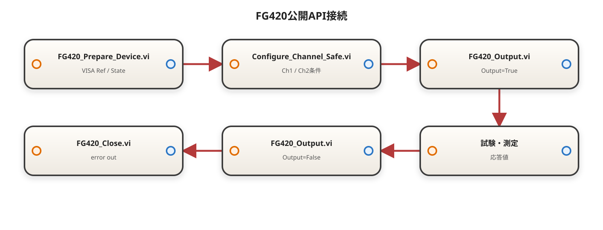

**最終整理日：2026-07-28**

> 横河ドライバVIの端子、Query／Set動作および制限値は`IMFG410-63JA`と対象PCの実VIで照合し、証跡は[00C](./00C_一次資料とバージョン基準.md)に従う。既決のtypedef、Wrapper、Service、PoC構成は変更しない。

## A1A.0 本章の位置づけ

本章は、[A1_付録_FG420基盤単体試験自動化.md](./A1_付録_FG420基盤単体試験自動化.md) の通信確認 PoC 完了後に実施する拡張実装を扱う。

既存 PoC では、1 台の FG420 に対して次の通信・出力フローが成立している。

```text
Initialize
  → FUNC
  → FREQ
  → OUTP Load
  → VOLT
  → VOLT Offs
  → OUTP ON
  → Wait
  → OUTP OFF
  → Close
```

本章では次の3機能を追加する。

1. 設定した電圧リミットを超える条件を FG420 へ送信しない。
2. 複数台の FG420 を接続し、機器ごとに異なる条件を設定できる。
3. FG420 の Ch1 / Ch2 を独立して設定できる。

本章の実装では、横河提供の`YKFG400 *.vi`を変更しない。自作VIは`10_FG420`配下に置き、ドライバVIを1個だけ呼ぶ薄いラッパVI、純粋ロジックVI、PoCオーケストレーションVIに分ける。

---

## A1A.1 マニュアルから確定している仕様

参照資料は`IMFG410-63JA FG410/FG420 LabVIEW ドライバ ユーザーズマニュアル`とする。

### A1A.1.1 VISAとerrorの接続

- 全ての操作VIは標準error in / error outを持つ。
- `Close`以外の操作VIはVISA session inと複製VISA session outを持つ。
- 各操作VIはVISAとerrorを直列接続して実行順序を確定する。
- ほとんどの設定VIは`Ch(Ch1)`または`Ch?(Ch1)`入力を持つ。

### A1A.1.2 2ch独立設定

`YKFG400 CHAN Mode.vi`の`Channel Mode`を`INDependent`に設定すると、Ch1とCh2を独立して設定できる。

`YKFG400 INST Coup.vi`の`Couple`は次の意味を持つ。

| 値 | 意味 |
|---|---|
| `ALL` | Ch1に送った設定をCh2にも同時反映する |
| `NONE` | 同時設定を無効にし、Ch1 / Ch2を個別設定する |

本PoCでは、個別設定を実現するため次を標準設定とする。

```text
CHAN Mode = INDependent
INST Coup  = NONE
```

### A1A.1.3 振幅・オフセット・負荷

`YKFG400 VOLT.vi`の振幅範囲は次のとおり。

| 負荷条件 | 振幅範囲 |
|---|---:|
| 開放 / Hi-Z | 0 ～ 20 Vp-p |
| 50 Ω | 0 ～ 10 Vp-p |

`YKFG400 VOLT Offs.vi`のオフセット範囲は次のとおり。

| 負荷条件 | オフセット範囲 |
|---|---:|
| 開放 / Hi-Z | -10 ～ +10 V |
| 50 Ω | -5 ～ +5 V |

`YKFG400 OUTP Load.vi`は負荷インピーダンスを設定する。数値指定は1 Ω～10 kΩ、`INFinity`でHi-Zを設定する。

振幅とオフセットの設定可能範囲は負荷設定に依存するため、必ず次の順で呼ぶ。

```text
OUTP Load
  → 振幅・オフセットの設定可能範囲取得
  → 出力リミット判定
  → VOLT
  → VOLT Offs
```

### A1A.1.4 機器識別

`YKFG400 IDN.vi`は次の形式のID文字列を返す。

```text
YOKOGAWA,FG4xx,シリアル番号,ファームウェアバージョン
```

複数台PoCではVISAリソース名だけでなくIDNのシリアル番号も記録し、設定対象の取り違えを防ぐ。

### A1A.1.5 複数台の厳密な同期

複数台へVISAコマンドを順番に送る方式では、出力ONの時刻は完全には一致しない。

- 「複数台を接続して同一PoCから個別設定する」ことは本章の標準機能とする。
- 「複数台の出力開始エッジを厳密に一致させる」ことは別要件とする。
- 厳密同期が必要な場合は、`ROSC Sour=EXTernal`による外部基準周波数、共通外部トリガ、`TRIG`系VIを組み合わせて実機確認する。

---

## A1A.2 実装レイヤ

```text
PoC_FG420_Multi_Device.vi
  ├─ FG420_Prepare_Device.vi
  ├─ FG420_Configure_Channel_Safe.vi
  ├─ FG420_Output.vi
  ├─ FG420_Close.vi
  └─ Cleanup

FG420_Prepare_Device.vi
  ├─ FG420_Init.vi
  ├─ FG420_Get_ID.vi
  ├─ FG420_Set_PowerOn_Output.vi
  ├─ FG420_Set_ChanMode.vi
  └─ FG420_Set_Coupling.vi

FG420_Configure_Channel_Safe.vi
  ├─ FG420_Output.vi（OFF）
  ├─ FG420_Set_Load.vi
  ├─ FG420_Query_Ampl_Bound.vi ×2
  ├─ FG420_Query_Offset_Bound.vi ×2
  ├─ FG420_Apply_Output_Limit.vi
  ├─ FG420_Set_Func.vi
  ├─ FG420_Set_Freq.vi
  ├─ FG420_Set_Ampl.vi
  └─ FG420_Set_Offset.vi
```

| レイヤ | 責務 |
|---|---|
| 薄いラッパVI | 横河ドライバVIを1個だけ呼び、VISA / error / Status / TestErrorを接続する |
| 純粋ロジックVI | 電圧ピーク計算、範囲判定、Clamp / Rejectを行う。VISAを呼ばない |
| 複合公開VI | 複数の薄いラッパを安全な順序で接続し、1イベントを完結する |
| PoC VI | 複数台・複数chの反復、状態管理、Wait、Cleanup、結果集計を行う |

---

## A1A.3 追加するtypedef

### A1A.3.1 `FG420_Limit_Mode.ctl`

Enum typedefとする。

| 値 | 意味 |
|---|---|
| `Reject` | リミット超過時はエラーを返し、設定をFG420へ送らない |
| `Clamp` | オフセットを維持し、振幅を安全値まで縮小する |

安全性を優先し、既定値は`Reject`とする。

### A1A.3.2 `FG420_Channel_Config.ctl`

Cluster typedefとする。

| フィールド | 型 | 初期値 | 意味 |
|---|---|---:|---|
| Enabled? | Boolean | False | このチャネルを設定対象にする |
| Channel | ドライバCh Enum | Ch1 | Ch1 / Ch2 |
| Function | ドライバ波形Enum | Sin | 波形種別 |
| Frequency Hz | DBL | 1000 | 出力周波数 |
| Load Infinity? | Boolean | True | Trueの場合Hi-Z |
| Load Ohm | DBL | 50 | 数値負荷を使う場合の値 |
| Requested Amplitude Vpp | DBL | 1.0 | 要求振幅 |
| Requested Offset V | DBL | 0.0 | 要求オフセット |
| Output Limit Abs V | DBL | 5.0 | 正負共通の絶対電圧リミット |
| Limit Mode | FG420_Limit_Mode.ctl | Reject | 超過時の動作 |
| Output On? | Boolean | False | 出力開始対象 |

### A1A.3.3 `FG420_Device_Config.ctl`

Cluster typedefとする。

| フィールド | 型 | 初期値 | 意味 |
|---|---|---:|---|
| Enabled? | Boolean | False | この機器をPoC対象にする |
| Logical Name | String | FG420_01 | ログ表示用名称 |
| VISA Resource | VISA resource name | 空 | 機器固有VISAリソース |
| ID Check? | Boolean | True | InitializeのID照合 |
| Reset? | Boolean | True | Initialize時のリセット |
| Ch1 Config | FG420_Channel_Config.ctl | Channel=Ch1 | Ch1条件 |
| Ch2 Config | FG420_Channel_Config.ctl | Channel=Ch2 | Ch2条件 |

### A1A.3.4 `FG420_Device_State.ctl`

Cluster typedefとする。

| フィールド | 型 | 初期値 |
|---|---|---:|
| Initialized? | Boolean | False |
| ID Read? | Boolean | False |
| Independent Mode? | Boolean | False |
| Coupling Disabled? | Boolean | False |
| Ch1 Configured? | Boolean | False |
| Ch2 Configured? | Boolean | False |
| Ch1 Output On? | Boolean | False |
| Ch2 Output On? | Boolean | False |
| Closed? | Boolean | False |
| IDN | String | 空 |

---

## A1A.4 追加する薄いラッパ VI

全ラッパで次を共通とする。

1. VISA session in / out を直列配線する。
2. error in.status=True の場合は、設定系ドライバ VI を呼ばず安全出力を返す。
3. ドライバ error out を `Error_To_TestStatus.vi` へ接続する。
4. Device Name は `FG420` とする。
5. `Read=False` で無効になる Query 出力は、設定専用ラッパでは公開しない。
6. Cleanup 用の `Output OFF` と `Close` は、通常処理の error を Clear Errors した別ワイヤで実行し、Original Error を Merge Errors の先頭入力へ保持する。

### A1A.4.1 `FG420_Set_ChanMode.vi`

<!-- generated-vi-diagram -->
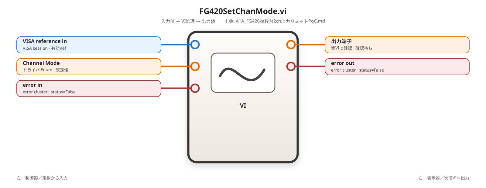

#### 0. 責務

FG420 を 2ch 独立モードへ設定する。

#### 1. 呼ぶドライバ VI

`YKFG400 CHAN Mode.vi`

#### 2. 入力

| 入力 | 型 |
|---|---|
| VISA reference in | VISA session |
| Channel Mode | ドライバ Enum |
| error in | error cluster |

#### 3. 内部固定値

```text
Read = False
```

PoC の標準入力は `INDependent` とする。

#### 4. 出力

VISA reference out、Status、TestError、error out。

#### 5. 単体テスト

- `INDependent` を設定してエラーなし。
- `Read=True` の一時確認版で `INDEPENDENT` が返る。
- 既存 error 時にドライバを実行しない。

### A1A.4.2 `FG420_Set_Coupling.vi`

<!-- generated-vi-diagram -->


#### 0. 責務

Ch1 設定を Ch2 へ自動反映するかを選択する。

#### 1. 呼ぶドライバ VI

`YKFG400 INST Coup.vi`

#### 2. 入力

VISA reference in、Couple Enum、error in。

#### 3. PoC 標準値

```text
Couple = NONE
Read   = False
```

Ch1 / Ch2 を個別設定する場合、必ず `NONE` を設定する。

#### 4. 単体テスト

- `NONE` 後に Ch1 の周波数を変更しても Ch2 が変化しない。
- `ALL` 後に Ch1 の設定が Ch2 へ反映される。
- PoC の通常経路では `NONE` を使用する。

### A1A.4.3 `FG420_Get_ID.vi`

<!-- generated-vi-diagram -->


#### 0. 責務

機器 ID とシリアル番号を取得し、複数台の論理名と実機を対応付ける。

#### 1. 呼ぶドライバ VI

`YKFG400 IDN.vi`

#### 2. 入出力

入力：VISA reference in、error in。

出力：VISA reference out、IDN String、Status、TestError、error out。

#### 3. 検証

- 文字列先頭が `YOKOGAWA,FG4` であること。
- 複数台の IDN が重複していないこと。
- 期待シリアル番号を条件に持つ場合は一致を検証する。

### A1A.4.4 `FG420_Set_PowerOn_Output.vi`

<!-- generated-vi-diagram -->


#### 0. 責務

電源投入時の出力状態を OFF に固定する。

#### 1. 呼ぶドライバ VI

`YKFG400 OUTP Pon.vi`

#### 2. 内部固定値

```text
Mode = OFF
Read = False
```

#### 3. 単体テスト

電源再投入後に Ch1 / Ch2 が自動で ON にならないことを実機確認する。

### A1A.4.5 `FG420_Query_Ampl_Bound.vi`

<!-- generated-vi-diagram -->
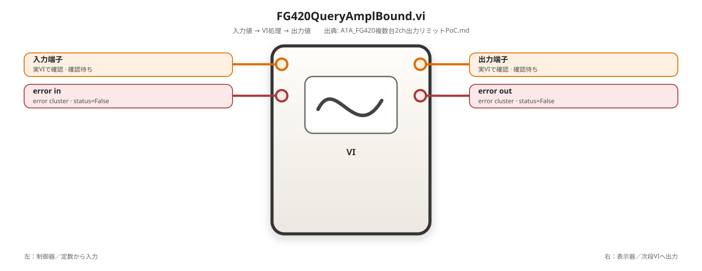

#### 0. 責務

現在の負荷・波形・チャネル条件に対する振幅の Minimum または Maximum を問い合わせる。

#### 1. 呼ぶドライバ VI

`YKFG400 VOLT.vi`

#### 2. 入力

VISA reference in、Channel、Bound Enum（Minimum / Maximum）、error in。

#### 3. 内部設定

```text
Units         = VPP
Set Amplitude = Bound 入力
Read          = True
Amplitude     = 0 DBL（問合せ時は設定値として使用しない）
```

#### 4. 出力

VISA reference out、Bound Value Vpp、Status、TestError、error out。

#### 5. 単体テスト

- Hi-Z と 50 Ω で Maximum が変化すること。
- Ch1 / Ch2 の各条件で問い合わせできること。
- Minimum <= Maximum を確認すること。

### A1A.4.6 `FG420_Query_Offset_Bound.vi`

<!-- generated-vi-diagram -->


`YKFG400 VOLT Offs.vi` を1回だけ呼び、Minimum または Maximum を問い合わせる。

内部設定は次のとおり。

```text
Units      = V
Set Offset = Bound 入力
Read       = True
Offset     = 0 DBL
```

出力は Bound Value V とする。

### A1A.4.7 `FG420_Read_System_Error.vi`

<!-- generated-vi-diagram -->


`YKFG400 SYST Err.vi` を1回呼び、FG420 のエラーキューを取得する。

設定後のデバッグおよび PoC の最終検証で使用する。通常ラッパの error cluster と機器内部エラーは別情報として記録する。

### A1A.4.8 同期拡張用ラッパ（任意）

厳密な複数台同期が必要な場合だけ次を追加する。

| 作成 VI | ドライバ VI | 責務 |
|---|---|---|
| `FG420_Set_Reference_Source.vi` | `YKFG400 ROSC Sour.vi` | Internal / External 基準周波数源を選ぶ |
| `FG420_Trigger.vi` | `YKFG400 TRIG.vi` | トリガボタン相当の動作を行う |
| `FG420_Set_Trigger_Source.vi` | `YKFG400 TRIG Sour.vi` | Internal / External 等のトリガ源を設定する |

VISA 経由で各台へ `TRIG.vi` を順番に呼ぶだけでは同時性を保証できない。厳密同期は共通外部トリガ配線を正式方式とする。
---

## A1A.5 出力リミット純粋処理VI

### A1A.5.1 `FG420_Apply_Output_Limit.vi`

<!-- generated-vi-diagram -->
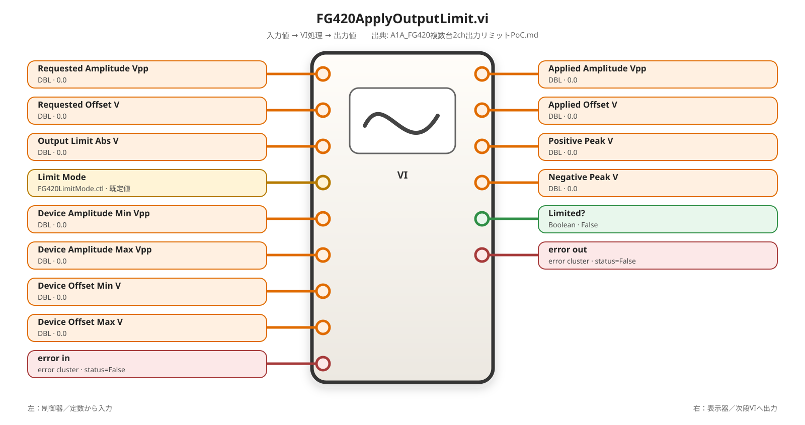

#### 0. 実現したい機能とVIの責務

要求振幅と要求オフセットから、FG420が出力しようとする正側ピーク電圧と負側ピーク電圧を別々に計算する。両ピークが`Output Limit Abs V`で指定した正負共通の絶対電圧範囲内なら要求値を通過させる。超過時は`Limit Mode`に従い、`Reject`では設定を拒否し、`Clamp`ではオフセットを維持したまま振幅だけを縮小する。

本VIはVISA、FG420ドライバ、ファイルI/Oを呼ばない純粋処理VIである。機器への設定、出力ON/OFF、Cleanupは担当しない。

**00C証跡**

| 項目 | 記録 |
|---|---|
| Source | 本章の既決設計、`IMFG410-63JA`のVOLT / VOLT Offs範囲 |
| Version | LabVIEW 2026 Q1 64bit |
| Symbol | `FG420_Apply_Output_Limit.vi` |
| Signature | 6個のDBL入力、`FG420_Limit_Mode.ctl`、error cluster → 4個のDBL出力、Boolean、error cluster |
| Verified by | 設計レビュー、単体テストで確認予定 |
| State | 既決設計、実装・単体テスト待ち |

#### 1. 入力データの実体

入力は全て単一スカラ値であり、配列ではない。

| 入力 | 型 | 実体・意味 |
|---|---|---|
| `Requested Amplitude Vpp` | DBL | FG420へ設定したいピーク・ツー・ピーク振幅。0以上 |
| `Requested Offset V` | DBL | 波形中心を0 Vから移動するDCオフセット |
| `Device Amplitude Min Vpp` | DBL | 現在のChannel / Load条件でFG420が受け付ける最小振幅 |
| `Device Amplitude Max Vpp` | DBL | 現在のChannel / Load条件でFG420が受け付ける最大振幅 |
| `Device Offset Min V` | DBL | 現在のChannel / Load条件でFG420が受け付ける最小オフセット |
| `Device Offset Max V` | DBL | 現在のChannel / Load条件でFG420が受け付ける最大オフセット |
| `Output Limit Abs V` | DBL | 正側を`+Limit`、負側を`-Limit`とする絶対電圧リミット。0より大きい値 |
| `Limit Mode` | `FG420_Limit_Mode.ctl` | `Reject`または`Clamp` |
| `error in` | error cluster | 前段エラー。status=True時は計算を開始しない |

Vp-p振幅の半分が波形中心から正側・負側へ広がるため、要求波形は次の2点で表す。

```text
Requested Positive Peak = Requested Offset V + Requested Amplitude Vpp / 2
Requested Negative Peak = Requested Offset V - Requested Amplitude Vpp / 2
```

#### 2. 出力データモデル

| 出力 | 型 | 意味 |
|---|---|---|
| `Applied Amplitude Vpp` | DBL | 後段の`FG420_Set_Ampl.vi`へ渡す振幅。Rejectまたは入力異常時は0.0 |
| `Applied Offset V` | DBL | 後段の`FG420_Set_Offset.vi`へ渡すオフセット。Clamp成功時は要求オフセットを維持する |
| `Positive Peak V` | DBL | リミッタ適用前の要求正側ピーク。超過原因の診断に使用する |
| `Negative Peak V` | DBL | リミッタ適用前の要求負側ピーク。超過原因の診断に使用する |
| `Limited?` | Boolean | 要求値がRejectまたはClamp対象になった場合True |
| `error out` | error cluster | 元のerrorまたは本VIのローカルエラー |

`Positive Peak V`と`Negative Peak V`は、Clamp後の値ではなく要求条件のピークを返す。Clamp後のピークは内部で再計算し、安全条件を満たすことを確認する。

#### 3. 前提条件・異常条件

| 条件 | 必要な理由 | 破った場合 | Code |
|---|---|---|---:|
| `error in.status=False` | 元エラーを上書きしない | 全計算をスキップし安全出力 | 元error |
| `Output Limit Abs V > 0` | 正負範囲を成立させる | ローカルエラー | -710110 |
| `Device Amplitude Min Vpp <= Device Amplitude Max Vpp` | 機器範囲を成立させる | ローカルエラー | -710113 |
| `Device Offset Min V <= Device Offset Max V` | 機器範囲を成立させる | ローカルエラー | -710113 |
| `Requested Amplitude Vpp >= 0` | Vp-pは負値を取らない | ローカルエラー | -710114 |
| 要求振幅がDevice Min/Max内 | FG420が受け付ける条件に限定する | ローカルエラー | -710114 |
| 要求オフセットがDevice Min/Max内 | FG420が受け付ける条件に限定する | ローカルエラー | -710114 |
| Clamp時に`abs(Offset) <= Limit` | 振幅0でもオフセット単独で超過しないため | Clamp不能エラー | -710111 |

ローカルエラーのsource全文は次のとおり。

```text
-710110:
FG420_Apply_Output_Limit.vi: Output Limit Abs V must be greater than zero. LimitAbsV=%f

-710111:
FG420_Apply_Output_Limit.vi: Offset alone exceeds the configured absolute voltage limit. OffsetV=%f, LimitAbsV=%f

-710112:
FG420_Apply_Output_Limit.vi: Requested output exceeds the configured absolute voltage limit. AmplitudeVpp=%f, OffsetV=%f, PositivePeakV=%f, NegativePeakV=%f, LimitAbsV=%f

-710113:
FG420_Apply_Output_Limit.vi: Device bounds are invalid. AmpMinVpp=%f, AmpMaxVpp=%f, OffsetMinV=%f, OffsetMaxV=%f

-710114:
FG420_Apply_Output_Limit.vi: Requested value is outside the FG420 device bounds. AmplitudeVpp=%f, AmpMinVpp=%f, AmpMaxVpp=%f, OffsetV=%f, OffsetMinV=%f, OffsetMaxV=%f
```

#### 4. 処理アルゴリズム

```text
if error in.status=True:
    0、0、0、0、False、元errorを返す
else:
    Limitが正値か確認する
    Device Min/Maxの並びを確認する
    要求振幅と要求オフセットがDevice範囲内か確認する

    Half Amplitude = Requested Amplitude / 2
    Positive Peak = Requested Offset + Half Amplitude
    Negative Peak = Requested Offset - Half Amplitude

    Positive Exceeded? = Positive Peak > Output Limit Abs V
    Negative Exceeded? = Negative Peak < -Output Limit Abs V
    Limit Exceeded? = Positive Exceeded? OR Negative Exceeded?

    if Limit Mode=Reject:
        if Limit Exceeded?=False:
            要求振幅と要求オフセットをそのまま返す
        else:
            Applied値を0にし、-710112を返す

    if Limit Mode=Clamp:
        if Limit Exceeded?=False:
            要求振幅と要求オフセットをそのまま返す
        else if abs(Requested Offset) > Output Limit Abs V:
            Applied値を0にし、-710111を返す
        else:
            Allowed Amplitude = 2 × (Limit - abs(Offset))
            Applied Amplitude = min(Requested Amplitude, Allowed Amplitude, Device Amplitude Max)
            Applied Offset = Requested Offset
            Clamp後の正負ピークを再計算して範囲内であることを確認する
            Limited?=True、errorなしを返す
```

#### 5. LabVIEW構造の選定理由

| 必要なロジック | 採用構造 | 理由 |
|---|---|---|
| 前段error時に計算しない | 外側Case Structure | 元errorを優先し、ローカル検証で上書きしない |
| 入力条件を優先順位付きで検証 | 多段Case Structure | -710110、-710113、-710114の発生条件を混在させない |
| Reject / Clampを分離 | `Limit Mode` Case Structure | 各モードの全出力を個別に配線できる |
| 超過あり / なしを分離 | Boolean Case Structure | 正常通過と制限処理を明示する |
| ローカルerror生成 | Format Into String + Bundle By Name | code、source、statusを再現可能な形で作る |

For Loop、While Loop、Shift Registerは使用しない。入力が単一条件であり、反復状態を保持する必要がないためである。

#### 6. 入出力

| 端子名 | 方向 | 型 | 制御器／表示器 | 公開用途 |
|---|---|---|---|---|
| Requested Amplitude Vpp | 入力 | DBL | 制御器 | 要求振幅 |
| Requested Offset V | 入力 | DBL | 制御器 | 要求オフセット |
| Device Amplitude Min Vpp | 入力 | DBL | 制御器 | 機器最小振幅 |
| Device Amplitude Max Vpp | 入力 | DBL | 制御器 | 機器最大振幅 |
| Device Offset Min V | 入力 | DBL | 制御器 | 機器最小オフセット |
| Device Offset Max V | 入力 | DBL | 制御器 | 機器最大オフセット |
| Output Limit Abs V | 入力 | DBL | 制御器 | 絶対リミット |
| Limit Mode | 入力 | `FG420_Limit_Mode.ctl` | 制御器 | Reject / Clamp |
| error in | 入力 | error cluster | 制御器 | 前段error |
| Applied Amplitude Vpp | 出力 | DBL | 表示器 | 設定用振幅 |
| Applied Offset V | 出力 | DBL | 表示器 | 設定用オフセット |
| Positive Peak V | 出力 | DBL | 表示器 | 要求正側ピーク |
| Negative Peak V | 出力 | DBL | 表示器 | 要求負側ピーク |
| Limited? | 出力 | Boolean | 表示器 | 制限動作の有無 |
| error out | 出力 | error cluster | 表示器 | 処理結果 |

#### 7. 配置する関数およびSubVI等

| 数 | 日本語名 | 英語名 | 配置場所・追加方法 |
|---:|---|---|---|
| 4以上 | ケースストラクチャ | Case Structure | プログラミング → ストラクチャ |
| 2 | 範囲内と強制 | In Range and Coerce | プログラミング → 比較 |
| 1 | 絶対値 | Absolute Value | プログラミング → 数値 |
| 2 | 除算 | Divide | プログラミング → 数値 |
| 2 | 加算 | Add | プログラミング → 数値 |
| 3 | 減算 | Subtract | プログラミング → 数値 |
| 1 | 乗算 | Multiply | プログラミング → 数値 |
| 1 | 符号反転 | Negate | プログラミング → 数値 |
| 2 | 最小＆最大 | Min & Max | プログラミング → 比較 |
| 必要数 | 大きい?／小さい?／以上?／以下? | Greater? / Less? / Greater Or Equal? / Less Or Equal? | プログラミング → 比較 |
| 2 | 複合演算 | Compound Arithmetic | プログラミング → Boolean。AND用とOR用 |
| 5 | 文字列にフォーマット | Format Into String | プログラミング → 文字列 |
| 5 | 名前でバンドル | Bundle By Name | プログラミング → クラスタ、クラス、バリアント |
| 1 | `FG420_Limit_Mode.ctl`定数 | typedef定数 | Limit Mode制御器から定数を作成 |

#### 8. 配線順

##### 8.1 外側error Case

1. `error in`を名前でアンバンドル（Unbundle By Name）の`cluster`へ接続し、`status`を取り出す。
2. `status`を外側ケースストラクチャ（Case Structure）のselectorへ接続する。
3. Trueケースでは、DBL定数`0.0`を`Applied Amplitude Vpp`、`Applied Offset V`、`Positive Peak V`、`Negative Peak V`の各出力トンネルへ接続する。
4. Trueケースでは、Boolean定数`False`を`Limited?`出力トンネルへ接続する。
5. Trueケースでは、`error in`を`error out`用トンネルへ接続する。
6. Falseケースでは、手順8.2以降の入力検証回路を配置する。

##### 8.2 Limit正値検証

7. `Output Limit Abs V`を大きい?（Greater?）の上側入力へ接続する。
8. DBL定数`0.0`を同じ大きい?（Greater?）の下側入力へ接続する。
9. Greater?出力を`Limit Positive?`として扱い、`Limit Positive?` Case Structureのselectorへ接続する。
10. Falseケースでは、`Output Limit Abs V`を文字列にフォーマット（Format Into String）の引数へ接続し、書式文字列定数を`FG420_Apply_Output_Limit.vi: Output Limit Abs V must be greater than zero. LimitAbsV=%f`とする。
11. Falseケースでは、`error in`を名前でバンドル（Bundle By Name）の基準clusterへ接続し、Boolean定数`True`を`status`、I32定数`-710110`を`code`、Format Into String出力を`source`へ接続する。
12. Falseケースのデータ出力はDBL定数`0.0`×4、Boolean定数`False`、errorはBundle By Name出力とする。
13. TrueケースではDevice Min/Max検証へ進む。

##### 8.3 Device Min/Max検証

14. `Device Amplitude Min Vpp`を以下?（Less Or Equal?）の一方へ、`Device Amplitude Max Vpp`をもう一方へ接続する。出力を`Amplitude Bounds Valid?`とする。
15. `Device Offset Min V`を2個目の以下?（Less Or Equal?）の一方へ、`Device Offset Max V`をもう一方へ接続する。出力を`Offset Bounds Valid?`とする。
16. `Amplitude Bounds Valid?`と`Offset Bounds Valid?`をAND設定の複合演算（Compound Arithmetic）へ接続し、出力を`Device Bounds Valid?`とする。
17. `Device Bounds Valid?`をCase Structureのselectorへ接続する。
18. Falseケースでは4個のDevice Min/Max入力をFormat Into Stringへ接続し、-710113のsource全文を生成する。
19. Falseケースでは`error in`をBundle By Nameの基準clusterとし、status=True、code=I32`-710113`、source=Format Into String出力を接続する。
20. Falseケースのデータ出力はDBL定数`0.0`×4、Boolean定数`False`、errorは-710113 clusterとする。
21. Trueケースでは要求値のDevice範囲検証へ進む。

##### 8.4 要求値のDevice範囲検証

22. `Requested Amplitude Vpp`を以上?（Greater Or Equal?）の一方へ接続し、DBL定数`0.0`をもう一方へ接続する。出力を`Amplitude Nonnegative?`とする。
23. `Requested Amplitude Vpp`を1個目の範囲内と強制（In Range and Coerce）の`x`へ接続する。
24. `Device Amplitude Min Vpp`を同関数の`lower limit`、`Device Amplitude Max Vpp`を`upper limit`へ接続する。`include lower limit?`と`include upper limit?`はBoolean定数`True`とする。
25. 1個目の`In Range?`出力を`Amplitude In Device Range?`とする。`coerced x`は接続しない。
26. `Requested Offset V`を2個目のIn Range and Coerceの`x`へ接続する。
27. `Device Offset Min V`を`lower limit`、`Device Offset Max V`を`upper limit`へ接続し、両包含端子へBoolean定数`True`を接続する。
28. 2個目の`In Range?`出力を`Offset In Device Range?`とする。
29. `Amplitude Nonnegative?`、`Amplitude In Device Range?`、`Offset In Device Range?`をAND設定のCompound Arithmeticへ接続し、出力を`Requested Values Valid?`とする。
30. `Requested Values Valid?`をCase Structureのselectorへ接続する。
31. Falseケースでは、Requested値とDevice Min/MaxをFormat Into Stringへ接続し、-710114のsource全文を生成する。
32. Falseケースではstatus=True、code=I32`-710114`、source=生成文字列をBundle By Nameへ接続する。
33. Falseケースのデータ出力はDBL定数`0.0`×4、Boolean定数`False`、errorは-710114 clusterとする。
34. Trueケースではピーク計算へ進む。

##### 8.5 正側ピーク・負側ピーク・超過Booleanの生成

35. `Requested Amplitude Vpp`を除算（Divide）の`x`へ接続し、DBL定数`2.0`を`y`へ接続する。出力を`Requested Half Amplitude V`とする。
36. `Requested Offset V`を加算（Add）の一方へ、`Requested Half Amplitude V`をもう一方へ接続する。出力を`Requested Positive Peak V`とする。
37. `Requested Offset V`を減算（Subtract）の`x`へ、`Requested Half Amplitude V`を`y`へ接続する。出力を`Requested Negative Peak V`とする。
38. `Requested Positive Peak V`を大きい?（Greater?）の一方へ、`Output Limit Abs V`をもう一方へ接続する。出力を`Positive Exceeded?`とする。
39. `Output Limit Abs V`を符号反転（Negate）へ接続し、出力を`Negative Limit V`とする。
40. `Requested Negative Peak V`を小さい?（Less?）の一方へ、`Negative Limit V`をもう一方へ接続する。出力を`Negative Exceeded?`とする。
41. `Positive Exceeded?`と`Negative Exceeded?`をOR設定のCompound Arithmeticへ接続し、出力を`Limit Exceeded?`とする。
42. `Requested Positive Peak V`を全後続ケースの`Positive Peak V`出力トンネルへ接続する。
43. `Requested Negative Peak V`を全後続ケースの`Negative Peak V`出力トンネルへ接続する。
44. `Limit Mode`をCase Structureのselectorへ接続し、`Reject`ケースと`Clamp`ケースを作成する。

##### 8.6 Rejectケース

45. `Limit Exceeded?`をRejectケース内のCase Structure selectorへ接続する。
46. Falseケースでは、`Requested Amplitude Vpp`を`Applied Amplitude Vpp`へ、`Requested Offset V`を`Applied Offset V`へ、Boolean定数`False`を`Limited?`へ、`error in`をerrorトンネルへ接続する。
47. Trueケースでは、DBL定数`0.0`を`Applied Amplitude Vpp`と`Applied Offset V`へ接続する。
48. Trueケースでは、Boolean定数`True`を`Limited?`へ接続する。
49. TrueケースではRequested Amplitude、Requested Offset、Requested Positive Peak、Requested Negative Peak、Output LimitをFormat Into Stringへ接続し、-710112のsource全文を生成する。
50. Trueケースでは`error in`をBundle By Nameの基準clusterへ接続し、status=True、code=I32`-710112`、source=生成文字列を接続する。
51. Trueケースのerror出力へ-710112 clusterを接続する。

##### 8.7 Clampケース

52. `Limit Exceeded?`をClampケース内の1個目のCase Structure selectorへ接続する。
53. Falseケースでは、Requested Amplitude、Requested Offset、Requested Positive Peak、Requested Negative Peak、Limited?=False、error inを各出力トンネルへ接続する。
54. Trueケースでは、`Requested Offset V`を絶対値（Absolute Value）へ接続し、出力を`Absolute Offset V`とする。
55. `Absolute Offset V`を大きい?（Greater?）の一方へ、`Output Limit Abs V`をもう一方へ接続し、出力を`Offset Alone Exceeded?`とする。
56. `Offset Alone Exceeded?`を2個目のCase Structure selectorへ接続する。
57. TrueケースではDBL定数`0.0`をApplied Amplitude / Applied Offsetへ、Boolean定数`True`をLimited?へ接続する。
58. TrueケースではRequested OffsetとOutput LimitをFormat Into Stringへ接続して-710111のsource全文を生成し、status=True、code=I32`-710111`、source=生成文字列をBundle By Nameへ接続する。
59. Falseケースでは、`Output Limit Abs V`を減算（Subtract）の`x`、`Absolute Offset V`を`y`へ接続する。出力を`Available Peak Margin V`とする。
60. `Available Peak Margin V`を乗算（Multiply）の一方へ接続し、DBL定数`2.0`をもう一方へ接続する。出力を`Allowed Amplitude Vpp`とする。
61. `Requested Amplitude Vpp`と`Allowed Amplitude Vpp`を1個目の最小＆最大（Min & Max）へ接続し、`min`出力を`Requested Or Limit Min Vpp`とする。`max`出力は接続しない。
62. `Requested Or Limit Min Vpp`と`Device Amplitude Max Vpp`を2個目のMin & Maxへ接続し、`min`出力を`Applied Amplitude Candidate Vpp`とする。
63. `Applied Amplitude Candidate Vpp`を`Applied Amplitude Vpp`へ、`Requested Offset V`を`Applied Offset V`へ、Boolean定数`True`を`Limited?`へ、`error in`をerrorトンネルへ接続する。
64. `Applied Amplitude Candidate Vpp`を2個目のDivideの`x`へ、DBL定数`2.0`を`y`へ接続し、`Applied Half Amplitude V`を作る。
65. `Requested Offset V + Applied Half Amplitude V`を2個目のAddで生成し、`Applied Positive Peak V`とする。
66. `Requested Offset V - Applied Half Amplitude V`を3個目のSubtractで生成し、`Applied Negative Peak V`とする。
67. `Applied Positive Peak V <= Output Limit Abs V`と`Applied Negative Peak V >= Negative Limit V`を比較関数で生成し、AND設定のCompound Arithmeticへ接続する。出力を`Clamp Result Safe?`とする。
68. `Clamp Result Safe?=False`は浮動小数点丸めまたは不正な境界値を示すため、-710113を生成してApplied値をDBL定数`0.0`へ切り替える。Trueでは手順63の値を維持する。

##### 8.8 全ケースの出力確認

| 経路 | Applied Amp | Applied Offset | Positive Peak | Negative Peak | Limited? | error |
|---|---:|---:|---:|---:|---|---|
| error in=True | 0 | 0 | 0 | 0 | False | 元error |
| Limit<=0 | 0 | 0 | 0 | 0 | False | -710110 |
| Bounds不正 | 0 | 0 | 0 | 0 | False | -710113 |
| Requested範囲外 | 0 | 0 | 0 | 0 | False | -710114 |
| Reject・範囲内 | Requested | Requested | Requested peak | Requested peak | False | no error |
| Reject・超過 | 0 | 0 | Requested peak | Requested peak | True | -710112 |
| Clamp・範囲内 | Requested | Requested | Requested peak | Requested peak | False | no error |
| Clamp・Offset単独超過 | 0 | 0 | Requested peak | Requested peak | True | -710111 |
| Clamp・縮小成功 | 計算値 | Requested | Requested peak | Requested peak | True | no error |

#### 9. 単体テスト

テストはフロントパネルの全入力制御器へ直接値を入れ、各表示器とerror outを確認する。

| No. | 入力 | 通過経路 | 期待結果 |
|---:|---|---|---|
| 1 | Amp=2、Offset=0、Amp範囲0～20、Offset範囲-10～10、Limit=5、Reject | 正常・非超過 | Applied=2/0、Peak=+1/-1、Limited=False、no error |
| 2 | Amp=10、Offset=0、Limit=5、Reject | 正側・負側境界 | Peak=+5/-5、超過なし、Applied=10 |
| 3 | Amp=10.0002、Offset=0、Limit=5、Reject | Reject超過 | Applied=0/0、Limited=True、-710112 |
| 4 | Amp=8、Offset=2、Limit=5、Clamp | Clamp縮小 | Allowed=6、Applied Amp=6、Offset=2、Limited=True、no error |
| 5 | Amp=0、Offset=5、Limit=5、Clamp | Offset境界 | Applied=0/5、Limited=False、no error |
| 6 | Amp=0、Offset=5.0001、Limit=5、Clamp | Offset単独超過 | Applied=0/0、Limited=True、-710111 |
| 7 | Amp=-1 | 入力範囲異常 | -710114、安全出力 |
| 8 | Amp Min=20、Amp Max=10 | Bounds不正 | -710113、安全出力 |
| 9 | Device Amp Max=10、Requested Amp=12 | Device範囲外 | -710114、安全出力 |
| 10 | error in.status=True、code=-123 | 外側True | 全DBL=0、Limited=False、error out.code=-123 |

推奨プローブ位置は`Requested Half Amplitude V`、`Positive Exceeded?`、`Negative Exceeded?`、`Allowed Amplitude Vpp`、`Clamp Result Safe?`である。

> 本機能はソフトウェアガードであり、ハードウェアの過電圧保護ではない。供試体破損または安全上の危険がある場合は、外付けクランプ、アッテネータ、保護回路、ヒューズ等を併用する。

---

## A1A.6 チャネル安全設定VI

### A1A.6.1 `FG420_Configure_Channel_Safe.vi`

<!-- generated-vi-diagram -->


#### 0. 実現したい機能とVIの責務

1台のFG420の1チャネルについて、出力をOFFにした状態で負荷条件を設定し、その負荷条件に対応する振幅・オフセットの機器Min/Maxを取得する。取得値と`FG420_Channel_Config.ctl`の要求値を`FG420_Apply_Output_Limit.vi`へ渡し、安全と判定された値だけを波形、周波数、振幅、オフセット設定VIへ渡す。

本VIは出力ON、Wait、複数台反復、Closeを担当しない。

**00C証跡**

| 項目 | 記録 |
|---|---|
| Source | `IMFG410-63JA`、A1のCtrl+H確認済みラッパ、A1A既決呼出順 |
| Version | LabVIEW 2026 Q1 64bit、対象PCのYKFG400ドライバ |
| Symbol | `FG420_Configure_Channel_Safe.vi` |
| Signature | VISA session + `FG420_Channel_Config.ctl` + error → VISA session + Applied値 + Status / TestError / error |
| Verified by | 既存Wrapper端子はA1で確認。複合VIは実装後にCtrl+H確認 |
| State | 既決設計、実装・実機確認待ち |

> `Load Infinity?`を受ける既存`FG420_Set_Load.vi`公開端子は、実装時に対象プロジェクトのコネクタペインをCtrl+Hで再確認する。端子が既存実体に存在しない場合は、本限定修正ではWrapper署名を変更せず、A1Aの既決データモデルとの不一致として別途是正承認を得る。推測でドライバ端子を追加しない。

#### 1. 入力データの実体

`Channel Config`は1チャネル分の設定を持つ単一clusterである。配列ではない。

```text
FG420_Channel_Config.ctl
├─ Enabled?
├─ Channel
├─ Function
├─ Frequency Hz
├─ Load Infinity?
├─ Load Ohm
├─ Requested Amplitude Vpp
├─ Requested Offset V
├─ Output Limit Abs V
├─ Limit Mode
└─ Output On?   ※本VIでは参照しない。PoCのOutput ON判断で使用する
```

`Output On?`はclusterの一部として入力されるが、本VIの責務は安全な設定までであるため出力ONには使用しない。未使用理由を明記し、PoC側で必ず配線する。

#### 2. 出力データモデル

| 出力 | 意味 |
|---|---|
| VISA reference out | 最後に呼んだ`FG420_Set_Offset.vi`のVISA出力。途中停止時は最後に成功またはスキップしたVIのVISA出力 |
| Applied Amplitude Vpp | リミット処理後の振幅 |
| Applied Offset V | リミット処理後のオフセット |
| Positive Peak V | 要求条件の正側ピーク |
| Negative Peak V | 要求条件の負側ピーク |
| Limited? | RejectまたはClamp対象になったことを示す |
| Status / TestError | 本VI全体の最終errorから生成する共通結果 |
| error out | 最初に発生したWrapper、Query、Limit、設定エラー |

#### 3. 前提条件・異常条件

- `error in.status=True`では全SubVIを呼ばず、VISAを素通りし、数値0、Limited=False、元errorを返す。
- `Enabled?=False`ではチャネルを変更せず、VISAとno errorを素通りし、数値0、Limited=Falseを返す。
- `FG420_Output.vi(OFF)`からMin/Max取得までのどこかでerrorが発生した場合、後段Wrapperは各Wrapper内のerror Caseによりドライバ呼出しをスキップする。
- `FG420_Apply_Output_Limit.vi`がRejectまたは入力異常を返した場合、Function / Frequency / Amplitude / Offset設定を開始しない。
- `FG420_Set_Load.vi`は振幅・オフセットMin/Max問い合わせより前に実行する。
- `Channel Config.Channel`はCh1またはCh2である。

#### 4. 処理アルゴリズム

```text
if error in.status=True:
    安全出力を返す
else if Channel Config.Enabled?=False:
    チャネルを変更せずバイパスする
else:
    対象ChannelをOutput OFFにする
    対象ChannelのLoadを設定する
    対象ChannelのAmplitude Minimumを取得する
    対象ChannelのAmplitude Maximumを取得する
    対象ChannelのOffset Minimumを取得する
    対象ChannelのOffset Maximumを取得する
    要求値、Device Min/Max、Limit、ModeをLimit VIへ渡す

    if Limit VI error=True:
        設定VIを呼ばずLimit結果とerrorを返す
    else:
        Functionを設定する
        Frequencyを設定する
        Applied Amplitudeを設定する
        Applied Offsetを設定する

最終errorからStatus / TestErrorを生成する
```

#### 5. LabVIEW構造の選定理由

| 構造 | selector | 理由 |
|---|---|---|
| 外側Case Structure | `error in.status` | 元error時に機器操作を開始しない |
| Enabled Case Structure | `Channel Config.Enabled?` | 未使用chを完全にバイパスする |
| Limit Error Case Structure | `FG420_Apply_Output_Limit.vi / error out.status` | Reject・入力異常時に設定値を機器へ送らない |
| error cluster直列配線 | 各Wrapperのerror out → 次Wrapperのerror in | 実行順と最初のerror保持を保証する |

LoopとShift Registerは使用しない。対象が1チャネル固定だからである。

#### 6. 入出力

| 端子名 | 方向 | 型 | 制御器／表示器 | 接続先 |
|---|---|---|---|---|
| VISA reference in | 入力 | VISA session | 制御器 | `FG420_Output.vi / VISA reference in` |
| Channel Config | 入力 | `FG420_Channel_Config.ctl` | 制御器 | Unbundle By Name |
| error in | 入力 | error cluster | 制御器 | 外側Case selector抽出、`FG420_Output.vi / error in` |
| VISA reference out | 出力 | VISA session | 表示器 | 最終CaseのVISAトンネル |
| Applied Amplitude Vpp | 出力 | DBL | 表示器 | Limit VI出力 |
| Applied Offset V | 出力 | DBL | 表示器 | Limit VI出力 |
| Positive Peak V | 出力 | DBL | 表示器 | Limit VI出力 |
| Negative Peak V | 出力 | DBL | 表示器 | Limit VI出力 |
| Limited? | 出力 | Boolean | 表示器 | Limit VI出力 |
| Status | 出力 | `Status.ctl` | 表示器 | `Error_To_TestStatus.vi / Status` |
| TestError | 出力 | `TestError.ctl` | 表示器 | `Error_To_TestStatus.vi / TestError` |
| error out | 出力 | error cluster | 表示器 | `Error_To_TestStatus.vi / error out` |

#### 7. 配置する関数およびSubVI等

| 数 | 日本語名 | 英語名 | 配置場所・追加方法 |
|---:|---|---|---|
| 1 | 名前でアンバンドル | Unbundle By Name | プログラミング → クラスタ、クラス、バリアント |
| 3 | ケースストラクチャ | Case Structure | プログラミング → ストラクチャ |
| 1 | `FG420_Output.vi` | SubVI | `10_FG420` |
| 1 | `FG420_Set_Load.vi` | SubVI | `10_FG420` |
| 2 | `FG420_Query_Ampl_Bound.vi` | SubVI | `10_FG420` |
| 2 | `FG420_Query_Offset_Bound.vi` | SubVI | `10_FG420` |
| 1 | `FG420_Apply_Output_Limit.vi` | SubVI | `10_FG420` |
| 1 | `FG420_Set_Func.vi` | SubVI | `10_FG420` |
| 1 | `FG420_Set_Freq.vi` | SubVI | `10_FG420` |
| 1 | `FG420_Set_Ampl.vi` | SubVI | `10_FG420` |
| 1 | `FG420_Set_Offset.vi` | SubVI | `10_FG420` |
| 1 | `Error_To_TestStatus.vi` | SubVI | `00_Common` |
| 1 | エラーなし定数 | No Error Constant | error cluster端子から定数を作成 |

#### 8. 配線順

##### 8.1 Cluster展開と外側error Case

1. `Channel Config`制御器を名前でアンバンドル（Unbundle By Name）の`cluster`端子へ接続する。
2. Unbundle By Nameへ`Enabled?`、`Channel`、`Function`、`Frequency Hz`、`Load Infinity?`、`Load Ohm`、`Requested Amplitude Vpp`、`Requested Offset V`、`Output Limit Abs V`、`Limit Mode`、`Output On?`を表示する。
3. `Output On?`ワイヤには「PoCで使用。本VIでは出力ONしない」とラベルを付け、機器操作SubVIへ接続しない。
4. `error in`をUnbundle By Nameへ接続し、`status`を外側Case Structureのselectorへ接続する。
5. 外側Trueケースでは、`VISA reference in`を`VISA reference out`トンネルへ接続する。
6. 外側Trueケースでは、DBL定数`0.0`を4個の数値出力へ、Boolean定数`False`を`Limited?`へ接続する。
7. 外側Trueケースでは、`error in`をFinal Errorトンネルへ接続する。
8. 外側Falseケースでは`Enabled?`を内側Case Structure selectorへ接続する。

##### 8.2 Enabled?=FalseバイパスCase

9. Falseケースでは、`VISA reference in`をVISA出力トンネルへ接続する。
10. FalseケースではDBL定数`0.0`をApplied Amplitude、Applied Offset、Positive Peak、Negative Peakの各出力トンネルへ接続する。
11. FalseケースではBoolean定数`False`を`Limited?`へ接続する。
12. Falseケースでは`error in`をFinal Errorトンネルへ接続する。
13. Falseケースでは全SubVIを配置しない。

##### 8.3 Enabled?=True：Output OFF

14. `VISA reference in`を`FG420_Output.vi / VISA reference in`へ接続する。
15. `Channel`を`FG420_Output.vi / Channel`へ接続する。
16. Boolean定数`False`を`FG420_Output.vi / Output On?`へ接続する。FalseはOUTP OFFを表す。
17. `error in`を`FG420_Output.vi / error in`へ接続する。
18. `FG420_Output.vi / VISA reference out`を`VISA After Output OFF`として扱う。
19. `FG420_Output.vi / error out`を`Error After Output OFF`として扱う。Status / TestError出力はこの複合VI内では接続せず、最終errorから再生成する。

##### 8.4 Load設定

20. `VISA After Output OFF`を`FG420_Set_Load.vi / VISA reference in`へ接続する。
21. `Channel`を`FG420_Set_Load.vi / Channel`へ接続する。
22. `Load Infinity?`を`FG420_Set_Load.vi / Load Infinity?`へ接続する。
23. `Load Ohm`を`FG420_Set_Load.vi / Load Ohm`へ接続する。
24. `Error After Output OFF`を`FG420_Set_Load.vi / error in`へ接続する。
25. `FG420_Set_Load.vi / VISA reference out`を`VISA After Load`、`error out`を`Error After Load`として扱う。

##### 8.5 Amplitude Min / Max取得

26. `VISA After Load`を1個目の`FG420_Query_Ampl_Bound.vi / VISA reference in`へ接続する。
27. `Channel`を同VIの`Channel`へ接続する。
28. Bound Enum定数`Minimum`を同VIの`Bound`へ接続する。
29. `Error After Load`を同VIの`error in`へ接続する。
30. 1個目の`Bound Value Vpp`を`Device Amplitude Min Vpp`として扱う。
31. 1個目のVISA出力を2個目の`FG420_Query_Ampl_Bound.vi / VISA reference in`へ接続する。
32. `Channel`を2個目の`Channel`へ接続する。
33. Bound Enum定数`Maximum`を2個目の`Bound`へ接続する。
34. 1個目のerror outを2個目のerror inへ接続する。
35. 2個目の`Bound Value Vpp`を`Device Amplitude Max Vpp`として扱う。
36. 2個目のVISA出力を`VISA After Amplitude Bounds`、error outを`Error After Amplitude Bounds`として扱う。

##### 8.6 Offset Min / Max取得

37. `VISA After Amplitude Bounds`を1個目の`FG420_Query_Offset_Bound.vi / VISA reference in`へ接続する。
38. `Channel`を同VIの`Channel`へ、Bound Enum定数`Minimum`を`Bound`へ接続する。
39. `Error After Amplitude Bounds`を同VIの`error in`へ接続する。
40. 1個目の`Bound Value V`を`Device Offset Min V`として扱う。
41. 1個目のVISA出力を2個目の`FG420_Query_Offset_Bound.vi / VISA reference in`へ接続する。
42. `Channel`を2個目の`Channel`へ、Bound Enum定数`Maximum`を`Bound`へ接続する。
43. 1個目のerror outを2個目のerror inへ接続する。
44. 2個目の`Bound Value V`を`Device Offset Max V`として扱う。
45. 2個目のVISA出力を`VISA After Offset Bounds`、error outを`Error After Offset Bounds`として扱う。

##### 8.7 Limit VI接続

46. `Requested Amplitude Vpp`を`FG420_Apply_Output_Limit.vi / Requested Amplitude Vpp`へ接続する。
47. `Requested Offset V`を同VIの`Requested Offset V`へ接続する。
48. `Device Amplitude Min Vpp`と`Device Amplitude Max Vpp`を同名端子へ接続する。
49. `Device Offset Min V`と`Device Offset Max V`を同名端子へ接続する。
50. `Output Limit Abs V`を同名端子へ、`Limit Mode`を同名端子へ接続する。
51. `Error After Offset Bounds`を`FG420_Apply_Output_Limit.vi / error in`へ接続する。
52. Limit VIのApplied Amplitude、Applied Offset、Positive Peak、Negative Peak、Limited?を、Enabled=Trueケースの対応する出力トンネルへ接続する。
53. Limit VIの`error out.status`をUnbundle By Nameで取得し、`Limit Error?` Case Structureのselectorへ接続する。

##### 8.8 Limit Reject／入力異常Case

54. `Limit Error?=True`ケースでは`VISA After Offset Bounds`をVISA出力トンネルへ接続する。
55. 同ケースではLimit VIの全データ出力をそのまま各データ出力トンネルへ接続する。
56. 同ケースではLimit VIの`error out`をFinal Errorトンネルへ接続する。
57. 同ケースでは`FG420_Set_Func.vi`、`FG420_Set_Freq.vi`、`FG420_Set_Ampl.vi`、`FG420_Set_Offset.vi`を配置しない。

##### 8.9 Limit正常Case：Function / Frequency / Amplitude / Offset

58. `VISA After Offset Bounds`を`FG420_Set_Func.vi / VISA reference in`へ接続する。
59. `Channel`を`FG420_Set_Func.vi / Channel`へ、`Function`を`Function`へ接続する。
60. Limit VIのerror outを`FG420_Set_Func.vi / error in`へ接続する。
61. `FG420_Set_Func.vi / VISA reference out`を`FG420_Set_Freq.vi / VISA reference in`へ接続する。
62. `Channel`を`FG420_Set_Freq.vi / Channel`へ、`Frequency Hz`を`Frequency Hz`へ接続する。
63. `FG420_Set_Func.vi / error out`を`FG420_Set_Freq.vi / error in`へ接続する。
64. `FG420_Set_Freq.vi / VISA reference out`を`FG420_Set_Ampl.vi / VISA reference in`へ接続する。
65. `Channel`を`FG420_Set_Ampl.vi / Channel`へ、Limit VIの`Applied Amplitude Vpp`を`Amplitude Vpp`へ接続する。
66. `FG420_Set_Freq.vi / error out`を`FG420_Set_Ampl.vi / error in`へ接続する。
67. `FG420_Set_Ampl.vi / VISA reference out`を`FG420_Set_Offset.vi / VISA reference in`へ接続する。
68. `Channel`を`FG420_Set_Offset.vi / Channel`へ、Limit VIの`Applied Offset V`を`Offset V`へ接続する。
69. `FG420_Set_Ampl.vi / error out`を`FG420_Set_Offset.vi / error in`へ接続する。
70. `FG420_Set_Offset.vi / VISA reference out`をEnabled=TrueケースのVISA出力トンネルへ接続する。
71. `FG420_Set_Offset.vi / error out`をFinal Errorトンネルへ接続する。
72. 途中のドライバVIでerrorが発生すると、そのerrorが次VIのerror inへ入り、次VI内部のerror Caseが実ドライバ呼出しをスキップする。最終VISAは各Wrapperのバイパス出力を通って維持され、Applied値とPeak値はLimit VI出力を維持し、Final Errorは最初のドライバerrorを保持する。

##### 8.10 Status / TestError / error out

73. 外側Case StructureのFinal Error出力を`Error_To_TestStatus.vi / error in`へ接続する。
74. String定数`FG420`を`Error_To_TestStatus.vi / Device Name`へ接続する。
75. `Error_To_TestStatus.vi / Status`をフロントパネル`Status`へ接続する。
76. `Error_To_TestStatus.vi / TestError`をフロントパネル`TestError`へ接続する。
77. `Error_To_TestStatus.vi / error out`をフロントパネル`error out`へ接続する。

##### 8.11 全ケースの出力

| ケース | VISA out | Applied値 | Peak値 | Limited? | Final Error |
|---|---|---|---|---|---|
| error in=True | VISA in | 0 / 0 | 0 / 0 | False | 元error |
| Enabled=False | VISA in | 0 / 0 | 0 / 0 | False | no error |
| Output OFF～Query途中error | 最後のWrapper出力 | 0またはQuery前の安全値 | 0 | False | 最初のWrapper error |
| Limit Reject / Limit入力異常 | VISA After Offset Bounds | Limit VI出力 | Limit VI出力 | Limit VI出力 | Limit error |
| Function～Offset途中error | 最終WrapperのバイパスVISA | Limit VI Applied値 | Limit VI Peak値 | Limit VI値 | 最初の設定error |
| 正常 | Set Offset VISA out | Limit VI Applied値 | Limit VI Peak値 | Limit VI値 | no error |

#### 9. 単体テスト

| No. | 入力・エラー注入 | 期待結果 |
|---:|---|---|
| 1 | Ch1 Enabled=True、Sin、1 kHz、1 Vpp、0 V、Limit=5 V | 全VI正常、Applied=1/0、no error |
| 2 | Ch2 Enabled=True、Ch1と異なる周波数 | Ch2端子が全Wrapperへ渡る |
| 3 | Enabled=False | ドライバ呼出しなし、VISA素通り、全数値0 |
| 4 | Limit境界：Amp=10 Vpp、Offset=0、Limit=5 | 設定成功、Limited=False |
| 5 | Reject超過 | Function以降を呼ばず-710112 |
| 6 | Clamp超過 | 縮小Applied AmpをSet Amplへ渡す |
| 7 | `FG420_Set_Load.vi`でエラー注入 | Query / Limit / 設定VIは実処理スキップ、同じerrorを返す |
| 8 | 2個目のOffset Queryでエラー注入 | Limitはerror in=Trueで安全出力、設定VIはスキップ |
| 9 | `FG420_Set_Freq.vi`でエラー注入 | Set Ampl / Set Offsetはスキップ、VISA保持、Freq errorを返す |
| 10 | error in.status=True | 全SubVI未実行、元error、安全出力 |

---

## A1A.7 機器準備VI

### A1A.7.1 `FG420_Prepare_Device.vi`

<!-- generated-vi-diagram -->


#### 0. 実現したい機能とVIの責務

1台のFG420をInitializeし、IDNを取得してFG420であることを検証し、電源投入時出力OFF、2ch独立モード、カップリング無効を設定する。処理の進行状況を`FG420_Device_State.ctl`へ記録する。

本VIはチャネル波形設定、出力ON、Wait、複数台反復、Closeを担当しない。Initialize成功後に途中エラーが発生した場合は、`Initialized?=True`、`Closed?=False`、VISA reference、Original Errorを呼出し元へ返し、`PoC_FG420_Multi_Device.vi`のCleanupでCloseする。

**00C証跡**

| 項目 | 記録 |
|---|---|
| Source | `IMFG410-63JA`、A1のCtrl+H確認済み`FG420_Init.vi`、IDN / CHAN Mode / INST Coup / OUTP Pon |
| Version | LabVIEW 2026 Q1 64bit、対象PCのYKFG400ドライバ |
| Symbol | `FG420_Prepare_Device.vi` |
| Signature | `FG420_Device_Config.ctl` + error → VISA session + IDN + Device State + Status / TestError / error |
| Verified by | Wrapper端子はA1およびマニュアル。複合VIは実装後Ctrl+H |
| State | 既決設計、実装・実機確認待ち |

#### 1. 入力データの実体

`Device Config`は1台分の設定clusterである。本VIが使用するのは次のフィールドである。

| フィールド | 使用先 |
|---|---|
| `VISA Resource` | `FG420_Init.vi / VISA Resource` |
| `ID Check?` | `FG420_Init.vi / ID Check?` |
| `Reset?` | `FG420_Init.vi / Reset?` |
| `Logical Name` | ID不一致error sourceの識別情報 |
| `Enabled?` | PoC側で使用。本VIへ入った時点では有効機器として扱う |
| `Ch1 Config` / `Ch2 Config` | 本VIでは使用しない。PoCのConfigure段で使用する |

#### 2. 出力データモデル

`FG420_Device_State.ctl`の更新規則は次のとおり。

| フィールド | Trueへ更新する条件 | Falseの意味 |
|---|---|---|
| Initialized? | `FG420_Init.vi / error out.status=False` | VISA初期化未完了 |
| ID Read? | `FG420_Get_ID.vi`成功かつIDNが空文字でない | ID未取得または取得失敗 |
| Independent Mode? | `FG420_Set_ChanMode.vi`成功 | 独立モード設定未完了 |
| Coupling Disabled? | `FG420_Set_Coupling.vi`成功 | カップリング無効化未完了 |
| IDN | Get IDの文字列 | 未取得時は空文字 |
| Ch1/Ch2 Configured? | 本VIではFalseを維持 | Configure VIで更新する |
| Ch1/Ch2 Output On? | 本VIではFalseを維持 | PoCで更新する |
| Closed? | 本VIではFalseを維持 | Cleanupで更新する |

#### 3. 前提条件・異常条件

- `error in.status=True`ではInitializeを呼ばず、Device State初期値、空IDN、VISA Resourceの素通り値、元errorを返す。
- Initialize失敗時は`Initialized?=False`であり、Close対象ではない。
- Initialize成功後のGet ID、IDN検証、PowerOn Output、CHAN Mode、Couplingの失敗時は`Initialized?=True`を保持する。この状態はClose対象である。
- IDNは正規表現`^YOKOGAWA,FG420,`へ一致する必要がある。FG410または他機種は-710130とする。
- 本VI内部ではCloseしない。既存呼出順を維持し、PoC Cleanupに資源解放を一元化する。

```text
-710130 source:
FG420_Prepare_Device.vi: Unexpected instrument ID. LogicalName=%s, IDN=%s, ExpectedPrefix=YOKOGAWA,FG420,
```

#### 4. 処理アルゴリズム

```text
if error in.status=True:
    初期State、空IDN、元errorを返す
else:
    Device Stateを初期値で作る
    Initを呼ぶ
    Initialized?をInit結果から更新する

    Get IDを呼ぶ
    ID Read?とIDNを更新する

    if Get ID error=False:
        IDNがYOKOGAWA,FG420,で始まるか検証する
        不一致なら-710130を作る

    PowerOn Output=OFFを設定する
    CHAN Mode=INDependentを設定する
    Independent Mode?を結果で更新する
    Coupling=NONEを設定する
    Coupling Disabled?を結果で更新する

    最終VISA、State、IDN、Original Errorを返す
```

#### 5. LabVIEW構造の選定理由

| 構造 | 理由 |
|---|---|
| 外側error Case | 前段error時にVISA Openを開始しない |
| Get ID error Case | 既存ドライバerrorをIDNローカルエラーで上書きしない |
| IDN Valid Case | FG420以外を2ch PoCへ進めない |
| Bundle By Name直列更新 | 状態clusterの未変更フィールドを保持し、成功した段階だけTrueへする |
| error直列配線 | Init → ID → PowerOn OFF → Independent → NONEの順を保証する |

LoopとShift Registerは使用しない。対象が1台で、状態はBundle By Nameの直列更新で保持できるためである。

#### 6. 入出力

| 端子名 | 方向 | 型 | 接続元／接続先 |
|---|---|---|---|
| Device Config | 入力 | `FG420_Device_Config.ctl` | Unbundle By Name |
| error in | 入力 | error cluster | 外側Case、`FG420_Init.vi / error in` |
| VISA reference out | 出力 | VISA session | `FG420_Set_Coupling.vi / VISA reference out`またはInit途中出力 |
| IDN | 出力 | String | `FG420_Get_ID.vi / IDN String` |
| Device State | 出力 | `FG420_Device_State.ctl` | 最後のBundle By Name出力 |
| Status | 出力 | `Status.ctl` | `Error_To_TestStatus.vi / Status` |
| TestError | 出力 | `TestError.ctl` | `Error_To_TestStatus.vi / TestError` |
| error out | 出力 | error cluster | `Error_To_TestStatus.vi / error out` |

#### 7. 配置する関数およびSubVI等

| 数 | 日本語名 | 英語名 | 配置場所・追加方法 |
|---:|---|---|---|
| 2 | 名前でアンバンドル | Unbundle By Name | プログラミング → クラスタ、クラス、バリアント |
| 5 | 名前でバンドル | Bundle By Name | プログラミング → クラスタ、クラス、バリアント |
| 3 | ケースストラクチャ | Case Structure | プログラミング → ストラクチャ |
| 1 | パターンに一致 | Match Pattern | プログラミング → 文字列 |
| 1 | 文字列長 | String Length | プログラミング → 文字列 |
| 2 | 等しくない? | Not Equal? | プログラミング → 比較 |
| 必要数 | 否定 | Not | プログラミング → Boolean |
| 1 | 複合演算 | Compound Arithmetic | プログラミング → Boolean、AND設定 |
| 1 | `FG420_Init.vi` | SubVI | `10_FG420` |
| 1 | `FG420_Get_ID.vi` | SubVI | `10_FG420` |
| 1 | `FG420_Set_PowerOn_Output.vi` | SubVI | `10_FG420` |
| 1 | `FG420_Set_ChanMode.vi` | SubVI | `10_FG420` |
| 1 | `FG420_Set_Coupling.vi` | SubVI | `10_FG420` |
| 1 | `Error_To_TestStatus.vi` | SubVI | `00_Common` |
| 1 | 文字列にフォーマット | Format Into String | プログラミング → 文字列 |

#### 8. 配線順

##### 8.1 Device Config展開と外側error Case

1. `Device Config`をUnbundle By Nameへ接続し、`Enabled?`、`Logical Name`、`VISA Resource`、`ID Check?`、`Reset?`、`Ch1 Config`、`Ch2 Config`を表示する。
2. `Enabled?`、`Ch1 Config`、`Ch2 Config`には「PoC側で使用」とラベルを付け、本VIの機器操作SubVIへ接続しない。
3. `error in.status`を外側Case Structure selectorへ接続する。
4. Trueケースでは、`VISA Resource`をVISA reference outトンネルへ接続する。
5. Trueケースでは`FG420_Device_State.ctl`初期値定数をDevice Stateトンネルへ、空文字列定数をIDNトンネルへ、`error in`をFinal Errorトンネルへ接続する。
6. FalseケースではState初期値定数を`State 0`として扱い、`FG420_Init.vi`を配置する。

##### 8.2 InitとInitialized?更新

7. `VISA Resource`を`FG420_Init.vi / VISA Resource`へ接続する。
8. `ID Check?`を`FG420_Init.vi / ID Check?`へ、`Reset?`を`Reset?`へ接続する。
9. `error in`を`FG420_Init.vi / error in`へ接続する。
10. `FG420_Init.vi / VISA reference out`を`VISA After Init`、`error out`を`Error After Init`として扱う。
11. `Error After Init.status`を否定（Not）へ接続し、出力を`Init Succeeded?`とする。
12. `State 0`を1個目のBundle By Nameへ接続し、`Init Succeeded?`を`Initialized?`へ接続する。出力を`State After Init`とする。

##### 8.3 Get ID、ID Read?、IDN更新

13. `VISA After Init`を`FG420_Get_ID.vi / VISA reference in`へ接続する。
14. `Error After Init`を`FG420_Get_ID.vi / error in`へ接続する。
15. `FG420_Get_ID.vi / VISA reference out`を`VISA After ID`、`IDN String`を`IDN Read String`、`error out`を`Error After ID`として扱う。
16. `IDN Read String`を文字列長（String Length）へ接続し、出力を等しくない?（Not Equal?）の一方へ接続する。I32定数`0`をもう一方へ接続し、`IDN Nonempty?`を作る。
17. `Error After ID.status`をNotへ接続し、`Get ID Succeeded?`を作る。
18. `IDN Nonempty?`と`Get ID Succeeded?`をAND設定のCompound Arithmeticへ接続し、`ID Read?`を作る。
19. `State After Init`を2個目のBundle By Nameへ接続し、`ID Read?`を`ID Read?`フィールドへ、`IDN Read String`を`IDN`フィールドへ接続する。出力を`State After ID`とする。
20. `IDN Read String`をフロントパネルIDN出力へ分岐接続する。

##### 8.4 IDN文字列検証

21. `Error After ID.status`を`Get ID Error?` Case Structure selectorへ接続する。
22. Trueケースでは`Error After ID`を`Error After ID Validation`トンネルへ接続する。Match Patternは配置しない。
23. Falseケースでは`IDN Read String`をパターンに一致（Match Pattern）の`string`へ接続する。
24. 正規表現文字列定数`^YOKOGAWA,FG420,`をMatch Patternの`regular expression`へ接続する。
25. Match Patternの`offset past match`をNot Equal?の一方へ接続し、I32定数`-1`をもう一方へ接続する。出力を`IDN Valid?`とする。
26. `IDN Valid?`を内側Case Structure selectorへ接続する。
27. Trueケースでは`Error After ID`をerrorトンネルへ接続する。
28. Falseケースでは`Logical Name`と`IDN Read String`をFormat Into Stringへ接続し、-710130のsource全文を生成する。
29. Falseケースでは`Error After ID`をBundle By Nameの基準clusterへ接続し、Boolean定数`True`をstatus、I32定数`-710130`をcode、生成文字列をsourceへ接続する。
30. 内側Case出力を`Error After ID Validation`とする。

##### 8.5 PowerOn Output OFF

31. `VISA After ID`を`FG420_Set_PowerOn_Output.vi / VISA reference in`へ接続する。
32. `Error After ID Validation`を同VIの`error in`へ接続する。
33. Modeはラッパ内部でOFF固定であり、外部端子へ追加しない。
34. 同VIのVISA出力を`VISA After PowerOn OFF`、error outを`Error After PowerOn OFF`として扱う。

##### 8.6 CHAN Mode=INDependentとState更新

35. `VISA After PowerOn OFF`を`FG420_Set_ChanMode.vi / VISA reference in`へ接続する。
36. Channel Mode Enum定数`INDependent`を同VIの`Channel Mode`へ接続する。
37. `Error After PowerOn OFF`を同VIの`error in`へ接続する。
38. 同VIのVISA出力を`VISA After Independent`、error outを`Error After Independent`として扱う。
39. `Error After Independent.status`をNotへ接続し、`Independent Set Succeeded?`を作る。
40. `State After ID`を3個目のBundle By Nameへ接続し、`Independent Set Succeeded?`を`Independent Mode?`へ接続する。出力を`State After Independent`とする。

##### 8.7 Coupling=NONEとState更新

41. `VISA After Independent`を`FG420_Set_Coupling.vi / VISA reference in`へ接続する。
42. Couple Enum定数`NONE`を同VIの`Couple`へ接続する。
43. `Error After Independent`を同VIの`error in`へ接続する。
44. 同VIのVISA出力を外側FalseケースのVISA出力トンネルへ接続する。
45. 同VIのerror outを`Error After Coupling`として扱う。
46. `Error After Coupling.status`をNotへ接続し、`Coupling Disable Succeeded?`を作る。
47. `State After Independent`を4個目のBundle By Nameへ接続し、`Coupling Disable Succeeded?`を`Coupling Disabled?`へ接続する。出力を`Final Device State`とする。
48. `Final Device State`をDevice Stateトンネルへ接続する。
49. `Error After Coupling`をFinal Errorトンネルへ接続する。

##### 8.8 Status / TestError / error out

50. 外側CaseのFinal Errorを`Error_To_TestStatus.vi / error in`へ接続する。
51. String定数`FG420`を`Device Name`へ接続する。
52. Status、TestError、error outを各フロントパネル表示器へ接続する。

##### 8.9 途中失敗時のClose要否とOriginal Error保持

53. `Init Succeeded?=False`の場合、VISA sessionは確立していないためClose対象外である。State.Initialized?はFalseを返す。
54. Init成功後にGet ID、ID検証、PowerOn OFF、CHAN Mode、Couplingで失敗した場合、State.Initialized?はTrue、Closed?は初期値Falseを維持する。
55. 本VIでは`FG420_Close.vi`を呼ばない。これは既存呼出順を維持し、複数台CleanupをPoCへ一元化するためである。
56. Final ErrorをOriginal ErrorとしてPoCへ返す。PoCはOriginal Errorを配列へ保存し、エラークリア（Clear Errors）出力をCleanup用error wireへ接続してCloseを試みる。
57. PoCはエラーをマージ（Merge Errors）の第1入力へOriginal Error、第2入力へCleanup Errorを接続する。Original Errorが存在する場合は元エラーをerror outへ維持し、Cleanup ErrorはDevice Errors配列で確認する。

##### 8.10 全ケースの出力

| 失敗位置 | Initialized? | ID Read? | Independent? | Coupling Disabled? | IDN | VISA | Close要否 |
|---|---|---|---|---|---|---|---|
| error in=True | False | False | False | False | 空 | Resource素通り | 不要 |
| Init失敗 | False | False | False | False | 空 | Init出力 | 不要 |
| Get ID失敗 | True | False | False | False | 空または取得値 | 維持 | 必要 |
| IDN不一致 | True | True | False | False | 取得値 | 維持 | 必要 |
| PowerOn OFF失敗 | True | True | False | False | 取得値 | 維持 | 必要 |
| CHAN Mode失敗 | True | True | False | False | 取得値 | 維持 | 必要 |
| Coupling失敗 | True | True | True | False | 取得値 | 維持 | 必要 |
| 正常 | True | True | True | True | FG420 IDN | 維持 | PoC正常終了時に必要 |

#### 9. 単体テスト

| No. | 入力・エラー注入 | 期待結果 |
|---:|---|---|
| 1 | 正常FG420、IDCheck=True、Reset=True | Stateの4項目True、IDN取得、no error |
| 2 | IDCheck=False、Reset=False | 入力端子がInitへ正しく渡り、後続正常 |
| 3 | FG410のIDN | -710130、Initialized=True、ID Read=True、Close必要 |
| 4 | 空IDN | ID Read=False、ID検証エラーまたはGet ID errorを保持 |
| 5 | InitにVISAエラー注入 | Initialized=False、Close不要 |
| 6 | Get IDにエラー注入 | Initialized=True、ID Read=False、後続Wrapperスキップ、Close必要 |
| 7 | Set ChanModeにエラー注入 | Independent=False、Coupling=False、Close必要 |
| 8 | Set Couplingにエラー注入 | Independent=True、Coupling=False、Close必要 |
| 9 | error in.status=True、code=-123 | Init未実行、初期State、元error |

---

## A1A.8 複数台PoC

### A1A.8.1 `PoC_FG420_Multi_Device.vi`

<!-- generated-vi-diagram -->
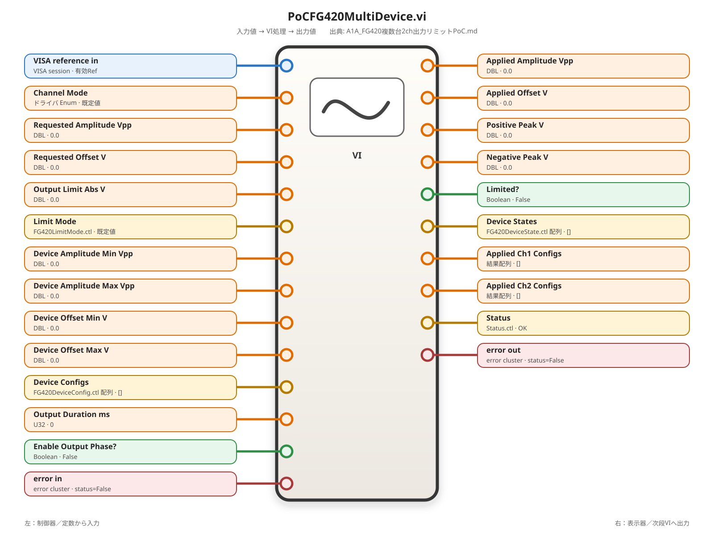

#### 0. 実現したい機能とVIの責務

`FG420_Device_Config.ctl`一次元配列から1反復で1台分を取り出し、Disabled Deviceをバイパスしながら、有効機器ごとにPrepare、Ch1 Configure、Ch2 Configure、Ch1/Ch2 Output ON、Wait、Ch1/Ch2 Output OFF、Closeを実行する。1台の失敗が別機器のCleanupを妨げないよう、VISA reference、Device State、Applied Ch1/Ch2 Config、Device Errorを機器数と同じ要素数の配列で保持する。

PoC初版は外側For Loopの並列反復を無効とし、機器を配列index順に処理する。複数台を同一PoCから個別設定できるが、出力ONエッジの厳密同時性は保証しない。

**00C証跡**

| 項目 | 記録 |
|---|---|
| Source | A1A既決設計、`IMFG410-63JA`、00A / 00B / 00C |
| Version | LabVIEW 2026 Q1 64bit、対象PCのYKFG400ドライバ |
| Symbol | `PoC_FG420_Multi_Device.vi` |
| Signature | Device Config一次元配列 + PoC条件 + error → State / Applied / Device Error配列 + Status / TestError / error |
| Verified by | 既存通信PoC完了。複数台・2ch・Limiterは実装・実機確認待ち |
| State | 既決設計、詳細配線確定、実装待ち |

#### 1. 入力データの実体

```text
Device Configs[]
├─ index 0 = FG420_Device_Config.ctl（1台目）
│  ├─ Device情報
│  ├─ Ch1 Config
│  └─ Ch2 Config
├─ index 1 = 2台目
└─ ...
```

- ループ外の`Device Configs`は`FG420_Device_Config.ctl`一次元配列である。
- Main For Loopの入力トンネルで自動指標付けを有効にする。
- ループ内では`Current Device Config`という単一`FG420_Device_Config.ctl`になる。
- N端子は未配線とし、Device Configsの実要素数だけ反復する。

`Applied Ch1 Configs`と`Applied Ch2 Configs`は新しいtypedefを追加せず、`FG420_Channel_Config.ctl`一次元配列を使用する。各要素は入力Configのコピーで、Enabledなチャネルでは`Requested Amplitude Vpp`と`Requested Offset V`を実際のApplied値へ置換する。Disabledチャネルは入力Configを変更せず出力する。

#### 2. 出力データモデル

| 出力 | 型 | index対応 |
|---|---|---|
| Device States | `FG420_Device_State.ctl[]` | Device Configsと同じindex |
| Applied Ch1 Configs | `FG420_Channel_Config.ctl[]` | Device Configsと同じindexのCh1結果 |
| Applied Ch2 Configs | `FG420_Channel_Config.ctl[]` | Device Configsと同じindexのCh2結果 |
| Device Errors | error cluster[] | Device Configsと同じindexのOriginal + Cleanup結果 |
| Status | `Status.ctl` | 全機器の最初のerrorから生成 |
| TestError | `TestError.ctl` | 全機器の最初のerror詳細 |
| error out | error cluster | Original errorを最優先した最初のerror |

内部では`VISA References[]`一次元配列も保持する。これはフロントパネルへ公開せず、Main Loop後のCleanup Loopで使用する。

#### 3. 前提条件・異常条件

| 条件 | 動作 |
|---|---|
| `error in.status=True` | 全Deviceをバイパスし、機器操作を行わず元errorを最終出力へ保持する |
| Device Configsが0要素 | Enabled Deviceなしエラー-710122 |
| Enabled Deviceが0台 | -710122 |
| Enabled DeviceのVISA Resource重複 | -710120、機器操作を開始しない |
| Enabled DeviceでCh1/Ch2が両方Disabled | -710121、機器操作を開始しない |
| Device Enabled=False | 1反復は行うが全機器操作をバイパスする。出力配列のindexを維持する |
| Prepare途中error | そのDeviceのConfigure / Output ONをスキップし、InitializedならCleanupでOFF / Closeする |
| Ch設定途中error | 後段設定とOutput ONをスキップし、Cleanupを実行する |
| Output ON後error | Original Device Errorを保持し、OFF / Closeを別Cleanup wireで実行する |
| Cleanup error | Original Device Errorを優先してMergeし、Originalがない場合はCleanup errorを返す |

追加するローカルエラーは既存-710120に続けて次を使用する。

```text
-710120:
PoC_FG420_Multi_Device.vi: Duplicate VISA resource was found. Resource=%s, FirstIndex=%d, DuplicateIndex=%d

-710121:
PoC_FG420_Multi_Device.vi: Enabled device has no enabled channel. DeviceIndex=%d, LogicalName=%s

-710122:
PoC_FG420_Multi_Device.vi: No enabled FG420 device was provided.
```

#### 4. 処理アルゴリズム

```text
Original Error = error in

Precheck Loop:
    Device Configsを1台ずつ読む
    Disabled Deviceは検証対象から除外する
    Enabled Device数を数える
    Ch1 Enabled OR Ch2 Enabledを確認する
    VISA Resourceの重複を確認する
    最初のValidation Errorを保持する

Main Loop（1反復=1台）:
    if Device Disabled:
        初期State、入力Ch Config、no errorを配列へ追加する
    else if Validation Errorあり:
        機器操作せず、Validation ErrorをそのDevice結果へ追加する
    else if Stop On First Error=Trueかつ前機器errorあり:
        機器操作せず、最初のerrorをそのDevice結果へ追加する
    else:
        Prepare Device
        Ch1 Configure
        Ch2 Configure
        Ch1 Output ON条件を判定して必要時ON
        Ch2 Output ON条件を判定して必要時ON
        出力が1ch以上ONならWait
        Original Device Errorを保存する
        Ch1 OFFを独立Cleanup wireで試行する
        Ch2 OFFを独立Cleanup wireで試行する
        Closeを独立Cleanup wireで試行する
        Original Device ErrorとCleanup ErrorをMergeする
        VISA、State、Applied Ch1、Applied Ch2、Merged Device Errorを配列へ追加する

Cleanup Loop:
    Main Loop後の全indexを反復する
    Initialized=TrueかつClosed=FalseのDeviceだけ再Cleanupする
    Ch1 OFF、Ch2 OFF、Closeを各々Clear Errors後に試行する
    Original Device ErrorをMerge Errorsの第1入力へ接続する
    Cleanup Errorを第2入力へ接続する

全Device Errorから最初のerrorを取得する
Error_To_TestStatusを1回呼ぶ
```

#### 5. LabVIEW構造の選定理由

| 構造 | 理由 |
|---|---|
| Precheck For Loop | ハードウェア操作前に全Device Configを検証する |
| Main For Loop | 1反復で1台を有限回処理する |
| Device Config入力自動指標付け | 配列から単一Device clusterを取り出す |
| 配列Shift Register | VISA、State、Applied、errorをindex順に蓄積する |
| First Error Shift Register | 1台のerrorを別機器の通常処理へ混ぜず、全体結果には最初のerrorを保持する |
| Abort Shift Register | `Stop On First Error?`の選択を次反復へ保持する |
| Flat Sequence Structure | Output ON → Wait →通常OFFの実行順を保証する |
| 独立Cleanup Loop | Main Loopの途中状態に関係なく全機器を再走査する |
| Merge Errors | Original ErrorをCleanup Errorより優先する |

Parallel Iterationsは無効とする。横河ドライバVIの再入可能性と同一機器内のCh競合が未確認だからである。

#### 6. 入出力

| 端子名 | 方向 | 型 | 配線先 |
|---|---|---|---|
| Device Configs | 入力 | `FG420_Device_Config.ctl[]` | Precheck Loop、Main Loop、Cleanup Loop |
| Output Duration ms | 入力 | U32 | Wait (ms)の`milliseconds to wait` |
| Enable Output Phase? | 入力 | Boolean | Ch1 / Ch2 Output ON条件 |
| Stop On First Error? | 入力 | Boolean | Abort New Devices更新論理 |
| error in | 入力 | error cluster | Original Error、Validation Error初期値、First Error初期値 |
| Device States | 出力 | `FG420_Device_State.ctl[]` | Cleanup Loopの自動指標付け出力 |
| Applied Ch1 Configs | 出力 | `FG420_Channel_Config.ctl[]` | Main Loop Shift Register右外側 |
| Applied Ch2 Configs | 出力 | `FG420_Channel_Config.ctl[]` | Main Loop Shift Register右外側 |
| Device Errors | 出力 | error cluster[] | Cleanup Loopの自動指標付け出力 |
| Status | 出力 | `Status.ctl` | `Error_To_TestStatus.vi / Status` |
| TestError | 出力 | `TestError.ctl` | `Error_To_TestStatus.vi / TestError` |
| error out | 出力 | error cluster | `Error_To_TestStatus.vi / error out` |

#### 7. 配置する関数およびSubVI等

| 数 | 日本語名 | 英語名 | 配置場所・追加方法 |
|---:|---|---|---|
| 3 | Forループ | For Loop | プログラミング → ストラクチャ |
| 必要数 | シフトレジスタ | Shift Register | For Loop枠右クリック → シフトレジスタを追加 |
| 必要数 | ケースストラクチャ | Case Structure | プログラミング → ストラクチャ |
| 1 | フラットシーケンスストラクチャ | Flat Sequence Structure | プログラミング → ストラクチャ |
| 必要数 | 名前でアンバンドル | Unbundle By Name | プログラミング → クラスタ、クラス、バリアント |
| 必要数 | 名前でバンドル | Bundle By Name | プログラミング → クラスタ、クラス、バリアント |
| 6以上 | 配列作成 | Build Array | プログラミング → 配列。配列＋単一要素では「入力を連結」を有効 |
| 1 | 1次元配列を検索 | Search 1D Array | プログラミング → 配列 |
| 1 | 配列サイズ | Array Size | プログラミング → 配列 |
| 必要数 | エラークリア | Clear Errors | ダイアログ＆ユーザインタフェース → エラー処理 |
| 必要数 | エラーをマージ | Merge Errors | ダイアログ＆ユーザインタフェース → エラー処理 |
| 1 | 待機（ミリ秒） | Wait (ms) | プログラミング → タイミング |
| 1 | `FG420_Prepare_Device.vi` | SubVI | `10_FG420` |
| 2 | `FG420_Configure_Channel_Safe.vi` | SubVI | `10_FG420` |
| 4以上 | `FG420_Output.vi` | SubVI | `10_FG420` |
| 1以上 | `FG420_Close.vi` | SubVI | `10_FG420` |
| 1 | `Error_To_TestStatus.vi` | SubVI | `00_Common` |

#### 8. 配線順

##### 8.1 Precheck For Loopの作成

1. 1個目のFor Loopを配置する。`Device Configs`を左枠入力トンネルへ接続する。
2. 入力トンネルを右クリックし、`指標付けを有効（Enable Indexing）`を選ぶ。トンネルの`[]`表示を確認する。
3. N端子は未配線にする。ループ外は`FG420_Device_Config.ctl[]`、ループ内は単一`FG420_Device_Config.ctl`となる。
4. `Seen VISA Resources`用Shift Registerを追加する。左外側へVISA resource name型の空一次元配列定数を接続する。左内側は前反復までのVISA配列、右内側は今回更新配列、右外側は全検証後の配列となる。
5. `Enabled Device Count`用Shift Registerを追加し、左外側へU32定数`0`を接続する。
6. `Validation Error`用Shift Registerを追加し、左外側へ`error in`を接続する。元errorがTrueなら以降の検証errorで上書きしない。
7. ループ内Current Device ConfigをUnbundle By Nameへ接続し、Enabled?、Logical Name、VISA Resource、Ch1 Config、Ch2 Configを取り出す。
8. Enabled?をCase Structure selectorへ接続する。
9. Falseケースでは、Seen VISA左内側を右内側へ、Count左内側を右内側へ、Validation Error左内側を右内側へ接続する。
10. TrueケースではCount左内側を加算（Add）の一方へ接続し、U32定数`1`をもう一方へ接続する。出力をCount右内側へ接続する。
11. Ch1 ConfigとCh2 Configを各Unbundle By Nameへ接続し、両方のEnabled?をORへ接続する。出力を`Any Channel Enabled?`とする。
12. `Any Channel Enabled?`をCase Structure selectorへ接続する。FalseではDevice index端子`i`とLogical NameをFormat Into Stringへ接続して-710121を作り、現在Validation ErrorとMerge Errorsする。Trueでは現在Validation Errorを保持する。
13. Seen VISA左内側配列をSearch 1D Arrayの`array`へ、VISA Resourceを`element`へ接続する。
14. Search 1D Arrayの`index of element`出力を以上?（Greater Or Equal?）の一方の入力へ接続し、I32定数`0`をもう一方の入力へ接続する。Boolean出力を`Duplicate?`とする。
15. Duplicate? CaseのTrueでは、VISA Resource、最初のindex、現在の`i`をFormat Into Stringへ接続し、-710120を生成して現在Validation ErrorとMerge Errorsする。Seen VISA配列は左内側から右内側へ保持する。
16. Duplicate? CaseのFalseでは、Seen VISA左内側とVISA ResourceをBuild Arrayへ接続し、「入力を連結」を有効にしてVISA Resourceを末尾へ追加する。出力をSeen VISA右内側へ接続する。
17. Precheck Loop右外側のEnabled Countを等しい?（Equal?）の一方の入力へ接続し、U32定数`0`をもう一方の入力へ接続する。Boolean出力がTrueの場合は-710122を生成し、Validation Error右外側をMerge Errorsの第1入力、-710122 errorを第2入力へ接続する。Merge Errors出力を`Precheck Error`とする。

##### 8.2 Main For Loopと自動指標付け

18. 2個目のFor Loopを配置し、`Device Configs`を左入力トンネルへ接続して自動指標付けを有効にする。
19. N端子は未配線にする。1反復で1台のCurrent Device Configを処理する。
20. `Stop On First Error?`、`Enable Output Phase?`、`Output Duration ms`、`Precheck Error`は入力トンネルの指標付けを無効にしてループ内へ渡す。ループ外とループ内で型は変化しない。

##### 8.3 Main LoopのShift Register

21. 次の7個のShift RegisterをMain Loopへ追加する。

| Shift Register | 左外側初期値 | 左内側 | 右内側更新値 | 右外側 |
|---|---|---|---|---|
| VISA References | VISA型空配列 | 前DeviceまでのVISA[] | Current VISAを末尾追加 | Cleanup用VISA[] |
| Device States | State型空配列 | 前DeviceまでのState[] | Current Stateを末尾追加 | Main State[] |
| Applied Ch1 Configs | Channel Config型空配列 | 前Deviceまで | Current Applied Ch1を末尾追加 | 出力配列 |
| Applied Ch2 Configs | Channel Config型空配列 | 前Deviceまで | Current Applied Ch2を末尾追加 | 出力配列 |
| Device Errors | error cluster空配列 | 前Deviceまで | Current Device Errorを末尾追加 | Cleanup入力error[] |
| First Error | `Precheck Error` | 前反復までの最初のerror | Merge Errors(前First, Current Error) | 全体最初error |
| Abort New Devices? | `Precheck Error.status` | 前反復の中断状態 | 前値 OR (Stop On First Error? AND Current Error.status) | 最終中断状態 |

22. 各配列更新にはBuild Arrayを使用し、配列入力と単一要素入力を接続したうえで右クリックから`入力を連結（Concatenate Inputs）`を有効にする。無効のままでは二次元配列になるため使用しない。

##### 8.4 Disabled Device／Precheck／Stop On First Error分岐

23. Current Device ConfigをUnbundle By Nameへ接続し、Enabled?、VISA Resource、Ch1 Config、Ch2 Configを取り出す。
24. Enabled?をNotへ接続して`Disabled Device?`を作る。
25. Abort New Devices?左内側と`Stop On First Error?`をANDへ接続し、`Abort This Device?`を作る。
26. `Precheck Error.status`を取り出す。
27. Disabled Device?、Abort This Device?、Precheck Error.statusをOR設定のCompound Arithmeticへ接続し、`Bypass Device?`を作る。
28. `Bypass Device?`をCase Structure selectorへ接続する。
29. TrueケースでDisabled Device?=TrueかつPrecheck Error=Falseの場合、Current VISA=`VISA Resource`、Current State=初期State、Current Applied Ch1=`Ch1 Config`、Current Applied Ch2=`Ch2 Config`、Current Device Error=No Errorとする。
30. TrueケースでPrecheck Error=TrueまたはAbort This Device?=Trueの場合、Current VISA=`VISA Resource`、Current State=初期State、Applied Ch1/Ch2=入力Config、Current Device Error=`First Error`左内側とする。
31. TrueケースではPrepare、Configure、Output、Wait、OFF、Closeを配置しない。
32. Falseケースでは手順8.5以降を配置する。

##### 8.5 Prepare Device

33. Current Device Configを`FG420_Prepare_Device.vi / Device Config`へ接続する。
34. No Error定数を`FG420_Prepare_Device.vi / error in`へ接続する。別DeviceのerrorをこのDeviceの通常処理へ流さない。
35. PrepareのVISA出力を`Current VISA After Prepare`、IDNを`Current IDN`、Device Stateを`Current State After Prepare`、error outを`Current Error After Prepare`として扱う。
36. PrepareのStatus / TestErrorはPoC内では接続せず、Current Errorを最終段で1回変換する。

##### 8.6 Ch1 ConfigureとState / Applied Config更新

37. `Current VISA After Prepare`を1個目の`FG420_Configure_Channel_Safe.vi / VISA reference in`へ接続する。
38. `Ch1 Config`を同VIの`Channel Config`へ接続する。
39. `Current Error After Prepare`を同VIの`error in`へ接続する。
40. Ch1 ConfigureのVISA出力を`VISA After Ch1 Configure`、error outを`Error After Ch1 Configure`とする。
41. Ch1 ConfigureのApplied AmplitudeとApplied Offsetを、`Ch1 Config`を基準とするBundle By Nameの`Requested Amplitude Vpp`と`Requested Offset V`へ接続する。
42. Ch1 Config.Enabled?をCase selectorへ接続する。TrueではBundle By Name出力を`Current Applied Ch1 Config`、Falseでは元のCh1 Configを`Current Applied Ch1 Config`とする。
43. `Error After Ch1 Configure.status`をNotへ接続し、Ch1 Config.Enabled?とANDして`Ch1 Configured?`を作る。
44. `Current State After Prepare`をBundle By Nameへ接続し、`Ch1 Configured?`を`Ch1 Configured?`フィールドへ接続する。出力を`State After Ch1 Configure`とする。

##### 8.7 Ch2 ConfigureとState / Applied Config更新

45. `VISA After Ch1 Configure`を2個目の`FG420_Configure_Channel_Safe.vi / VISA reference in`へ接続する。
46. `Ch2 Config`を同VIの`Channel Config`へ接続する。
47. `Error After Ch1 Configure`を同VIの`error in`へ接続する。
48. Ch2 ConfigureのVISA出力を`VISA After Ch2 Configure`、error outを`Error After Ch2 Configure`とする。
49. Ch2 ConfigureのApplied値をCh2 ConfigのBundle By Nameへ接続し、Ch2 Enabled=Trueなら更新cluster、Falseなら元clusterを`Current Applied Ch2 Config`とする。
50. `NOT Error After Ch2 Configure.status AND Ch2 Enabled?`を`Ch2 Configured?`とし、State After Ch1 ConfigureのBundle By Nameで更新する。出力を`State After Configure`とする。

##### 8.8 Flat Sequence Frame 0：Ch1 / Ch2 Output ON

51. 3フレームのFlat Sequence Structureを配置する。`VISA After Ch2 Configure`、`Error After Ch2 Configure`、`State After Configure`をFrame 0へ渡す。
52. `Enable Output Phase? AND Ch1 Config.Enabled? AND Ch1 Config.Output On? AND NOT Error After Ch2 Configure.status`をAND設定のCompound Arithmeticで作り、`Ch1 Output Request?`とする。
53. Ch1 Output Request? CaseのFalseではVISA、error、Stateを入力から出力へ素通りし、Ch1 Output On?をFalseで維持する。
54. TrueではVISAを`FG420_Output.vi / VISA reference in`、Ch1 Config.Channelを`Channel`、Boolean定数`True`を`Output On?`、現在errorを`error in`へ接続する。
55. Ch1 Output error.statusをNotへ接続し、成功時TrueをState Bundle By Nameの`Ch1 Output On?`へ接続する。
56. Ch1 Case出力VISA / error / Stateを`VISA Before Ch2 ON`、`Error Before Ch2 ON`、`State Before Ch2 ON`とする。
57. `Enable Output Phase? AND Ch2 Config.Enabled? AND Ch2 Config.Output On? AND NOT Error Before Ch2 ON.status`を`Ch2 Output Request?`とする。
58. Ch2 Output Request? CaseのFalseではVISA、error、Stateを素通りする。
59. TrueではVISA、Ch2 Channel、Boolean定数True、errorを2個目の`FG420_Output.vi`へ接続し、成功時にStateの`Ch2 Output On?`をTrueへ更新する。
60. Frame 0のVISA / error / StateをFrame 1へ渡す。

##### 8.9 Flat Sequence Frame 1：Wait

61. StateからCh1 Output On?とCh2 Output On?をUnbundle By Nameで取り出し、ORへ接続して`Any Output On?`を作る。
62. `Any Output On? AND NOT Current Error.status`を`Wait Required?`とする。
63. Wait Required? CaseのTrueに待機（ミリ秒）（Wait (ms)）を配置し、`Output Duration ms` U32制御器を`milliseconds to wait`へ接続する。
64. True / False両ケースでVISA、error、Stateを入力トンネルから出力トンネルへ接続する。Wait関数にはerror端子がないため、Flat Sequenceのフレーム境界が順序を保証する。
65. Frame 1のerrorを`Original Device Error Before Cleanup`として分岐保存する。

##### 8.10 Flat Sequence Frame 2：通常OFFとClose

66. `Original Device Error Before Cleanup`を1個目のエラークリア（Clear Errors）へ接続し、出力を`Cleanup Call Error 0`とする。
67. No Error定数を`Cleanup Error Accumulator 0`として扱う。
68. Ch1 Config.Enabled?をCase selectorへ接続する。FalseではVISAを素通りし、No Errorを`Ch1 OFF Error`とする。
69. Trueでは現在VISAを`FG420_Output.vi / VISA reference in`、Ch1 Channelを`Channel`、Boolean定数Falseを`Output On?`、`Cleanup Call Error 0`を`error in`へ接続する。出力errorを`Ch1 OFF Error`とする。
70. `Cleanup Error Accumulator 0`をMerge Errorsの第1入力、`Ch1 OFF Error`を第2入力へ接続し、`Cleanup Error Accumulator 1`を作る。
71. `Cleanup Error Accumulator 1`をClear Errorsへ接続し、その出力をCh2 OFF呼出し用errorとする。これによりCh1 OFF失敗時もCh2 OFFを試行する。
72. Ch2 Enabled? CaseのFalseではVISAを素通りし、No Errorを`Ch2 OFF Error`とする。TrueではCh2 Channel、Output=False、クリア済みerrorを`FG420_Output.vi`へ接続する。
73. `Cleanup Error Accumulator 1`と`Ch2 OFF Error`をMerge Errorsし、`Cleanup Error Accumulator 2`を作る。
74. `Cleanup Error Accumulator 2`をClear Errorsへ接続し、その出力を`FG420_Close.vi / error in`へ接続する。
75. Ch2 OFF後のVISAを`FG420_Close.vi / VISA reference in`へ接続する。
76. `FG420_Close.vi / error out`を`Close Error`とする。
77. `Cleanup Error Accumulator 2`をMerge Errors第1入力、`Close Error`を第2入力へ接続し、`Cleanup Error Final`を作る。
78. `Original Device Error Before Cleanup`をMerge Errors第1入力、`Cleanup Error Final`を第2入力へ接続し、`Merged Device Error`を作る。Original Errorを第1入力に置く。
79. Ch1 OFF Error.status=FalseならState.Ch1 Output On?をFalseへ更新する。Ch2も同じ条件でFalseへ更新する。Close Error.status=FalseならState.Closed?をTrueへ更新する。
80. CloseにはVISA outがないため、Close直前のVISA referenceを`Current VISA Result`として保持する。

##### 8.11 Main Loop Shift Register更新

81. Bypass Caseまたは処理CaseからCurrent VISA、Current State、Current Applied Ch1、Current Applied Ch2、Current Device Errorを1組のCase出力として出す。全ケースで5出力を接続する。
82. VISA References左内側配列とCurrent VISAをBuild Arrayへ接続し、入力を連結して右内側へ接続する。
83. Device States、Applied Ch1、Applied Ch2、Device Errorsも各左内側配列とCurrent単一要素をBuild Arrayへ接続し、各右内側へ接続する。
84. First Error左内側をMerge Errors第1入力、Current Device Errorを第2入力へ接続し、出力をFirst Error右内側へ接続する。
85. `Stop On First Error? AND Current Device Error.status`を作り、Abort New Devices?左内側とORして右内側へ接続する。
86. False／Disabledケースで配列Shift Registerを初期値へ戻さない。必ず左内側の現在配列へCurrent要素を追加する。

##### 8.12 独立Cleanup For Loop

87. 3個目のFor LoopをMain Loopの右側へ配置する。
88. Main Loop右外側のVISA References[]、Device States[]、Device Errors[]と、フロントパネルDevice Configs[]をCleanup Loop左枠へ接続し、4トンネル全てで自動指標付けを有効にする。
89. ループ外は各一次元配列、ループ内はCurrent VISA、Current State、Current Error、Current Device Configの単一要素となる。
90. N端子は未配線とする。4配列はMain LoopでDevice Config数と同じ要素数を生成するため、Device Config数だけ反復する。
91. Final First Error用Shift Registerを追加し、左外側へMain LoopのFirst Error右外側を接続する。
92. State.Initialized?と`NOT State.Closed?`をANDし、`Needs Cleanup?` Case selectorへ接続する。
93. FalseケースではCurrent StateとCurrent Errorを各出力トンネルへ接続する。VISA操作を行わない。
94. TrueケースではCurrent Errorを`Original Device Error`として保存し、Clear Errors出力を最初のOFF用errorへ接続する。
95. Current Device ConfigのCh1 Config.Enabled? CaseでCh1 OFFを試行する。Ch1 OFF errorはCleanup accumulatorへMergeする。
96. Cleanup accumulatorをClear ErrorsしてからCh2 Enabled? CaseでCh2 OFFを試行する。Ch1失敗でもCh2を試行する。
97. Ch2までのCleanup accumulatorをClear ErrorsしてからCloseを試行する。
98. Original Device ErrorをMerge Errors第1入力、Cleanup Errorを第2入力へ接続し、`Cleanup Merged Device Error`を作る。
99. OFF / Close成功結果でStateのOutput On? / Closed?をBundle By Name更新する。
100. Cleanup LoopのState出力トンネルとError出力トンネルで自動指標付けを有効にする。ループ内単一State / errorから、ループ外`Device States[]` / `Device Errors[]`を生成する。
101. Final First Error左内側をMerge Errors第1入力、Cleanup Merged Device Errorを第2入力へ接続し、出力を右内側へ接続する。右外側が`Final Error`となる。

##### 8.13 フロントパネル出力

102. Cleanup Loopの自動指標付けState配列を`Device States`表示器へ接続する。
103. Main LoopのApplied Ch1 Configs右外側を`Applied Ch1 Configs`表示器へ接続する。
104. Main LoopのApplied Ch2 Configs右外側を`Applied Ch2 Configs`表示器へ接続する。
105. Cleanup Loopの自動指標付けError配列を`Device Errors`表示器へ接続する。
106. Cleanup LoopのFinal Error Shift Register右外側を`Error_To_TestStatus.vi / error in`へ接続する。
107. String定数`FG420`を`Error_To_TestStatus.vi / Device Name`へ接続する。
108. Status、TestError、error outを各フロントパネル表示器へ接続する。

##### 8.14 全Caseの主要出力

| 経路 | State | Applied Ch1/Ch2 | Device Error | Cleanup |
|---|---|---|---|---|
| Disabled Device | 初期State | 入力Configを保持 | no error | 対象外 |
| Precheck error | 初期State | 入力Configを保持 | Validation Error | VISA未Openのため対象外 |
| Stop On First Errorでskip | 初期State | 入力Configを保持 | First Error | 対象外 |
| Prepare途中error・Init失敗 | Prepare State | Configure出力は安全値 | Prepare Error | Initialized=FalseならClose不要 |
| Prepare途中error・Init成功後 | Initialized=TrueのState | Configureはスキップ | Prepare Error | OFF / Closeを実行 |
| Ch設定途中error | Configured?を成功分だけ更新 | 成功/安全値 | 最初のCh error | OFF / Closeを実行 |
| Output ON後error | Output成功分をStateへ記録 | Applied値 | Output error | OFF / Closeを実行 |
| Cleanup errorのみ | Closed?は成功時のみTrue | Applied値 | Cleanup error | Cleanup Loopで再試行対象 |
| Original + Cleanup error | Stateは成功分のみ更新 | Applied値 | Originalを優先 | Cleanup errorもDevice結果で追跡 |
| 正常 | Initialized/ID/Mode/Coupling/Configured/Closedを更新 | Applied値 | no error | OFF / Close完了 |

#### 9. 単体テスト

テスト時は`Device Configs`配列の実要素数をArray Size表示器で確認し、表示セル数と実要素数を混同しない。

| No. | 入力・注入方法 | 期待結果 |
|---:|---|---|
| 1 正常値 | Device[0] Enabled、Ch1 Enabled、1 kHz / 1 Vpp / 0 V、Output On=True | 1反復、Ch1設定・ON・Wait・OFF・Close、配列各1要素 |
| 2 境界値 | Amp=10 Vpp、Offset=0、Limit=5 | Rejectされず境界通過 |
| 3 Reject | Amp=10.1 Vpp、Offset=0、Limit=5、Reject | Output ONなし、Device Error=-710112、Cleanup Close |
| 4 Clamp | Amp=8 Vpp、Offset=2、Limit=5、Clamp | Applied Amp=6、Output ON後OFF、no error |
| 5 Ch1のみ | Ch1 Enabled=True、Ch2=False | Ch1だけConfigure / ON / OFF、Ch2 Configを入力値のまま出力 |
| 6 Ch2のみ | Ch1=False、Ch2=True | Ch2だけConfigure / ON / OFF |
| 7 2ch有効 | Ch1=1 kHz、Ch2=2 kHz、両Enabled | Ch1→Ch2順に個別設定し、両ch ON / OFF |
| 8 1台有効 | Device Configsを1要素 | 全出力配列が1要素 |
| 9 複数台有効 | Device Configsを2要素、異なるVISA | Main Loop 2反復、index対応を維持、全台Close |
| 10 Disabled Device | Device[0] Enabled=False、Device[1] Enabled=True | index0は初期State/no error、index1のみ実機操作 |
| 11 Prepare途中error | 1台目のGet IDまたはChanModeでerror注入 | 1台目InitializedならCleanup、Stop=Falseなら2台目を実行 |
| 12 Ch設定途中error | Ch1 Set Freqでerror注入 | Ch2はerror chainでスキップ、Output ONなし、OFF / Close実行 |
| 13 Output ON後error | Ch1 ON成功後、Ch2 ONまたは測定相当位置でerror注入 | Original Error保持、Ch1 OFFとCloseを実行 |
| 14 Cleanup error | FG420_Output OFFまたはCloseへerror注入 | 別OFF / Closeも試行、OriginalなしならCleanup errorが最終error |
| 15 Original + Cleanup | Set Freq errorとClose errorを同時注入 | Device ErrorはSet Freq errorを優先、Closed?はFalse |
| 16 Stop On First Error=False | Device0失敗、Device1正常 | Device1を通常実行し、全Device Cleanup |
| 17 Stop On First Error=True | Device0失敗、Device1有効 | Device1はskip、出力配列indexを維持 |
| 18 VISA重複 | Enabled 2台へ同一VISA Resource | -710120、Initializeを1回も呼ばない |
| 19 Channel全Disabled | Enabled DeviceでCh1/Ch2=False | -710121、Initializeを呼ばない |
| 20 既存error in | error in.status=True、code=-123 | 全Deviceバイパス、全出力配列はDevice数と同数、error out=-123 |

推奨プローブ位置は、Precheck Validation Error右外側、Main Loopの各Shift Register右内側、Original Device Error、Cleanup Error Final、Cleanup LoopのFinal First Error右外側である。

---

## A1A.9 PoCフロントパネル例

```text
Device Configs[0]
  Logical Name = FG420_A
  VISA Resource = USB0::...A...::INSTR
  Ch1: Enabled=True,  Freq=1000Hz, Amp=2Vpp, Offset=0V, Limit=3V
  Ch2: Enabled=True,  Freq=2000Hz, Amp=1Vpp, Offset=1V, Limit=3V

Device Configs[1]
  Logical Name = FG420_B
  VISA Resource = USB0::...B...::INSTR
  Ch1: Enabled=True,  Freq=500Hz, Amp=4Vpp, Offset=0V, Limit=2.5V, Mode=Clamp
  Ch2: Enabled=False
```

PoC初版は配列index順に1台ずつ処理する。厳密な出力同時開始が必要な場合は、A1A.4.8の外部基準・外部トリガ方式を別途実機確認する。

---

## A1A.10 単体試験・結合試験

A1A.5.1、A1A.6.1、A1A.7.1、A1A.8.1の各`9. 単体テスト`を正本とする。結合試験では次を追加する。

- 2台に異なるVISA Resourceを設定し、IDNシリアルをindexごとに記録する。
- Ch1 / Ch2へ異なる波形、周波数、振幅、オフセットを設定する。
- RejectされたチャネルがOutput ONされないことをオシロで確認する。
- Clampされた振幅がApplied値およびオシロ測定値と一致することを確認する。
- 1台のPrepare / Configure / Output / Cleanupエラーが、別機器のCleanupを妨げないことを確認する。
- 全Initialized機器で、最終的にCh1 / Ch2 OFFとCloseが試行されることを確認する。

---

## A1A.11 実装順

```text
STEP 1  typedef作成
  FG420_Limit_Mode.ctl
  FG420_Channel_Config.ctl
  FG420_Device_Config.ctl
  FG420_Device_State.ctl

STEP 2  追加薄いラッパ
  FG420_Set_ChanMode.vi
  FG420_Set_Coupling.vi
  FG420_Get_ID.vi
  FG420_Set_PowerOn_Output.vi
  FG420_Query_Ampl_Bound.vi
  FG420_Query_Offset_Bound.vi
  FG420_Read_System_Error.vi

STEP 3  純粋ロジック
  FG420_Apply_Output_Limit.vi

STEP 4  複合VI
  FG420_Prepare_Device.vi
  FG420_Configure_Channel_Safe.vi

STEP 5  PoC
  PoC_FG420_Multi_Device.vi

STEP 6  1台1ch → 1台2ch → 2台複数chの順で実機確認

STEP 7  必要な場合のみ同期拡張
  FG420_Set_Reference_Source.vi
  FG420_Set_Trigger_Source.vi
  FG420_Trigger.vi
```

---

## A1A.12 完了条件

- [ ] `CHAN Mode=INDependent`と`INST Coup=NONE`でCh1 / Ch2を個別設定できる。
- [ ] Ch1 / Ch2に異なる周波数・振幅・オフセットを設定できる。
- [ ] 複数のVISA Resourceを配列で受け取り、各FG420のIDNを記録できる。
- [ ] 設定した絶対電圧リミットを超える要求はRejectまたはClampされる。
- [ ] リミットエラー時にVOLT / VOLT Offs / OUTP ONが実行されない。
- [ ] 設定前とCleanupで全ch OUTP OFFを実行する。
- [ ] 1台のエラーが他の機器のCleanupを妨げない。
- [ ] 全てのInitialized機器でCloseを試行する。
- [ ] VISA Resource重複を開始前に検出する。
- [ ] ソフトウェア順次ONと厳密同期の違いを試験仕様へ明記する。
- [ ] 厳密同期が必要な場合、外部基準 / 外部トリガ構成で実機確認する。

---

## A1A.13 00A／00B／00C準拠の自己レビュー

### A1A.13.1 4 VIの節構成

| VI | 0 | 1 | 2 | 3 | 4 | 5 | 6 | 7 | 8 | 9 |
|---|---|---|---|---|---|---|---|---|---|---|
| FG420_Apply_Output_Limit.vi | ✓ | ✓ | ✓ | ✓ | ✓ | ✓ | ✓ | ✓ | ✓ | ✓ |
| FG420_Configure_Channel_Safe.vi | ✓ | ✓ | ✓ | ✓ | ✓ | ✓ | ✓ | ✓ | ✓ | ✓ |
| FG420_Prepare_Device.vi | ✓ | ✓ | ✓ | ✓ | ✓ | ✓ | ✓ | ✓ | ✓ | ✓ |
| PoC_FG420_Multi_Device.vi | ✓ | ✓ | ✓ | ✓ | ✓ | ✓ | ✓ | ✓ | ✓ | ✓ |

### A1A.13.2 00A確認

- [x] 全フロントパネル端子を入出力表へ記載した。
- [x] 全フロントパネル端子の接続先を配線順へ記載した。
- [x] 関数名を日本語名（英語名）で記載した。
- [x] 数値定数へDBL / I32 / U32の型と値を記載した。
- [x] Case Structureのselectorと全ケースの主要出力を記載した。
- [x] For Loopの1反復、N端子、自動指標付け、ループ内外の型を記載した。
- [x] Shift Registerの左外側初期値、左内側、右内側更新、右外側出力を記載した。
- [x] Original Error、Cleanup Error、Clear Errors、Merge Errorsの接続順を固定した。
- [x] 単体テストへ入力方法、通過経路、期待出力を記載した。

### A1A.13.3 00B確認

- [x] 機能要求からデータ実体、出力モデル、前提、アルゴリズム、LabVIEW構造の順で説明した。
- [x] Case / For Loop / Shift Registerの採用理由を機能ロジックと対応させた。
- [x] Limit計算式の意味をVp-pとオフセットの関係から説明した。
- [x] 単体テストを正常、境界、分岐、反復、Cleanupへ対応させた。
- [x] PoC初版でParallel Iterationsを採用しない理由を記載した。

### A1A.13.4 00C確認

- [x] 既決VI名、typedef、呼出順、レイヤを変更していない。
- [x] 横河ドライバ仕様のSourceを`IMFG410-63JA`とした。
- [x] LabVIEW基準を2026 Q1 64bitとした。
- [x] 実VIのコネクタペイン確認が必要な箇所を実機確認待ちとして残した。
- [x] ベンダーVIを改変しない。

**残確認**：`FG420_Set_Load.vi`の`Load Infinity?`公開端子は、対象プロジェクトの実VIをCtrl+Hで確認する。既存実体と本章typedefが一致しない場合、本限定修正の範囲で推測修正せず、別の設計是正として扱う。

<!-- generated-vi-reference-start -->

---

## 章内で参照するVIの入出力イメージ

### `YKFG400 .vi`

<!-- generated-vi-diagram -->
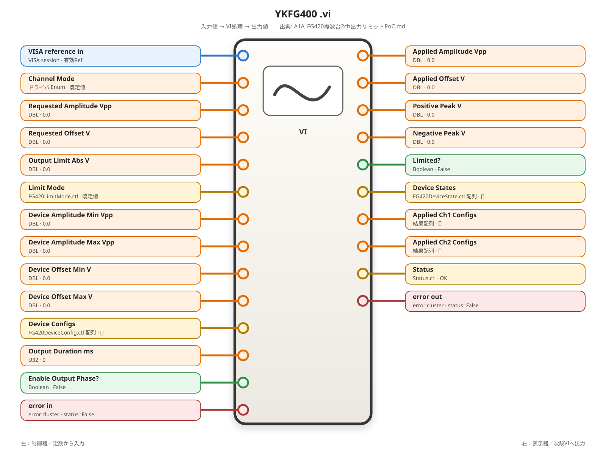

### `YKFG400 CHAN Mode.vi`

<!-- generated-vi-diagram -->
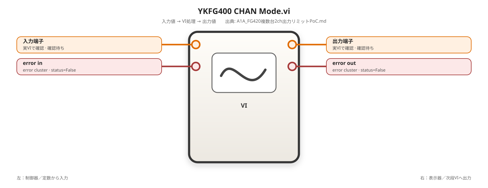

### `YKFG400 INST Coup.vi`

<!-- generated-vi-diagram -->


### `YKFG400 VOLT.vi`

<!-- generated-vi-diagram -->
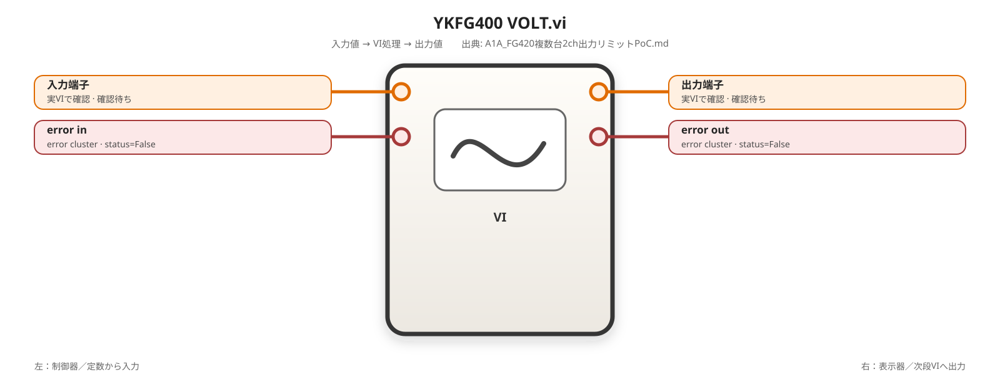

### `YKFG400 VOLT Offs.vi`

<!-- generated-vi-diagram -->


### `YKFG400 OUTP Load.vi`

<!-- generated-vi-diagram -->


### `YKFG400 IDN.vi`

<!-- generated-vi-diagram -->


### `ErrorToTestStatus.vi`

<!-- generated-vi-diagram -->
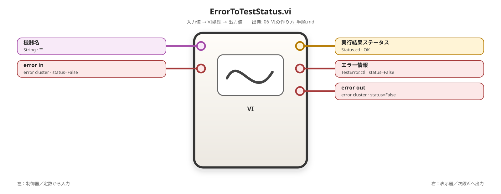

### `YKFG400 OUTP Pon.vi`

<!-- generated-vi-diagram -->


### `YKFG400 SYST Err.vi`

<!-- generated-vi-diagram -->


### `FG420SetReferenceSource.vi`

<!-- generated-vi-diagram -->


### `YKFG400 ROSC Sour.vi`

<!-- generated-vi-diagram -->
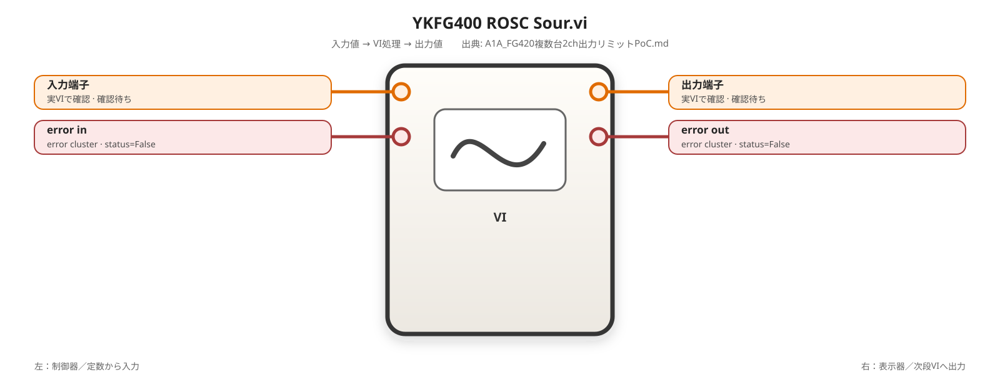

### `FG420Trigger.vi`

<!-- generated-vi-diagram -->


### `YKFG400 TRIG.vi`

<!-- generated-vi-diagram -->


### `FG420SetTriggerSource.vi`

<!-- generated-vi-diagram -->


### `YKFG400 TRIG Sour.vi`

<!-- generated-vi-diagram -->


### `TRIG.vi`

<!-- generated-vi-diagram -->
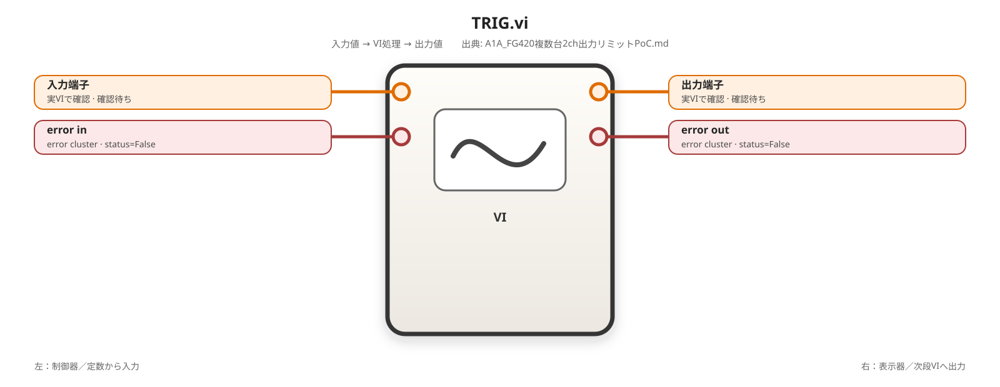

### `FG420SetAmpl.vi`

<!-- generated-vi-diagram -->


### `FG420SetOffset.vi`

<!-- generated-vi-diagram -->
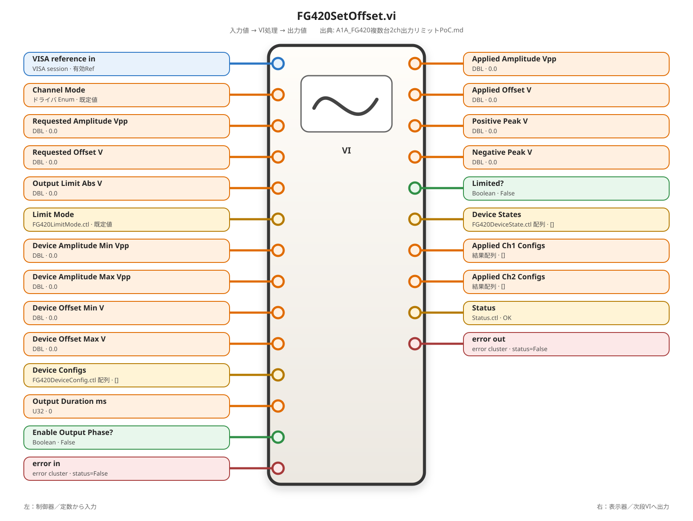

### `PoCFG420MultiDevice.vi`

<!-- generated-vi-diagram -->


<!-- generated-vi-reference-end -->